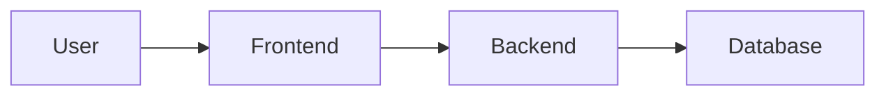

# Documentation Standards

**Document Version:** 1.0
**Project:** AI Voice Agent SaaS Platform
**Purpose:** Define documentation rules, naming conventions, structure, and quality standards for the entire platform.

---

# 1. Purpose

This document defines the standards used for creating, organizing, maintaining, and reviewing all project documentation.

The goal is to ensure:

* Consistent documentation across all engineering teams
* Easy navigation for developers, architects, and operators
* Clear relationship between architecture, code, APIs, databases, and deployment
* Long-term maintainability of the platform

---

# 2. Documentation Principles

## 2.1 Documentation Must Be

### Accurate

Documentation must represent the actual system behavior.

Do not document:

* Planned features as completed
* Deprecated systems as active
* Assumptions without validation

---

### Complete

Each major system component should document:

* Purpose
* Responsibilities
* Architecture
* Dependencies
* Data flow
* Configuration
* Security considerations
* Operational requirements

---

### Maintainable

Documentation should:

* Use simple structures
* Avoid duplication
* Reference source documents when possible
* Be updated with major code changes

---

### Developer Friendly

Documentation should allow a new engineer to understand:

* What the system does
* Why it exists
* How components communicate
* How to run and troubleshoot it

---

# 3. Documentation Structure

The project documentation follows this structure:

```
docs/

├── 00_Documentation_Standards.md

├── 01_System_Architecture/
│
├── 02_Agent_Platform/
│
├── 03_Voice_Runtime/
│
├── 04_RAG_Knowledge_System/
│
├── 05_Memory_System/
│
├── 06_Workflow_Engine/
│
├── 07_API_Documentation/
│
├── 08_Database_Design/
│
├── 09_Security/
│
├── 10_Deployment/
│
├── 11_Operations/
│
├── 12_Troubleshooting/
│
└── 99_Archive/
```

---

# 4. File Naming Standards

## 4.1 General Rule

Use:

```
<number>_<name>.md
```

Example:

```
01_System_Overview.md
02_Agent_Runtime_Architecture.md
03_Call_Flow.md
```

---

## 4.2 Versioning

For major document changes:

```
Document_Name_v2.0.md
```

Examples:

```
Agent_Runtime_Architecture_v1.0.md

Agent_Runtime_Architecture_v2.0.md
```

---

# 5. Markdown Standards

## 5.1 Heading Structure

Use:

```
# Main Title

## Section

### Subsection

#### Detail
```

Example:

```markdown
# Voice Agent Runtime

## Architecture

### Components

#### Agent Worker
```

---

# 6. Standard Document Template

All major documents should follow this format:

```markdown
# Document Title

## Document Information

Version:
Author:
Status:
Last Updated:

---

# 1. Overview

Description of the component.

---

# 2. Purpose

Why this component exists.

---

# 3. Architecture

System design explanation.

---

# 4. Components

List major components.

---

# 5. Data Flow

Explain communication flow.

---

# 6. API / Interface

External communication details.

---

# 7. Database

Related tables and schemas.

---

# 8. Security

Security considerations.

---

# 9. Deployment

Deployment requirements.

---

# 10. Troubleshooting

Common problems and solutions.

---

# 11. Future Improvements

Planned enhancements.
```

---

# 7. Diagram Standards

All architecture diagrams should:

* Have clear names
* Use consistent icons
* Show data direction
* Show external dependencies
* Include legends when required

Recommended diagram formats:

* Mermaid
* Draw.io
* Architecture diagrams
* Sequence diagrams
* ER diagrams

---

# 8. Mermaid Standards

Use Mermaid for version-controlled diagrams.

Example:



Rules:

* Keep diagrams readable
* Avoid extremely large diagrams
* Split complex diagrams into multiple files

---

# 9. API Documentation Standards

Every API document should include:

* Endpoint purpose
* Authentication requirements
* Request format
* Response format
* Error handling
* Example requests

Example:

```
POST /api/v1/calls/start
```

Documentation must match:

```
30_OpenAPI_Specs/
```

---

# 10. Database Documentation Standards

Database documentation must include:

* Table purpose
* Column definitions
* Relationships
* Indexes
* Constraints
* Migration information

Example:

```
organizations

Purpose:
Stores tenant information.

Relations:
organizations
    |
    |
users
```

---

# 11. Architecture Decision Records (ADR)

Important technical decisions must be recorded.

Location:

```
39_ADRs/
```

Format:

```
ADR_001_Use_PostgreSQL.md
ADR_002_Use_LangGraph_Runtime.md
```

Template:

```markdown
# ADR Title

## Status

Accepted

## Context

Problem description.

## Decision

Chosen solution.

## Consequences

Benefits and tradeoffs.
```

---

# 12. Code Documentation Rules

Code documentation should explain:

* Why something exists
* Complex business logic
* Non-obvious decisions

Avoid documenting obvious code.

Bad:

```python
# Add two numbers
return a+b
```

Good:

```python
# Calculates weighted customer priority score
# used by routing engine for agent assignment
```

---

# 13. Security Documentation

Security documentation must cover:

* Authentication
* Authorization
* Tenant isolation
* Data encryption
* Secrets management
* Audit logging
* Compliance requirements

---

# 14. Production Readiness Checklist

Before marking documentation complete:

## Architecture

☐ Diagram exists
☐ Components explained
☐ Data flow documented

## API

☐ OpenAPI specification exists
☐ Authentication documented
☐ Error responses documented

## Database

☐ Schema documented
☐ Relationships documented
☐ Index strategy documented

## Deployment

☐ Environment requirements documented
☐ Configuration documented
☐ Monitoring documented

---

# 15. Document Status Labels

Use:

| Status     | Meaning                |
| ---------- | ---------------------- |
| Draft      | Work in progress       |
| Review     | Waiting for approval   |
| Approved   | Official documentation |
| Deprecated | No longer used         |
| Archived   | Historical reference   |

---

# 16. Ownership

Each documentation area must have an owner.

Example:

| Area         | Owner            |
| ------------ | ---------------- |
| Architecture | System Architect |
| Backend APIs | Backend Team     |
| Database     | Database Owner   |
| Deployment   | DevOps           |
| Security     | Security Owner   |

---

# 17. Documentation Review Cycle

Documentation should be reviewed:

* During major releases
* After architecture changes
* After security changes
* After database migrations
* After API changes

---

# 18. Final Rule

Documentation is part of the product.

A feature is not considered production-ready until:

* Code exists
* Tests exist
* Documentation exists
* Deployment process exists
* Operational support exists

---

**End of Document**
