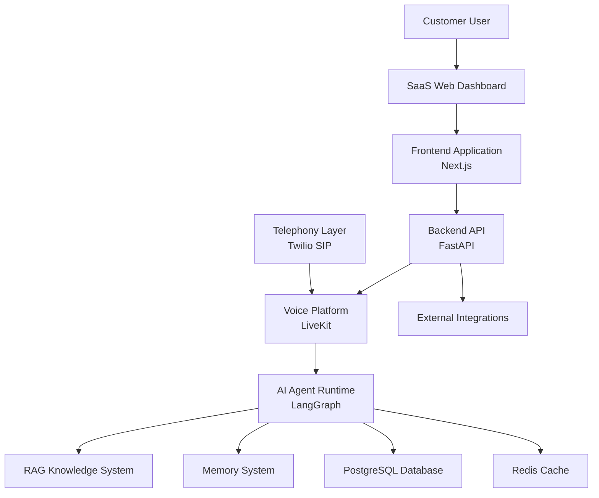
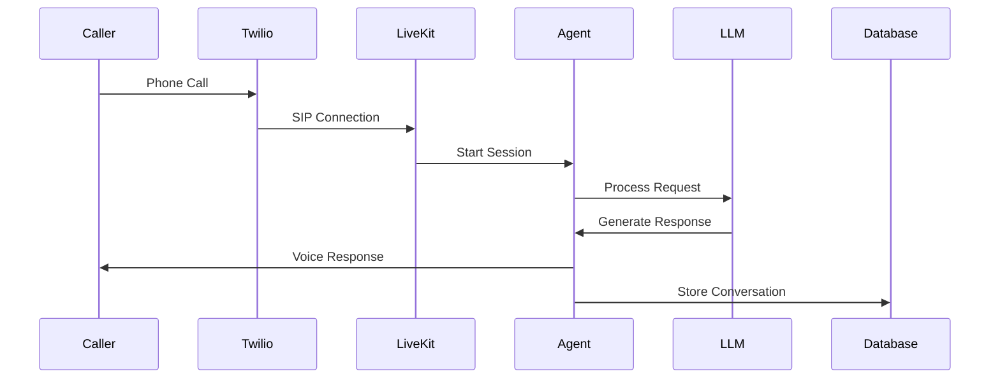
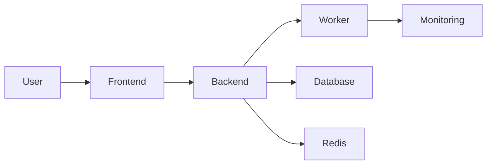

# System Overview

**Document Version:** 1.0
**Project:** AI Voice Agent SaaS Platform
**Status:** Draft
**Last Updated:** 2026-07-23

---

# 1. Overview

The AI Voice Agent SaaS Platform is a multi-tenant cloud platform that enables businesses to deploy intelligent voice agents capable of handling inbound and outbound phone conversations.

The platform combines:

* Telephony infrastructure
* Real-time voice processing
* Large Language Models (LLMs)
* Retrieval-Augmented Generation (RAG)
* Agent workflows
* Memory systems
* Business integrations
* Analytics and monitoring

The system allows customers to create, configure, deploy, and manage AI voice agents for different business use cases.

Examples:

* Receptionist Agent
* Sales Agent
* Appointment Booking Agent
* Customer Support Agent
* Medical Assistant Agent
* Lead Qualification Agent

---

# 2. System Goals

The primary goals of the platform are:

## 2.1 AI-Powered Communication

Provide natural voice conversations between customers and AI agents.

Capabilities:

* Speech recognition
* Natural language understanding
* Context-aware responses
* Voice synthesis
* Real-time conversation handling

---

## 2.2 Multi-Tenant SaaS Architecture

Support multiple organizations on a single platform while maintaining:

* Data isolation
* Security boundaries
* Independent configurations
* Separate billing
* Individual analytics

---

## 2.3 Production Voice Infrastructure

Provide reliable phone communication through:

* PSTN connectivity
* SIP infrastructure
* Call routing
* Recording
* Transcription
* Monitoring

---

# 3. High-Level Architecture

The platform consists of the following major layers:



---

# 4. Core System Components

---

# 4.1 SaaS Web Dashboard

## Purpose

Provides the customer administration interface.

Responsibilities:

* Account management
* Agent creation
* Agent configuration
* Knowledge upload
* Call analytics
* Billing management
* User management

Technology:

* Next.js
* React
* Tailwind CSS
* shadcn/ui

---

# 4.2 Frontend Application

## Purpose

Customer-facing web application.

Responsibilities:

* Authentication UI
* Dashboard rendering
* API communication
* Real-time status updates

Communication:

```
Frontend
    |
    |
REST API
    |
    |
FastAPI Backend
```

---

# 4.3 Backend API Platform

## Purpose

Central application backend.

Technology:

* Python
* FastAPI
* PostgreSQL
* Redis

Responsibilities:

* Authentication
* Tenant management
* Agent configuration
* API services
* Business logic
* Security enforcement

---

# 4.4 Voice Agent Platform

## Purpose

Handles real-time voice communication.

Technology:

* LiveKit
* SIP
* WebRTC

Responsibilities:

* Voice rooms
* Audio streaming
* Agent sessions
* Call lifecycle management

---

# 4.5 Telephony Layer

## Purpose

Connects external phone networks.

Technology:

* Twilio SIP Trunking

Responsibilities:

* Incoming calls
* Outgoing calls
* Phone number management
* SIP routing
* Call metadata

---

# 4.6 AI Agent Runtime

## Purpose

Runs intelligent conversational agents.

Technology:

* LangGraph
* LangChain
* OpenAI Models

Responsibilities:

* Conversation state
* Agent reasoning
* Tool execution
* Workflow control
* Decision making

---

# 4.7 RAG Knowledge System

## Purpose

Provides agents with company-specific knowledge.

Capabilities:

* Document ingestion
* Chunking
* Embeddings
* Vector search
* Context retrieval

Technology:

* LangChain
* PostgreSQL pgvector

Examples:

Knowledge sources:

* PDFs
* Websites
* FAQs
* Manuals
* Company documents

---

# 4.8 Memory System

## Purpose

Maintains conversation context.

Memory types:

## Short-Term Memory

Stores:

* Current conversation state
* Active call context

Technology:

* Redis

## Long-Term Memory

Stores:

* Customer history
* Previous interactions
* Preferences

Technology:

* PostgreSQL

---

# 4.9 Database Layer

## Primary Database

Technology:

* PostgreSQL

Stores:

* Organizations
* Users
* Agents
* Conversations
* Calls
* Knowledge data
* Analytics

## Vector Database

Technology:

* PostgreSQL pgvector

Stores:

* Document embeddings
* Semantic search data

---

# 4.10 Cache Layer

Technology:

* Redis

Responsibilities:

* Session state
* Temporary memory
* Rate limiting
* Real-time events
* Background jobs

---

# 4.11 External Integrations

Examples:

* CRM systems
* Calendar systems
* Payment providers
* Business software
* Webhooks

---

# 5. Request Flow

## Incoming Call Flow



---

# 6. Security Architecture

The platform implements:

## Authentication

* User authentication
* API tokens
* Session management

---

## Authorization

Controls:

* Organization access
* Agent ownership
* Resource permissions

---

## Tenant Isolation

Every business object contains:

```
organization_id
```

to ensure data separation.

---

## Data Protection

Security controls:

* Encryption in transit
* Encryption at rest
* Secret management
* Audit logging

---

# 7. Deployment Architecture

Production deployment includes:



---

# 8. Technology Stack

| Layer           | Technology       |
| --------------- | ---------------- |
| Frontend        | Next.js          |
| UI              | React + Tailwind |
| Backend         | FastAPI          |
| Language        | Python           |
| Database        | PostgreSQL       |
| Vector Search   | pgvector         |
| Cache           | Redis            |
| Voice           | LiveKit          |
| Telephony       | Twilio SIP       |
| Agent Framework | LangGraph        |
| RAG             | LangChain        |
| AI Models       | OpenAI           |

---

# 9. Future Expansion

Planned capabilities:

* Voice analytics
* Agent marketplace
* More LLM providers
* Automated workflow builder
* Advanced CRM integrations
* Enterprise deployment options

---

# 10. Related Documents

| Document           | Location                 |
| ------------------ | ------------------------ |
| Agent Architecture | 01_System_Architecture   |
| Database Design    | 29_Database_Schema       |
| API Specifications | 30_OpenAPI_Specs         |
| Deployment         | 32_Deployment_Configs    |
| Security           | 40_Security_Threat_Model |

---

# 11. Conclusion

The AI Voice Agent SaaS Platform is designed as a scalable, production-grade architecture combining telephony, AI agents, RAG, memory, and SaaS infrastructure.

The architecture supports both small businesses and enterprise deployments while maintaining flexibility, security, and operational reliability.

---

**End of Document**
