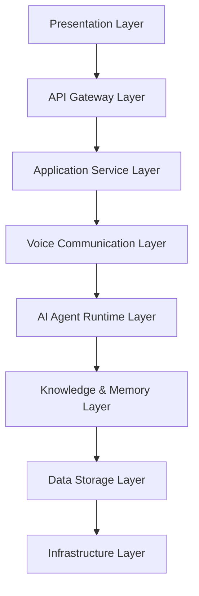
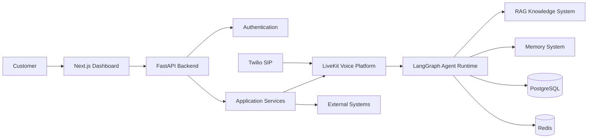

# High Level Architecture

**Document Version:** 1.0
**Project:** AI Voice Agent SaaS Platform
**Status:** Draft
**Last Updated:** 2026-07-23

---

# 1. Overview

This document describes the high-level architecture of the AI Voice Agent SaaS Platform.

The architecture defines how major platform components interact:

* Customer applications
* API services
* Voice infrastructure
* AI agent runtime
* Knowledge systems
* Data storage
* External integrations

The objective is to provide a scalable foundation for a production-grade multi-tenant voice AI platform.

---

# 2. Architecture Principles

The platform follows these architectural principles:

---

## 2.1 Separation of Responsibilities

Each subsystem has a clear responsibility.

Example:

```
Frontend
    |
User Interface

Backend API
    |
Business Logic

Voice Runtime
    |
Real-Time Communication

Agent Runtime
    |
AI Decision Making

Database
    |
Persistent Storage
```

---

## 2.2 Event Driven Design

The platform uses events for asynchronous operations.

Examples:

* Call started
* Call ended
* Agent assigned
* Document uploaded
* Knowledge indexed
* Workflow completed

---

## 2.3 API First Architecture

All major capabilities are exposed through APIs.

Benefits:

* Frontend independence
* External integrations
* Mobile application support
* Partner ecosystem

---

## 2.4 Cloud Native Design

The platform is designed for:

* Container deployment
* Horizontal scaling
* Service isolation
* Automated deployment

---

# 3. System Architecture Layers

The platform consists of eight primary layers.



---

# 4. Layer 1: Presentation Layer

## Purpose

Provides interfaces for users and administrators.

Components:

* Web Dashboard
* Agent Builder UI
* Analytics Dashboard
* Configuration Panels

Technology:

* Next.js
* React
* Tailwind CSS
* shadcn/ui

---

## Responsibilities

The presentation layer manages:

* User interaction
* Form validation
* Dashboard visualization
* Real-time updates

It does not contain:

* Business rules
* AI logic
* Database operations

---

# 5. Layer 2: API Gateway Layer

## Purpose

Provides a secure entry point into backend services.

Technology:

* FastAPI

Responsibilities:

* Request routing
* Authentication
* Authorization
* Rate limiting
* Request validation
* API versioning

---

## API Structure

Example:

```
/api/v1/

├── auth

├── organizations

├── users

├── agents

├── calls

├── knowledge

├── integrations

└── analytics
```

---

# 6. Layer 3: Application Service Layer

## Purpose

Contains the core business logic.

Services include:

---

## Identity Service

Handles:

* Users
* Roles
* Permissions
* Sessions

---

## Tenant Service

Handles:

* Organizations
* Subscription plans
* Tenant isolation

---

## Agent Management Service

Handles:

* Agent creation
* Agent configuration
* Agent deployment

---

## Call Management Service

Handles:

* Call lifecycle
* Call records
* Call history

---

## Workflow Service

Handles:

* Business processes
* Agent workflows
* Automation rules

---

# 7. Layer 4: Voice Communication Layer

## Purpose

Provides real-time audio communication.

Components:

```
Caller

↓

Twilio SIP

↓

LiveKit

↓

Voice Agent Worker
```

---

## Responsibilities

* Receive calls
* Create sessions
* Stream audio
* Manage participants
* Handle transfers

---

# 8. Layer 5: AI Agent Runtime Layer

## Purpose

Controls intelligent agent behavior.

Technology:

* LangGraph
* LangChain
* OpenAI Models

---

## Responsibilities

The agent runtime manages:

* Conversation state
* Reasoning
* Tool execution
* Memory retrieval
* Workflow execution

---

## Agent Runtime Components

```
Agent Runtime

├── State Manager

├── Planner

├── Tool Executor

├── Memory Manager

├── RAG Retriever

└── Response Generator
```

---

# 9. Layer 6: Knowledge & Memory Layer

## Purpose

Provides context and intelligence.

---

# Knowledge System

Technology:

* LangChain
* PostgreSQL pgvector

Responsibilities:

* Document processing
* Embedding generation
* Semantic search
* Context retrieval

---

# Memory System

Two levels:

## Short-Term Memory

Storage:

Redis

Contains:

* Current conversation state
* Active session information

## Long-Term Memory

Storage:

PostgreSQL

Contains:

* Customer history
* Previous conversations
* Preferences

---

# 10. Layer 7: Data Storage Layer

## Primary Database

Technology:

PostgreSQL

Stores:

```
Organizations

Users

Agents

Calls

Conversations

Messages

Knowledge Documents

Configurations
```

---

## Vector Storage

Technology:

PostgreSQL + pgvector

Stores:

```
Documents

Chunks

Embeddings

Metadata
```

---

## Cache Storage

Technology:

Redis

Stores:

```
Sessions

Temporary State

Queues

Rate Limits
```

---

# 11. Layer 8: Infrastructure Layer

Responsible for running the platform.

Components:

* Docker
* Kubernetes
* Cloud Infrastructure
* CI/CD Pipeline
* Monitoring

---

# 12. Complete Architecture Diagram



---

# 13. Scalability Strategy

The architecture supports scaling through:

## Horizontal Scaling

Multiple instances of:

* API servers
* Agent workers
* Background workers

## Database Scaling

Options:

* Read replicas
* Partitioning
* Connection pooling

## Voice Scaling

Multiple LiveKit workers can process simultaneous calls.

---

# 14. Reliability Design

The platform includes:

* Health checks
* Retry mechanisms
* Circuit breakers
* Logging
* Monitoring
* Alerting

---

# 15. Observability

The system tracks:

## Application Metrics

* API latency
* Error rate
* Request volume

## Voice Metrics

* Call duration
* Audio quality
* Agent response time

## AI Metrics

* Token usage
* Model latency
* Tool execution time

---

# 16. Related Documents

| Document                     | Purpose                      |
| ---------------------------- | ---------------------------- |
| 01_System_Overview.md        | Complete system introduction |
| 03_Component_Architecture.md | Detailed component design    |
| 04_Data_Flow.md              | System communication flows   |
| 29_Database_Schema           | Database implementation      |
| 30_OpenAPI_Specs             | API definitions              |

---

# 17. Conclusion

The high-level architecture provides a scalable foundation for a SaaS voice AI platform.

The design separates responsibilities between user interfaces, APIs, communication infrastructure, AI reasoning, knowledge systems, and storage layers.

This separation enables future expansion while maintaining reliability and operational simplicity.

---

**End of Document**
