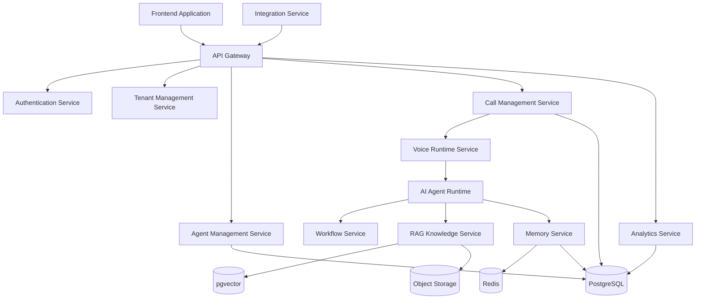
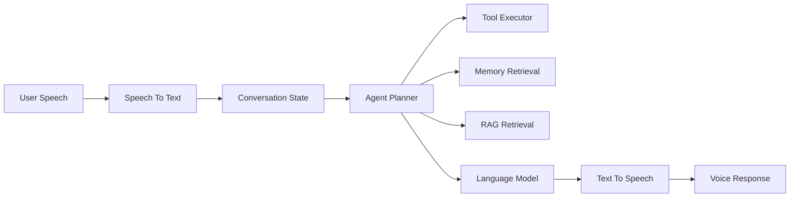

# Component Architecture

**Document Version:** 1.0
**Project:** AI Voice Agent SaaS Platform
**Status:** Draft
**Last Updated:** 2026-07-23

---

# 1. Overview

This document describes the detailed component architecture of the AI Voice Agent SaaS Platform.

The purpose is to define:

* Major software components
* Component responsibilities
* Internal communication
* Dependencies
* Deployment boundaries

The architecture follows a modular service-oriented approach where each component has a clearly defined responsibility.

---

# 2. Component Architecture Principles

## 2.1 Single Responsibility

Each component should have one primary purpose.

Example:

```text
Call Service

Responsible:
- Call lifecycle
- Call metadata
- Call status

Not responsible:
- AI reasoning
- User interface
- Document processing
```

---

## 2.2 Loose Coupling

Components communicate through:

* REST APIs
* Events
* Message queues
* Internal interfaces

Components should not directly depend on internal implementation details.

---

## 2.3 Independent Scaling

Components should be independently scalable.

Example:

```text
API Servers

Scale:
100 instances


Voice Workers

Scale:
500 workers
```

---

# 3. Complete Component Map



---

# 4. Frontend Application Component

## Purpose

Customer-facing interface for managing the platform.

---

## Technology

* Next.js
* React
* TypeScript
* Tailwind CSS
* shadcn/ui

---

## Responsibilities

Handles:

* User interface
* Dashboard rendering
* Agent configuration
* Knowledge uploads
* Analytics visualization

---

## Communication

```text
Frontend

↓

REST API

↓

FastAPI Backend
```

---

# 5. API Gateway Component

## Purpose

Central entry point for all application requests.

---

## Technology

* FastAPI

---

## Responsibilities

* Route requests
* Validate input
* Authenticate users
* Apply authorization
* Return responses

---

## Cross-Cutting Features

Includes:

* Request ID tracking
* Correlation IDs
* Logging
* Rate limiting

---

# 6. Authentication Service

## Purpose

Manages user identity and access.

---

## Responsibilities

* User registration
* Login
* Token generation
* Session management
* Password security

---

## Security Controls

* JWT tokens
* Refresh tokens
* Role-based access control

---

# 7. Tenant Management Service

## Purpose

Controls multi-tenant SaaS functionality.

---

## Responsibilities

Manages:

* Organizations
* Subscriptions
* Tenant settings
* Resource ownership

---

## Tenant Isolation

Every tenant-owned record includes:

```sql
organization_id
```

Example:

```text
Organization A

Users
Agents
Calls
Knowledge


Organization B

Users
Agents
Calls
Knowledge
```

Data must never cross tenant boundaries.

---

# 8. Agent Management Service

## Purpose

Creates and manages AI agents.

---

## Responsibilities

Agent configuration:

* Agent name
* Voice selection
* Personality
* Instructions
* Tools
* Knowledge sources
* Workflows

---

## Example Agent

```json
{
 "name": "Front Desk Agent",
 "purpose": "Appointment Booking",
 "voice": "professional",
 "model": "GPT"
}
```

---

# 9. Call Management Service

## Purpose

Controls call lifecycle.

---

## Responsibilities

Tracks:

* Incoming calls
* Outgoing calls
* Call status
* Duration
* Recording information
* Transcripts

---

## Call States

```text
CREATED

↓

CONNECTING

↓

ACTIVE

↓

TRANSFERRED

↓

COMPLETED

↓

FAILED
```

---

# 10. Voice Runtime Service

## Purpose

Handles real-time audio communication.

---

## Technology

* LiveKit
* SIP
* WebRTC

---

## Responsibilities

* Audio streams
* Voice sessions
* Participant management
* Human transfer
* Call recording

---

## Communication Flow

```text
Caller

↓

Twilio SIP

↓

LiveKit Room

↓

Voice Agent Worker
```

---

# 11. AI Agent Runtime Component

## Purpose

Executes intelligent conversations.

---

## Technology

* LangGraph
* LangChain
* OpenAI Models

---

## Internal Components



---

# 12. Workflow Service

## Purpose

Controls business processes.

---

## Technology

* LangGraph
* n8n

---

## Examples

Appointment workflow:

```text
Customer Request

↓

Check Availability

↓

Reserve Slot

↓

Send Confirmation
```

---

# 13. RAG Knowledge Service

## Purpose

Provides company-specific knowledge.

---

## Responsibilities

Pipeline:

```text
Document Upload

↓

Text Extraction

↓

Chunking

↓

Embedding Generation

↓

Vector Storage

↓

Semantic Retrieval
```

---

## Storage

Uses:

* PostgreSQL
* pgvector
* Object Storage

---

# 14. Memory Service

## Purpose

Provides contextual memory.

---

## Short-Term Memory

Storage:

Redis

Used for:

* Active conversations
* Session state

---

## Long-Term Memory

Storage:

PostgreSQL

Used for:

* Customer history
* Previous interactions

---

# 15. Integration Service

## Purpose

Connects external business systems.

---

## Examples

* CRM
* Calendar
* Payment systems
* Helpdesk software

---

## Integration Methods

* REST APIs
* Webhooks
* OAuth

---

# 16. Analytics Service

## Purpose

Provides business intelligence.

---

## Tracks

## Call Analytics

* Number of calls
* Duration
* Resolution

## AI Analytics

* Response latency
* Token usage
* Agent performance

---

# 17. Data Ownership Matrix

| Component         | Owns Data                |
| ----------------- | ------------------------ |
| Authentication    | Users, sessions          |
| Tenant Service    | Organizations            |
| Agent Service     | Agent configurations     |
| Call Service      | Call records             |
| Voice Runtime     | Live sessions            |
| RAG Service       | Documents and embeddings |
| Memory Service    | Conversation memory      |
| Analytics Service | Metrics                  |

---

# 18. Deployment Components

Production deployment:

```text
Frontend Container

↓

API Container

↓

Worker Containers

↓

Database

↓

Cache

↓

Storage
```

---

# 19. Failure Isolation

The architecture prevents cascading failures.

Examples:

## Database Failure

Impact:

* New writes fail

Protection:

* Backups
* Replication

## AI Model Failure

Impact:

* Agent responses affected

Protection:

* Retry
* Fallback models

## Voice Worker Failure

Impact:

* Specific calls affected

Protection:

* Worker restart
* Load balancing

---

# 20. Related Documents

| Document                      | Purpose             |
| ----------------------------- | ------------------- |
| 01_System_Overview.md         | Platform overview   |
| 02_High_Level_Architecture.md | Layer architecture  |
| 04_Data_Flow.md               | Communication flows |
| 29_Database_Schema            | Database design     |
| 30_OpenAPI_Specs              | API contracts       |

---

# 21. Conclusion

The component architecture establishes clear ownership boundaries between platform capabilities.

This modular design enables:

* Independent development
* Easier testing
* Better scalability
* Improved reliability
* Faster future expansion

---

**End of Document**
