# Data Flow Architecture

**Document Version:** 1.0
**Project:** AI Voice Agent SaaS Platform
**Status:** Draft
**Last Updated:** 2026-07-23

---

# 1. Overview

This document describes how data moves through the AI Voice Agent SaaS Platform.

It explains:

* User request flow
* Voice call flow
* AI processing flow
* Knowledge retrieval flow
* Memory flow
* Database persistence flow
* External integration flow

Understanding data movement is critical for:

* System debugging
* Performance optimization
* Security reviews
* Scaling decisions

---

# 2. Data Flow Principles

## 2.1 Clear Data Ownership

Each component owns its data domain.

Example:

```text
Agent Service

Owns:
- Agent configuration
- Agent settings


Call Service

Owns:
- Call records
- Call lifecycle
```

---

## 2.2 Event Driven Communication

Real-time and asynchronous operations use events.

Examples:

```text
Call Started Event

Document Uploaded Event

Agent Updated Event

Conversation Completed Event
```

---

## 2.3 Persistent vs Temporary Data

## Persistent Data

Stored permanently:

* Users
* Organizations
* Agents
* Calls
* Conversations
* Documents

Storage:

* PostgreSQL
* Object Storage

---

## Temporary Data

Short-lived:

* Active sessions
* Real-time state
* Queues

Storage:

* Redis

---

# 3. Complete Platform Data Flow

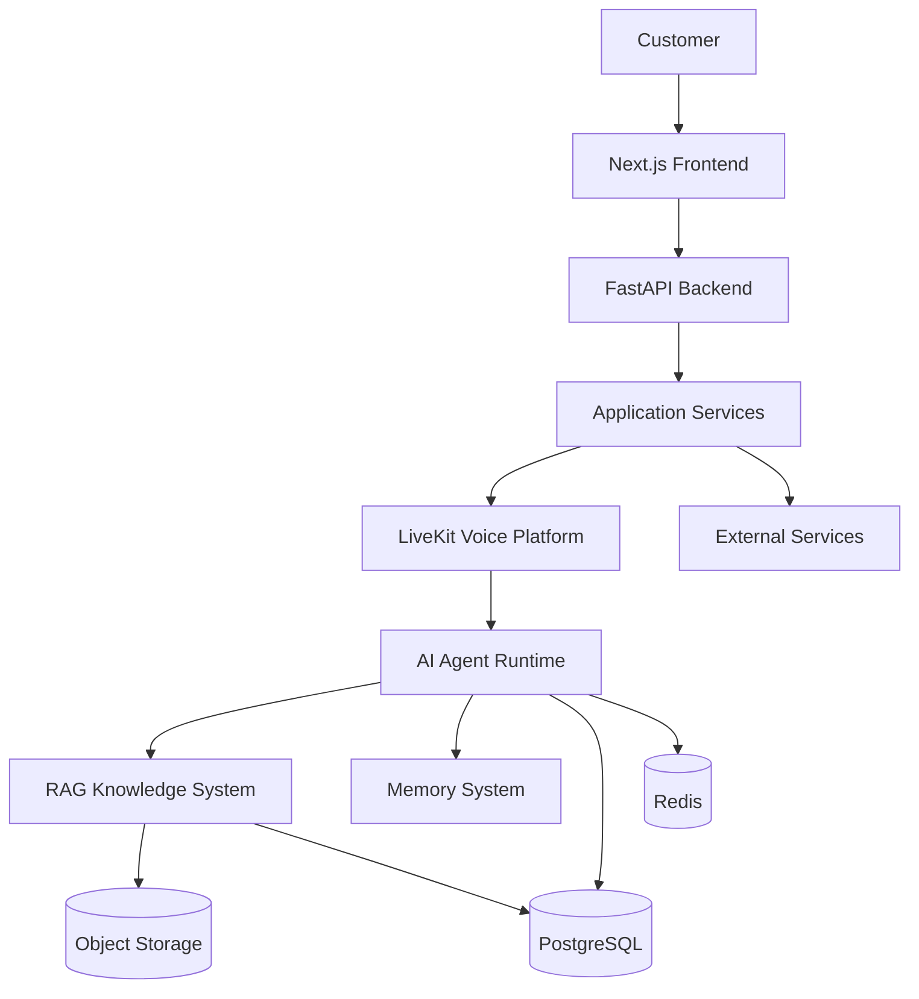

---

# 4. User Configuration Data Flow

## Scenario

Customer creates a new AI voice agent.

---

## Flow

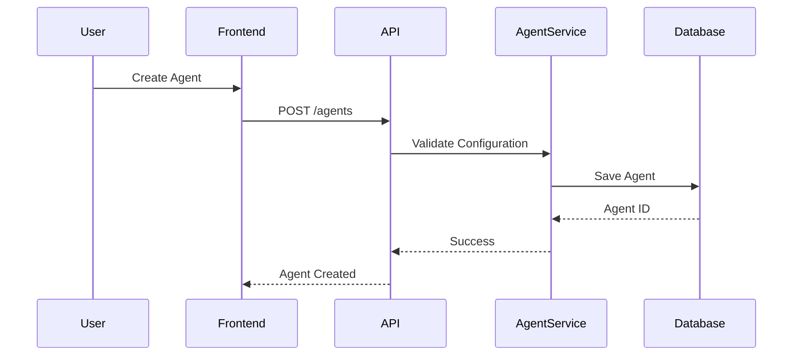

---

## Data Stored

Agent configuration includes:

```json
{
"name":"Sales Agent",
"voice":"professional",
"model":"GPT",
"instructions":"Handle sales inquiries"
}
```

---

# 5. Incoming Voice Call Data Flow

## Scenario

A customer calls a business phone number.

---

## Complete Flow

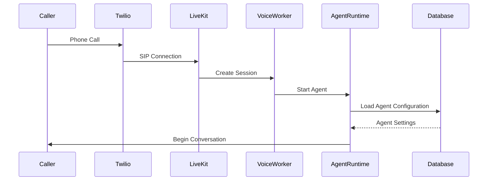

---

# 6. Real-Time Conversation Data Flow

During an active call:

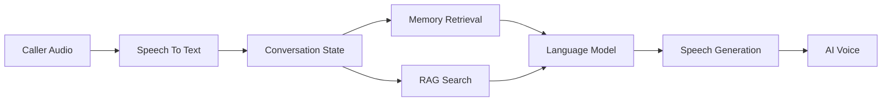

---

# 7. Speech Processing Flow

## Input Pipeline

```text
Caller Voice

↓

Audio Stream

↓

Speech Recognition

↓

Text

↓

AI Processing
```

---

## Output Pipeline

```text
AI Response

↓

Text

↓

Text To Speech

↓

Audio Stream

↓

Caller
```

---

# 8. Agent Decision Flow

The AI agent processes every user message:

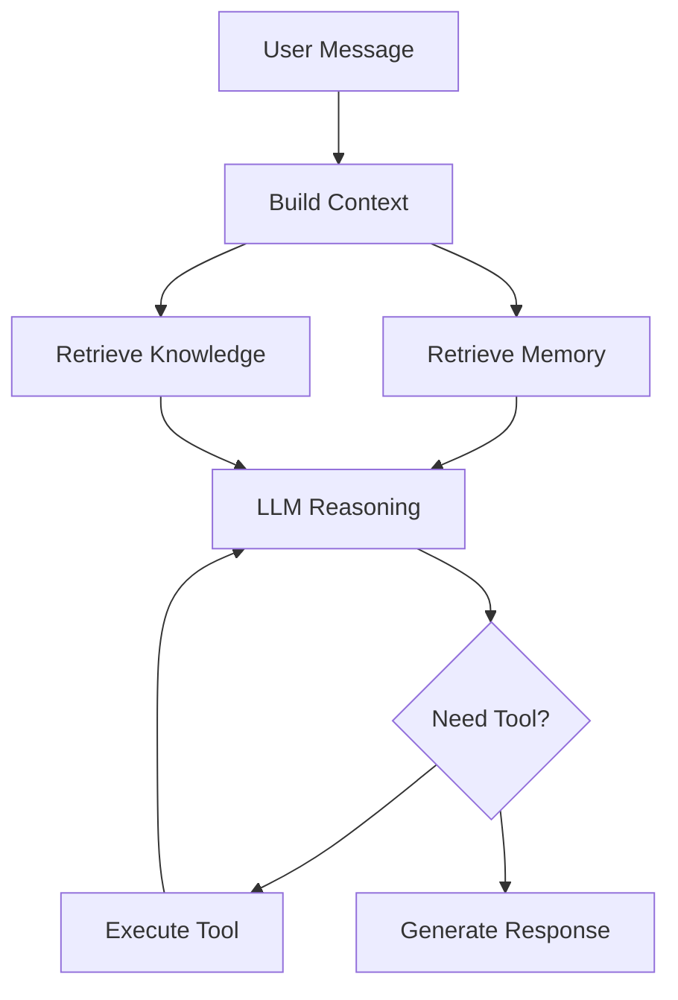

---

# 9. RAG Knowledge Data Flow

## Document Ingestion

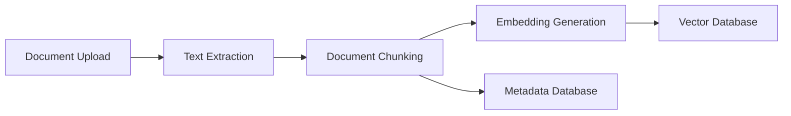

---

## Retrieval Flow

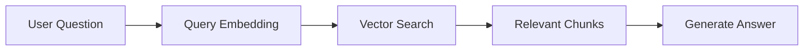

---

# 10. Memory Data Flow

## Short-Term Memory

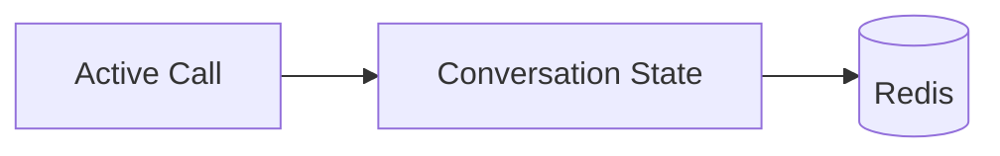

Used for:

* Current conversation
* Agent state
* Session information

---

## Long-Term Memory

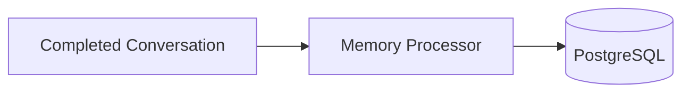

Stores:

* Customer history
* Preferences
* Previous interactions

---

# 11. Call Completion Data Flow

When a call ends:

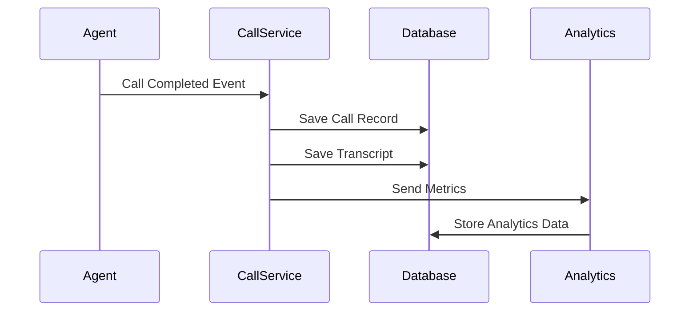

---

# 12. External Integration Data Flow

Examples:

* CRM update
* Calendar booking
* Ticket creation

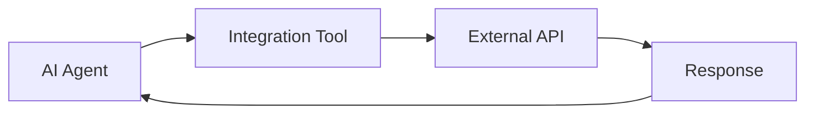

---

# 13. Security Data Flow Controls

All data flows enforce:

## Authentication

Verify identity.

---

## Authorization

Verify permissions.

---

## Tenant Filtering

Every query includes:

```sql
organization_id
```

---

## Encryption

Protected communication:

```text
Client

↓

HTTPS/TLS

↓

Backend
```

---

# 14. Event Flow Architecture

Important platform events:

```text
Agent.Created

Agent.Updated

Call.Started

Call.Completed

Message.Created

Document.Uploaded

Knowledge.Indexed

Workflow.Completed
```

---

# 15. Monitoring Data Flow

System metrics flow through:

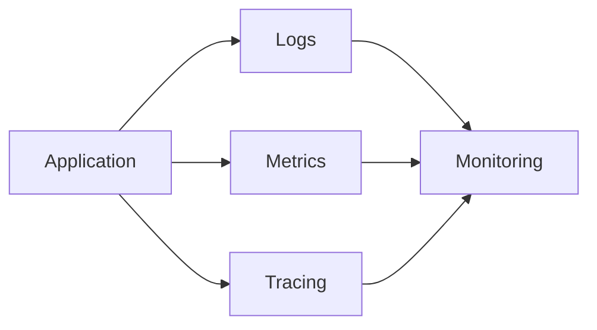

---

# 16. Performance Considerations

Optimization areas:

## Voice Latency

Target:

* Low audio delay
* Fast model response

## Database

Use:

* Indexing
* Connection pooling
* Query optimization

## AI Processing

Optimize:

* Prompt size
* Retrieval quality
* Model selection

---

# 17. Related Documents

| Document                     | Purpose                 |
| ---------------------------- | ----------------------- |
| 03_Component_Architecture.md | Components              |
| 05_Sequence_Diagrams.md      | Detailed interactions   |
| 29_Database_Schema           | Database implementation |
| 30_OpenAPI_Specs             | API contracts           |
| 37_Observability             | Monitoring              |

---

# 18. Conclusion

The data flow architecture defines how information travels across the AI Voice Agent SaaS Platform.

This design ensures:

* Predictable communication
* Clear ownership
* Secure data handling
* Efficient scaling
* Easier troubleshooting

---

**End of Document**
