# Sequence Diagrams

**Document Version:** 1.0
**Project:** AI Voice Agent SaaS Platform
**Status:** Draft
**Last Updated:** 2026-07-23

---

# 1. Overview

This document defines the major system interaction sequences inside the AI Voice Agent SaaS Platform.

Sequence diagrams describe:

* Component communication order
* API interactions
* Event flow
* Voice processing lifecycle
* AI reasoning lifecycle
* External integrations

These diagrams are used for:

* Development planning
* Architecture reviews
* Debugging
* Implementation reference

---

# 2. Core System Actors

The main actors in the platform are:

| Actor            | Responsibility                   |
| ---------------- | -------------------------------- |
| Customer         | Business user managing agents    |
| Caller           | Person interacting with AI agent |
| Frontend         | Web dashboard                    |
| Backend API      | Application control layer        |
| LiveKit          | Real-time voice infrastructure   |
| Twilio           | Telephony provider               |
| Agent Runtime    | AI conversation engine           |
| PostgreSQL       | Persistent storage               |
| Redis            | Real-time state storage          |
| External Systems | Third-party services             |

---

# 3. User Authentication Flow

## Scenario

A customer logs into the SaaS dashboard.

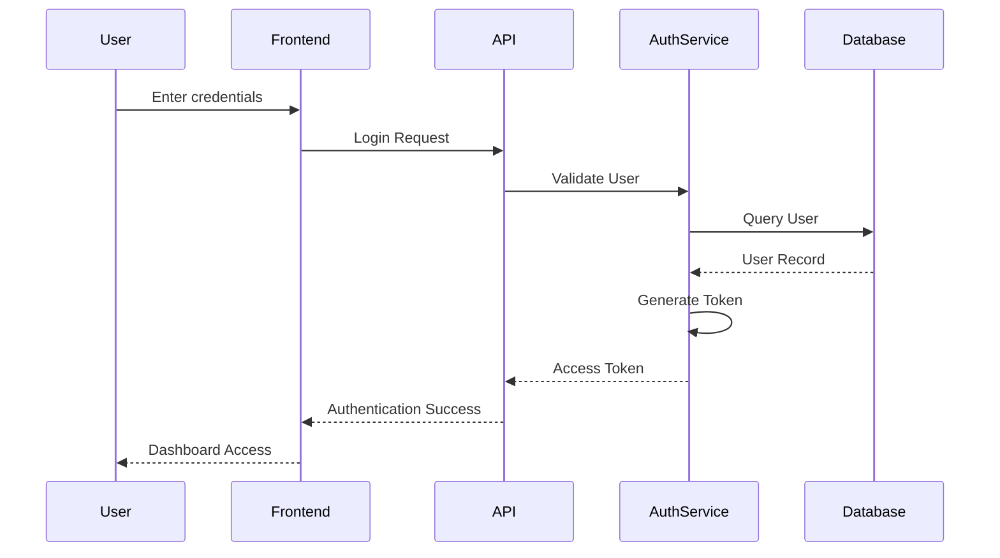

---

# 4. Organization Creation Flow

## Scenario

A new business creates a SaaS account.

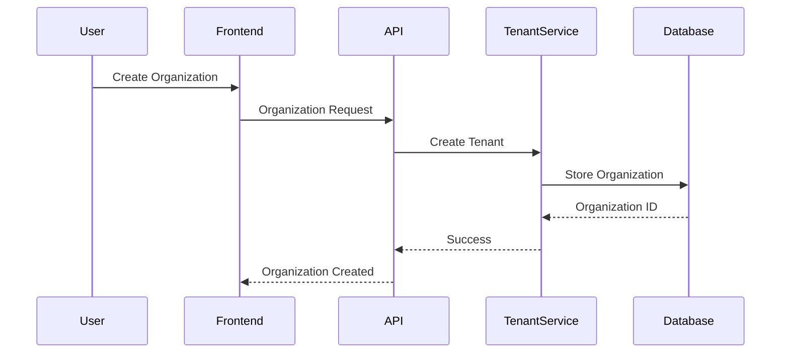

---

# 5. AI Agent Creation Flow

## Scenario

A customer creates a new voice agent.

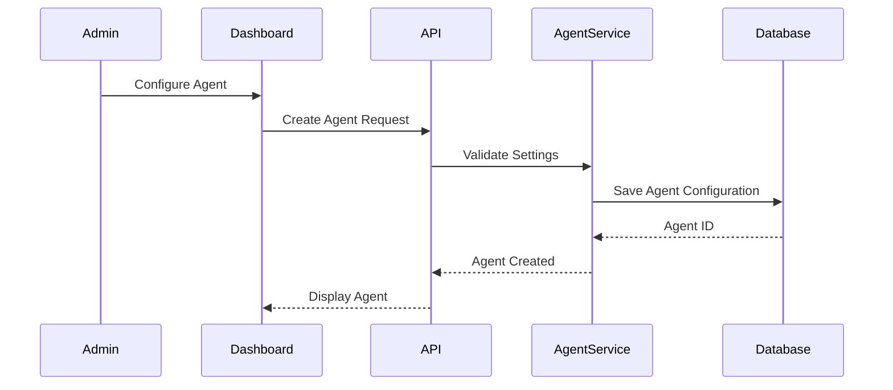

---

# 6. Knowledge Upload and Indexing Flow

## Scenario

A customer uploads company documents.

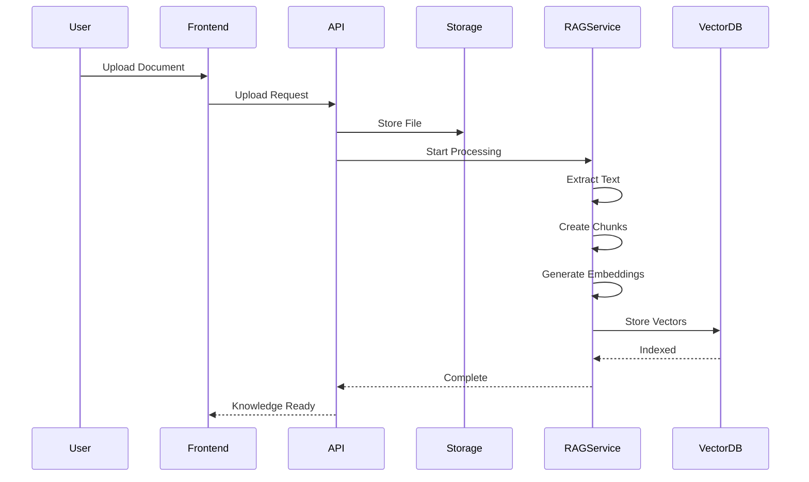

---

# 7. Incoming Phone Call Flow

## Scenario

A customer calls the business phone number.

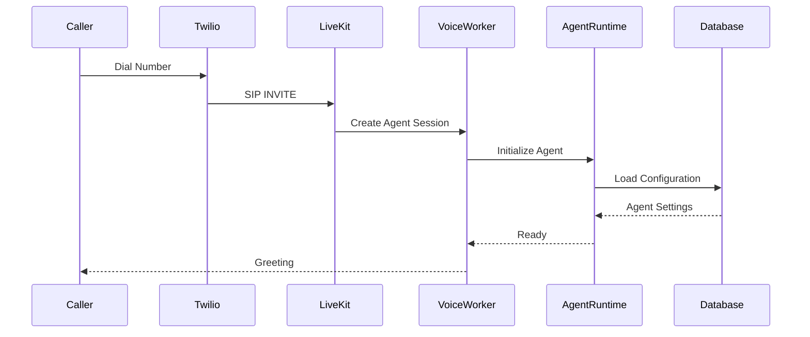

---

# 8. Real-Time Conversation Flow

## Scenario

Caller asks a question.

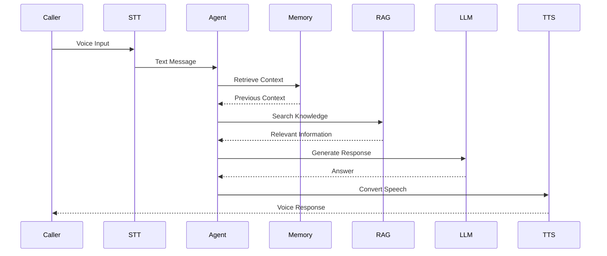

---

# 9. Tool Execution Flow

## Scenario

The AI agent needs external information.

Example:

* Booking appointment
* Checking CRM
* Creating ticket

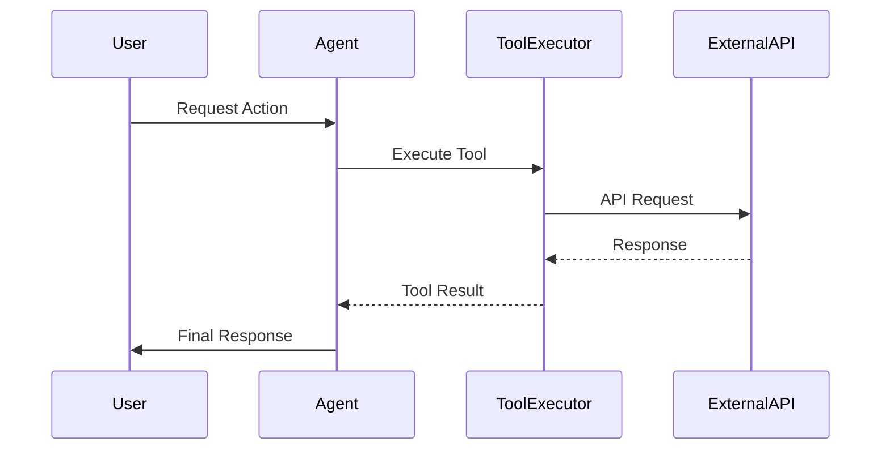

---

# 10. Human Transfer Flow

## Scenario

AI transfers conversation to a human.

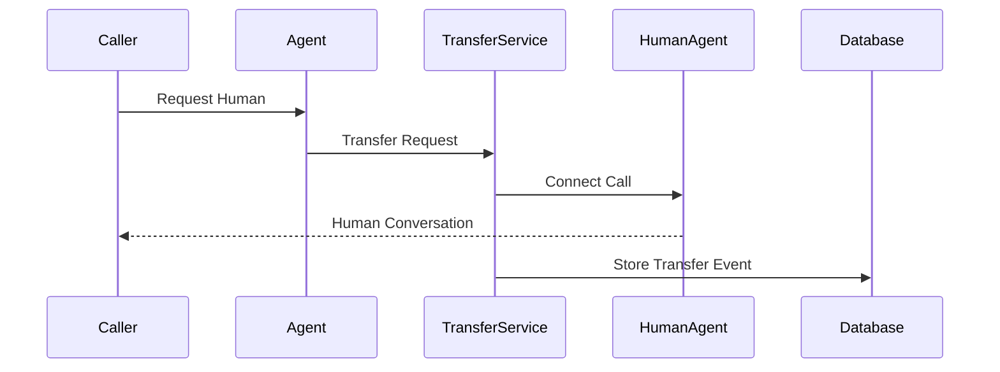

---

# 11. Outbound Campaign Call Flow

## Scenario

System calls customers from a campaign list.

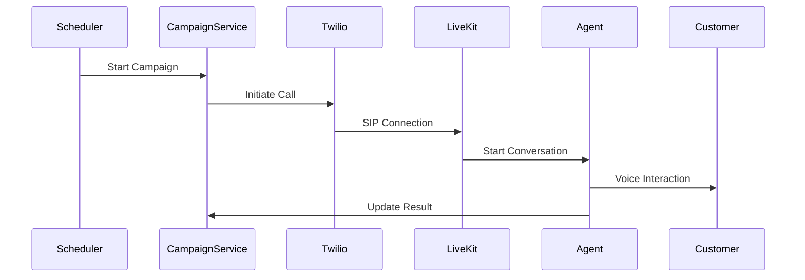

---

# 12. Call Completion Flow

## Scenario

Call finishes and data is stored.

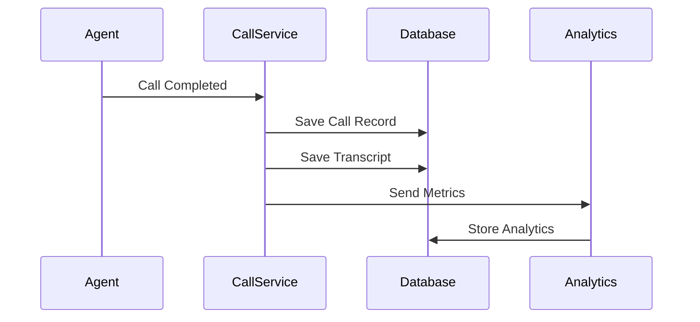

---

# 13. Event Processing Flow

## Scenario

Background events are processed asynchronously.

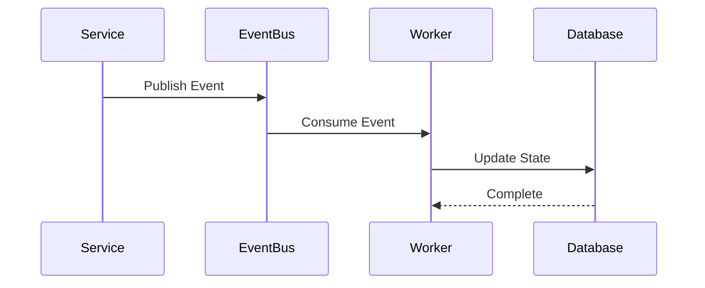

---

# 14. Complete Voice AI Pipeline

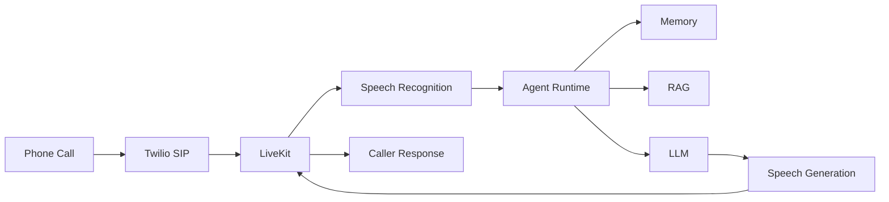

---

# 15. Error Handling Sequence

## Example: AI Model Failure

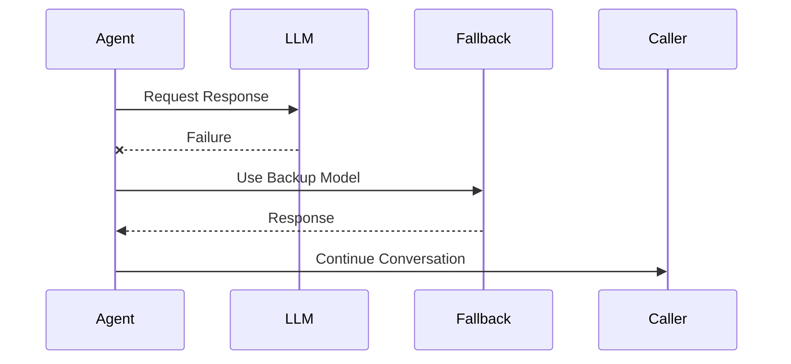

---

# 16. Security Validation Flow

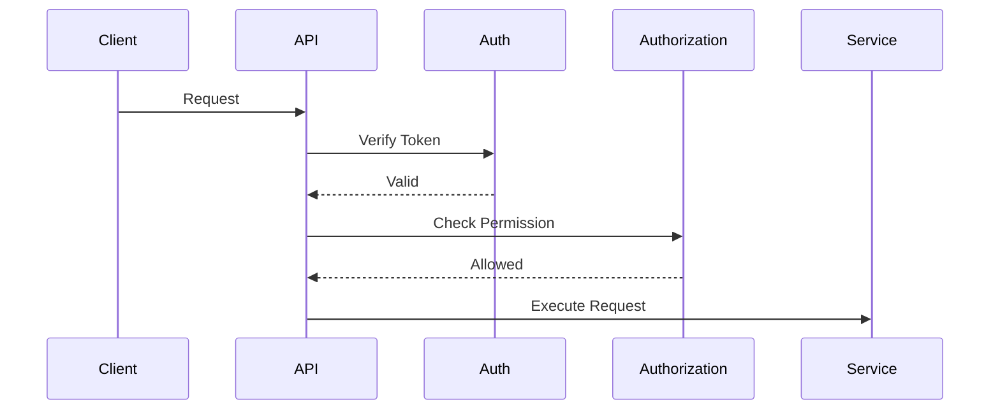

---

# 17. Related Documents

| Document                      | Purpose             |
| ----------------------------- | ------------------- |
| 01_System_Overview.md         | System introduction |
| 02_High_Level_Architecture.md | Architecture layers |
| 03_Component_Architecture.md  | Components          |
| 04_Data_Flow.md               | Data movement       |
| 29_Database_Schema            | Database design     |
| 30_OpenAPI_Specs              | API contracts       |

---

# 18. Conclusion

The sequence diagrams define the runtime behavior of the AI Voice Agent SaaS Platform.

They provide a blueprint for implementing:

* Voice communication
* AI reasoning
* Knowledge retrieval
* Memory handling
* Workflow execution
* External integrations

---

**End of Document**
