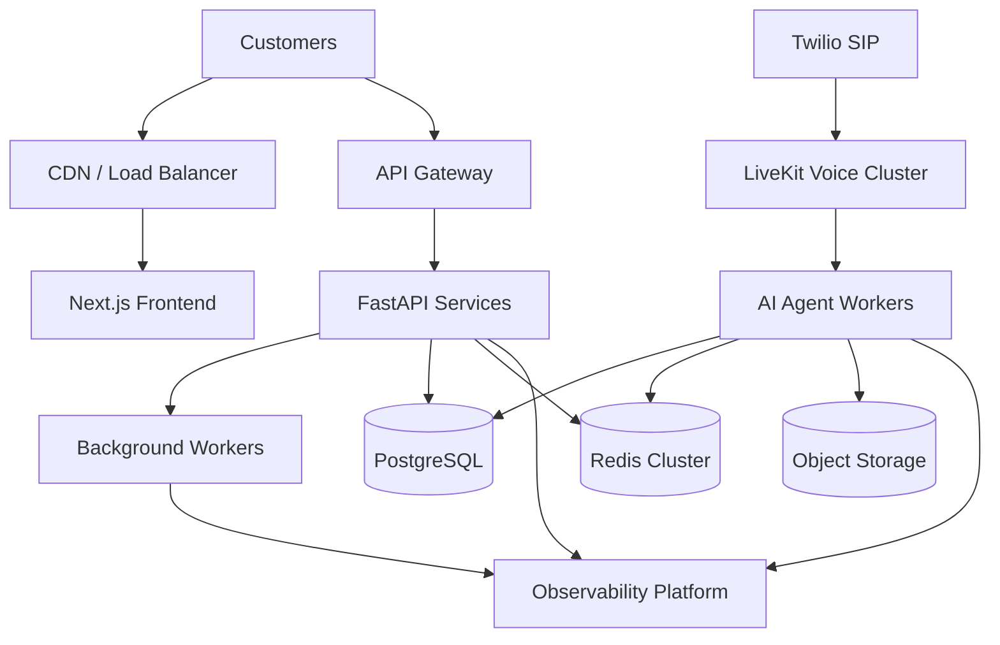
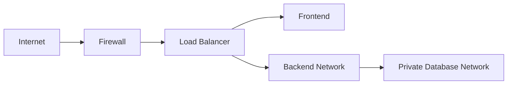
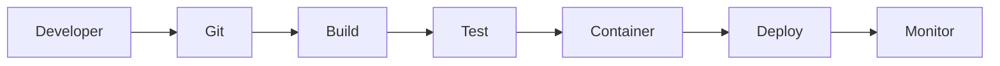

# Deployment Architecture

**Document Version:** 1.0
**Project:** AI Voice Agent SaaS Platform
**Status:** Draft
**Last Updated:** 2026-07-23

---

# 1. Overview

This document describes the deployment architecture of the AI Voice Agent SaaS Platform.

It defines:

* Runtime environments
* Infrastructure components
* Container architecture
* Cloud deployment model
* Network architecture
* Scaling strategy
* High availability approach

The deployment architecture is designed to support:

* Development environments
* Staging environments
* Production environments
* Multi-tenant SaaS workloads

---

# 2. Deployment Goals

The deployment platform must provide:

## Reliability

* Fault tolerance
* Automatic recovery
* Health monitoring

---

## Scalability

Support growth in:

* Number of customers
* Concurrent calls
* AI agent workers
* API traffic

---

## Security

Provide:

* Network isolation
* Secret management
* Access control
* Encryption

---

## Maintainability

Enable:

* Automated deployments
* Version control
* Monitoring
* Rollbacks

---

# 3. Deployment Environments

The platform uses three primary environments.

---

# 3.1 Development Environment

Purpose:

Local engineering development.

Components:

```text
Developer Machine

├── Frontend

├── Backend API

├── LiveKit Server

├── PostgreSQL

├── Redis

└── Agent Worker
```

Technology:

* Docker Compose
* Local databases
* Development API keys

---

# 3.2 Staging Environment

Purpose:

Production-like testing.

Used for:

* Integration testing
* QA testing
* Performance testing

Architecture:

```text
Cloud Environment

├── Frontend Service

├── Backend Services

├── Agent Workers

├── PostgreSQL

├── Redis

└── Monitoring
```

---

# 3.3 Production Environment

Purpose:

Customer-facing SaaS deployment.

Requirements:

* High availability
* Monitoring
* Backups
* Auto scaling

---

# 4. Production Deployment Architecture



---

# 5. Container Architecture

Each major service runs as an isolated container.

```text
containers/

├── frontend

├── api

├── agent-worker

├── workflow-worker

├── ingestion-worker

├── postgres

├── redis

└── livekit
```

---

# 6. Frontend Deployment

## Technology

* Next.js
* React
* TypeScript

---

## Responsibilities

Provides:

* Dashboard
* Agent configuration
* Analytics UI
* Customer portal

---

## Deployment Options

Can run on:

* Kubernetes
* Cloud hosting platform
* Container infrastructure

---

# 7. Backend Deployment

## Technology

* Python
* FastAPI
* Uvicorn/Gunicorn

---

## Services

Recommended separation:

```text
backend/

├── auth-service

├── tenant-service

├── agent-service

├── call-service

├── workflow-service

├── analytics-service

└── integration-service
```

---

# 8. Voice Infrastructure Deployment

## Components

```text
Caller

↓

PSTN Network

↓

Twilio SIP

↓

LiveKit

↓

Voice Agent Worker
```

---

## LiveKit Responsibilities

Handles:

* WebRTC sessions
* SIP connections
* Audio routing
* Participant management

---

# 9. AI Agent Worker Deployment

## Purpose

Runs real-time AI conversations.

---

## Worker Responsibilities

* Speech processing
* Agent execution
* Tool calling
* Memory retrieval
* Response generation

---

## Scaling Model

Example:

```text
Low Traffic

5 Workers


Medium Traffic

50 Workers


High Traffic

500+ Workers
```

---

# 10. Database Deployment

## PostgreSQL

Primary storage system.

Stores:

* Users
* Organizations
* Agents
* Calls
* Conversations
* Knowledge metadata

---

## Production Features

Required:

* Automated backups
* Replication
* Connection pooling
* Monitoring

---

## Vector Database

PostgreSQL extension:

```text
pgvector
```

Stores:

* Embeddings
* Document chunks
* Semantic search data

---

# 11. Redis Deployment

Redis provides:

* Session state
* Temporary memory
* Queues
* Rate limiting

Production requirements:

* Persistence configuration
* Replication
* Monitoring

---

# 12. Object Storage Deployment

Used for large files.

Stores:

* Audio recordings
* Uploaded documents
* Export files

Examples:

* S3 compatible storage
* Cloud object storage

---

# 13. Network Architecture



---

# 14. Security Architecture

Deployment security includes:

## Network Security

* Private database networks
* Firewall rules
* Restricted ports

## Secrets Management

Store:

* API keys
* Database credentials
* SIP credentials

Never store secrets in:

* Source code
* Git repositories

---

# 15. CI/CD Pipeline



---

# 16. Deployment Process

Example production release:

```text
1. Developer creates pull request

2. Automated tests run

3. Container images built

4. Security scans execute

5. Deployment starts

6. Health checks validate

7. Traffic switches
```

---

# 17. Scaling Strategy

## API Scaling

Scale based on:

* CPU usage
* Request volume
* Response latency

---

## Agent Worker Scaling

Scale based on:

* Active calls
* Audio sessions
* Processing latency

---

## Database Scaling

Options:

* Read replicas
* Partitioning
* Query optimization

---

# 18. Monitoring Requirements

Monitor:

## Infrastructure

* CPU
* Memory
* Disk
* Network

## Application

* API latency
* Errors
* Requests

## Voice

* Active calls
* Audio quality
* Connection failures

## AI

* Model latency
* Token usage
* Tool failures

---

# 19. Disaster Recovery

Required capabilities:

## Backup

* Database backups
* Object storage backups

## Recovery

* Restore procedures
* Failover strategy

## Testing

Disaster recovery should be tested regularly.

---

# 20. Related Documents

| Document                        | Purpose                   |
| ------------------------------- | ------------------------- |
| 07_Security_Architecture.md     | Security design           |
| 08_Infrastructure_Components.md | Infrastructure details    |
| 32_Deployment_Configs           | Deployment files          |
| 33_Kubernetes_Manifests         | Kubernetes resources      |
| 34_Terraform                    | Infrastructure automation |
| 35_CI_CD                        | Deployment pipeline       |

---

# 21. Conclusion

The deployment architecture provides a scalable production foundation for the AI Voice Agent SaaS Platform.

The design supports:

* Multi-tenant SaaS workloads
* Real-time voice communication
* AI agent execution
* Automated operations
* Future enterprise scaling

---

**End of Document**
