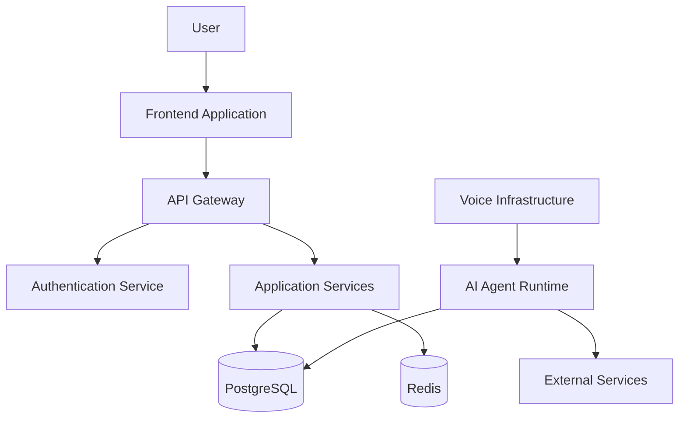

# Security Architecture

**Document Version:** 1.0
**Project:** AI Voice Agent SaaS Platform
**Status:** Draft
**Last Updated:** 2026-07-23

---

# 1. Overview

This document defines the security architecture of the AI Voice Agent SaaS Platform.

Security is designed across all system layers:

* Application security
* API security
* Identity management
* Tenant isolation
* Data protection
* Voice communication security
* Infrastructure security
* AI safety controls

The objective is to protect customer data while maintaining a scalable SaaS architecture.

---

# 2. Security Principles

## 2.1 Defense in Depth

Security controls exist at multiple layers.

```text
id="p3mx8r"
User

↓

Authentication

↓

Authorization

↓

Application Security

↓

Network Security

↓

Database Security

↓

Infrastructure Security
```

---

## 2.2 Least Privilege

Every user, service, and component receives only the permissions required.

Examples:

* Users access only their organization
* Services access only required databases
* Workers access only required APIs

---

## 2.3 Zero Trust Architecture

Every request must be:

* Authenticated
* Authorized
* Validated

No internal service is automatically trusted.

---

# 3. Security Architecture Overview



---

# 4. Identity and Authentication

## Purpose

Controls user identity.

---

## Authentication Methods

Supported methods:

* Email/password authentication
* OAuth providers
* API tokens
* Service credentials

---

# 5. Token Security

## JWT Authentication

Tokens contain:

```json
id="2qz4a8"
{
"user_id":"123",
"organization_id":"456",
"role":"admin",
"expires":"timestamp"
}
```

---

## Token Requirements

Access tokens:

* Short expiration time
* Signed securely
* Validated on every request

Refresh tokens:

* Stored securely
* Rotated regularly

---

# 6. Authorization Architecture

## Role-Based Access Control (RBAC)

Example roles:

| Role     | Permissions              |
| -------- | ------------------------ |
| Owner    | Full organization access |
| Admin    | Manage users and agents  |
| Operator | Manage calls             |
| Viewer   | Read-only access         |

---

## Permission Model

Example:

```text
Organization

├── Users

├── Agents

├── Calls

└── Knowledge Base
```

Users can only access resources belonging to their organization.

---

# 7. Multi-Tenant Security

## Tenant Isolation Strategy

Every tenant-owned database record contains:

```sql
organization_id
```

Example:

```sql
SELECT *
FROM agents
WHERE organization_id = current_user.organization_id;
```

---

## Tenant Isolation Rules

Must apply to:

* Database queries
* API endpoints
* File storage
* Vector search
* Analytics

---

# 8. API Security

## API Gateway Controls

Every API request validates:

* Authentication token
* Organization access
* Request format
* Rate limits

---

## Security Headers

Required headers:

```text
X-Request-ID

X-Correlation-ID

Authorization

Idempotency-Key
```

---

# 9. Input Validation

All external input must be validated.

Examples:

* API requests
* Uploaded files
* Agent instructions
* Tool parameters

Protection against:

* Injection attacks
* Malformed requests
* Data corruption

---

# 10. Database Security

## PostgreSQL Security

Controls:

* Private network access
* Encrypted connections
* Strong credentials
* Role separation

---

## Database Access Rules

Applications should:

* Use service accounts
* Avoid admin credentials
* Use prepared queries

---

# 11. Data Protection

## Data Classification

## Sensitive Data

Examples:

* Customer information
* Call recordings
* Transcripts
* API keys

---

## Encryption

Data in transit:

```text
TLS 1.3
```

Data at rest:

* Encrypted databases
* Encrypted object storage

---

# 12. Voice Security

Voice communication requires protection.

Security controls:

* Secure SIP connections
* Encrypted media streams
* Call authorization
* Recording access control

---

## Call Recording Protection

Recordings must:

* Have tenant ownership
* Use signed URLs
* Require authorization

---

# 13. AI Security

AI systems introduce additional risks.

---

# Prompt Injection Protection

Controls:

* Input filtering
* Context separation
* Tool permission checks

---

# Tool Execution Security

AI agents must not directly access unrestricted systems.

Example:

```text
AI Agent

↓

Tool Permission Layer

↓

External System
```

---

# Hallucination Controls

Methods:

* RAG grounding
* Confidence checks
* Human escalation

---

# 14. Knowledge Base Security

Documents must maintain:

* Tenant ownership
* Access permissions
* Metadata isolation

---

Vector searches must filter by:

```text
organization_id
```

before returning results.

---

# 15. Secret Management

Secrets include:

* Database passwords
* OpenAI API keys
* Twilio credentials
* LiveKit keys

---

Secrets must be stored in:

* Secret managers
* Environment variables
* Secure vault systems

Never store secrets in:

* Git
* Documentation
* Source code

---

# 16. Infrastructure Security

## Network Controls

Use:

* Private networks
* Firewalls
* Security groups
* Restricted ports

---

## Container Security

Controls:

* Minimal images
* Vulnerability scanning
* Non-root containers
* Regular updates

---

# 17. Logging and Auditing

Security events must be logged.

Examples:

```text
User login

Failed authentication

Permission denied

Agent configuration change

Knowledge upload

Call access

API key usage
```

---

# 18. Monitoring and Detection

Monitor:

## Application

* Failed requests
* Suspicious behavior

## Infrastructure

* Resource usage
* Unauthorized access

## AI

* Prompt attacks
* Unsafe tool usage

---

# 19. Backup Security

Backups must include:

* Encryption
* Access control
* Retention policies
* Recovery testing

---

# 20. Compliance Considerations

The platform should support future compliance requirements:

Potential areas:

* Data privacy
* Healthcare data
* Financial information
* Enterprise security reviews

Examples:

* GDPR considerations
* HIPAA readiness
* SOC 2 controls

---

# 21. Security Checklist

## Authentication

☐ Secure login
☐ Token expiration
☐ MFA support

## Authorization

☐ RBAC implemented
☐ Tenant isolation enforced

## Data

☐ Encryption enabled
☐ Backups protected

## AI

☐ Prompt injection protection
☐ Tool permissions controlled

## Infrastructure

☐ Secrets protected
☐ Network secured

---

# 22. Related Documents

| Document                      | Purpose                      |
| ----------------------------- | ---------------------------- |
| 06_Deployment_Architecture.md | Deployment security          |
| 29_Database_Schema            | Data security implementation |
| 30_OpenAPI_Specs              | API security                 |
| 40_Security_Threat_Model      | Detailed threat analysis     |

---

# 23. Conclusion

Security is a foundational requirement of the AI Voice Agent SaaS Platform.

The architecture protects:

* Customer data
* Voice communications
* AI operations
* Platform infrastructure

Security controls are integrated from design through deployment and operations.

---

**End of Document**
