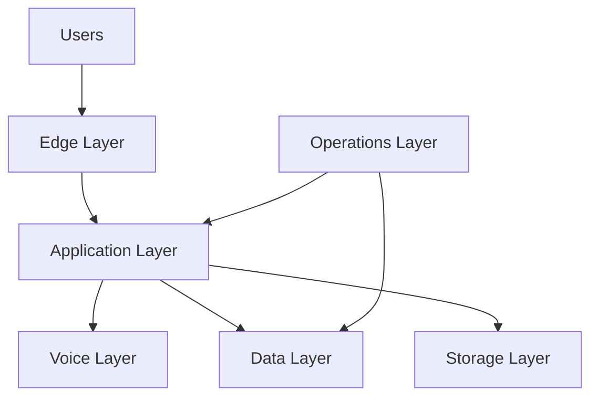
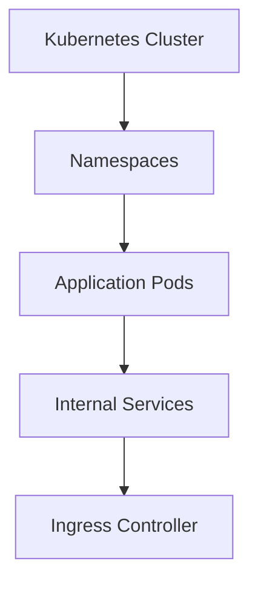
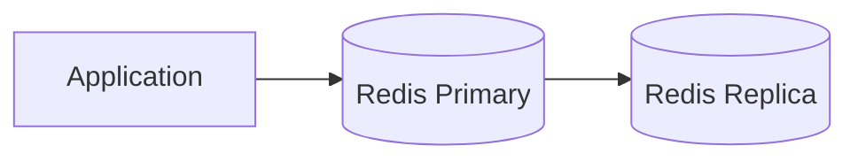
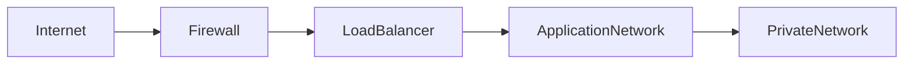
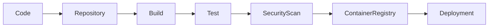

# Infrastructure Components

**Document Version:** 1.0
**Project:** AI Voice Agent SaaS Platform
**Status:** Draft
**Last Updated:** 2026-07-23

---

# 1. Overview

This document defines the infrastructure components required to operate the AI Voice Agent SaaS Platform.

It describes:

* Compute infrastructure
* Networking
* Storage systems
* Databases
* Messaging systems
* Voice infrastructure
* Monitoring systems
* Deployment dependencies

The infrastructure is designed to support:

* Multi-tenant SaaS operations
* Real-time voice communication
* AI workloads
* Horizontal scaling
* High availability

---

# 2. Infrastructure Architecture

The platform infrastructure consists of the following layers:



---

# 3. Compute Infrastructure

## Purpose

Provides execution environments for application services.

---

## Compute Components

| Component          | Purpose                        |
| ------------------ | ------------------------------ |
| API Servers        | Backend application processing |
| Frontend Servers   | Web application hosting        |
| Agent Workers      | AI voice processing            |
| Background Workers | Async processing               |
| Ingestion Workers  | Document processing            |

---

# 4. Container Infrastructure

## Technology

Recommended:

* Docker
* Kubernetes

---

## Container Responsibilities

```text
containers/

├── frontend

├── backend-api

├── agent-runtime

├── workflow-worker

├── rag-worker

├── scheduler

├── monitoring

└── database
```

---

# 5. Kubernetes Architecture

Production deployment uses Kubernetes for:

* Service management
* Scaling
* Self-healing
* Rolling deployments

---

## Kubernetes Components



---

# 6. Application Infrastructure

## Frontend Service

Technology:

* Next.js
* React

Responsibilities:

* Customer dashboard
* Agent configuration UI
* Analytics UI

---

## Backend API Service

Technology:

* Python
* FastAPI

Responsibilities:

* Business logic
* API endpoints
* Authentication
* Authorization

---

## Worker Infrastructure

Workers handle:

* AI processing
* Document ingestion
* Background jobs
* Notifications

---

# 7. Voice Infrastructure

## Components

```text
Caller

↓

PSTN

↓

Twilio SIP

↓

LiveKit Server

↓

AI Agent Worker
```

---

## LiveKit Infrastructure

Responsibilities:

* Real-time audio routing
* WebRTC sessions
* SIP handling
* Participant management

---

## Voice Worker Requirements

Must support:

* Low latency processing
* Multiple concurrent calls
* Automatic recovery

---

# 8. Database Infrastructure

## PostgreSQL

Primary application database.

Stores:

* Organizations
* Users
* Agents
* Calls
* Conversations
* Workflows
* Analytics

---

## PostgreSQL Requirements

Production setup:

* Managed PostgreSQL or clustered deployment
* Automated backups
* Monitoring
* Connection pooling

---

# 9. Vector Database Infrastructure

## Technology

PostgreSQL + pgvector

---

## Purpose

Stores embeddings for semantic search.

---

## Data Stored

```text
Documents

↓

Chunks

↓

Embeddings

↓

Metadata
```

---

# 10. Cache Infrastructure

## Redis

Purpose:

High-speed temporary storage.

---

## Redis Usage

Stores:

* Session state
* Conversation state
* Rate limits
* Queues
* Temporary data

---

## Redis Architecture



---

# 11. Object Storage Infrastructure

## Purpose

Stores large files.

---

## Data Types

* Call recordings
* Uploaded documents
* Export files
* Reports

---

## Requirements

* Encryption
* Lifecycle policies
* Access control
* Backup strategy

---

# 12. Message Queue Infrastructure

## Purpose

Handles asynchronous workloads.

---

## Queue Examples

```text
Document Processing Queue

Call Analytics Queue

Notification Queue

Webhook Queue

Workflow Queue
```

---

## Benefits

* Decoupled services
* Better reliability
* Background processing

---

# 13. Networking Infrastructure

## Network Design



---

# 14. Network Components

## Load Balancer

Responsibilities:

* Traffic distribution
* SSL termination
* Health checks

---

## Firewall

Controls:

* Allowed traffic
* Port access
* Network policies

---

## Private Networks

Protect:

* Databases
* Internal services
* Sensitive systems

---

# 15. Domain and DNS Infrastructure

Required components:

* Domain management
* DNS records
* SSL certificates

Example:

```text
app.company.com

api.company.com

voice.company.com
```

---

# 16. Monitoring Infrastructure

## Observability Stack

Tracks:

* Logs
* Metrics
* Traces

---

## Monitoring Areas

### Application

* API errors
* Response time
* Requests

### Voice

* Call quality
* Latency
* Connection issues

### AI

* Model latency
* Token usage
* Failures

---

# 17. Logging Infrastructure

Centralized logging collects:

```text
Frontend Logs

API Logs

Worker Logs

Voice Logs

Database Logs

Security Logs
```

---

# 18. CI/CD Infrastructure

Pipeline:



---

# 19. Backup Infrastructure

Backup targets:

## Database

* Daily backups
* Point-in-time recovery

## Object Storage

* Versioning
* Replication

## Configuration

* Infrastructure definitions
* Secrets metadata

---

# 20. Disaster Recovery Infrastructure

Requirements:

* Backup region
* Recovery procedures
* Restore testing

---

## Recovery Objectives

Define:

### RTO

Recovery Time Objective

How quickly service returns.

---

### RPO

Recovery Point Objective

How much data loss is acceptable.

---

# 21. Infrastructure Security Controls

Required:

* Private networks
* Encrypted communication
* Secret management
* Access auditing
* Vulnerability scanning

---

# 22. Cost Optimization Strategy

Optimize through:

* Auto scaling
* Resource limits
* Reserved capacity
* Database optimization
* Storage lifecycle rules

---

# 23. Related Documents

| Document                      | Purpose                   |
| ----------------------------- | ------------------------- |
| 06_Deployment_Architecture.md | Deployment model          |
| 07_Security_Architecture.md   | Security design           |
| 32_Deployment_Configs         | Configuration files       |
| 33_Kubernetes_Manifests       | Kubernetes resources      |
| 34_Terraform                  | Infrastructure automation |
| 37_Observability              | Monitoring                |

---

# 24. Conclusion

The infrastructure architecture provides a production-ready foundation for running the AI Voice Agent SaaS Platform.

It supports:

* Real-time communication
* AI workloads
* Multi-tenant SaaS operations
* Automated scaling
* Enterprise reliability

---

**End of Document**
