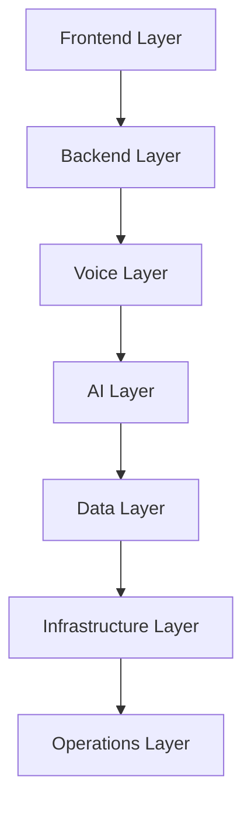
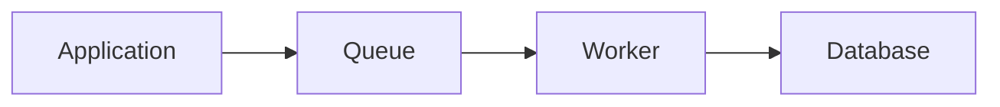

# Technology Stack

**Document Version:** 1.0
**Project:** AI Voice Agent SaaS Platform
**Status:** Draft
**Last Updated:** 2026-07-23

---

# 1. Overview

This document defines the technology stack selected for the AI Voice Agent SaaS Platform.

The technology choices are based on:

* Scalability
* Developer productivity
* AI ecosystem compatibility
* Production reliability
* Long-term maintainability

The platform combines modern web technologies, cloud infrastructure, real-time communication systems, and artificial intelligence frameworks.

---

# 2. Complete Technology Stack



---

# 3. Frontend Technology Stack

## Framework

## Next.js

Purpose:

Customer-facing SaaS application.

Used for:

* Dashboard
* Agent builder
* Analytics
* Authentication UI
* Administration panels

---

## Language

## TypeScript

Purpose:

Provides:

* Type safety
* Better developer experience
* Maintainable codebase

---

## UI Framework

## React

Used for:

* Component architecture
* Interactive interfaces
* State management

---

## Styling

Technologies:

* Tailwind CSS
* shadcn/ui

Used for:

* Design system
* Reusable components
* Responsive UI

---

# 4. Backend Technology Stack

## Programming Language

## Python

Purpose:

Primary backend language.

Reasons:

* Strong AI ecosystem
* Machine learning support
* Excellent API frameworks

---

## API Framework

## FastAPI

Responsibilities:

* REST APIs
* Authentication endpoints
* Business services
* OpenAPI generation

---

## Backend Architecture

```text
backend/

├── api

├── services

├── repositories

├── models

├── schemas

├── workers

└── integrations
```

---

# 5. Voice Communication Stack

## Real-Time Communication

## LiveKit

Purpose:

Handles:

* WebRTC communication
* Voice rooms
* Audio streaming
* SIP connections

---

## Telephony Provider

## Twilio SIP

Purpose:

Connects the platform to phone networks.

Responsibilities:

* Phone numbers
* Incoming calls
* Outbound calls
* SIP routing

---

## Voice Pipeline

```text
Caller

↓

Twilio SIP

↓

LiveKit

↓

Voice Agent Worker

↓

AI Runtime

↓

Voice Response
```

---

# 6. AI Agent Stack

## Agent Framework

## LangGraph

Purpose:

Controls agent workflows.

Provides:

* Stateful execution
* Workflow graphs
* Tool calling
* Human handoff

---

## AI Framework

## LangChain

Purpose:

Provides:

* Document processing
* Retrieval pipelines
* Tool integration
* Agent utilities

---

## Language Models

Primary:

* OpenAI Models

Potential future providers:

* Anthropic
* Google
* Open-source models

---

# 7. Speech Processing Stack

## Speech To Text

Purpose:

Convert caller audio into text.

Pipeline:

```text
Audio

↓

Speech Recognition

↓

Text

↓

Agent Processing
```

---

## Text To Speech

Purpose:

Convert AI response into natural voice.

Pipeline:

```text
AI Response

↓

TTS Engine

↓

Audio Stream

↓

Caller
```

---

# 8. Database Stack

## Primary Database

## PostgreSQL

Purpose:

Main transactional database.

Stores:

* Users
* Organizations
* Agents
* Calls
* Conversations
* Workflows
* Analytics

---

## Vector Search

## pgvector

Purpose:

Stores embeddings for RAG.

Stores:

* Document vectors
* Knowledge chunks
* Semantic metadata

---

## Cache Database

## Redis

Purpose:

High-speed temporary storage.

Stores:

* Sessions
* Conversation state
* Queues
* Rate limits

---

# 9. Storage Stack

## Object Storage

Purpose:

Large file storage.

Stores:

* Documents
* Call recordings
* Exports
* Reports

Requirements:

* Encryption
* Versioning
* Access control

---

# 10. Background Processing Stack

## Worker System

Used for:

* Document ingestion
* Embedding generation
* Analytics processing
* Notifications
* Scheduled jobs

---

## Queue Architecture



---

# 11. Infrastructure Stack

## Containerization

## Docker

Used for:

* Local development
* Application packaging
* Deployment consistency

---

## Container Orchestration

## Kubernetes

Used for:

* Scaling
* Service discovery
* Self-healing
* Deployment management

---

## Infrastructure as Code

## Terraform

Used for:

* Cloud resources
* Networks
* Databases
* Infrastructure automation

---

# 12. Cloud Infrastructure

Supported deployment options:

* Google Cloud Platform
* AWS
* Azure
* Private cloud

---

Typical production components:

```text
Cloud Provider

├── Kubernetes Cluster

├── PostgreSQL

├── Redis

├── Object Storage

├── Load Balancer

└── Monitoring
```

---

# 13. API Documentation Stack

## OpenAPI

Purpose:

Defines:

* REST APIs
* Request schemas
* Response formats
* Authentication

Location:

```text
30_OpenAPI_Specs/
```

---

# 14. Communication Protocols

| Communication       | Technology          |
| ------------------- | ------------------- |
| Browser → Backend   | HTTPS REST API      |
| Backend → Database  | PostgreSQL Protocol |
| Voice → Platform    | SIP/WebRTC          |
| Agent Communication | Internal APIs       |
| Events              | Message Queue       |
| External Systems    | REST/Webhooks       |

---

# 15. Development Tools

Recommended:

## Version Control

* Git
* GitHub/GitLab

---

## Package Management

Frontend:

* pnpm

Backend:

* Poetry / pip

---

## Development Environment

* Docker Compose
* VS Code
* Linux/WSL

---

# 16. Testing Stack

## Backend Testing

* Pytest
* FastAPI Test Client

---

## Frontend Testing

* Vitest
* React Testing Library

---

## End-to-End Testing

* Playwright

---

# 17. Observability Stack

Monitoring includes:

## Logging

Centralized application logs.

---

## Metrics

Tracks:

* API performance
* Voice latency
* AI usage

---

## Tracing

Tracks:

* Request flow
* Agent execution
* External calls

---

# 18. Security Stack

Security technologies:

* JWT authentication
* OAuth
* TLS encryption
* Secret management
* Role-based access control

---

# 19. Technology Selection Summary

| Layer         | Technology          |
| ------------- | ------------------- |
| Frontend      | Next.js + React     |
| Language      | TypeScript + Python |
| Backend       | FastAPI             |
| Voice         | LiveKit             |
| Telephony     | Twilio SIP          |
| Agent Runtime | LangGraph           |
| AI Framework  | LangChain           |
| Models        | OpenAI              |
| Database      | PostgreSQL          |
| Vector Search | pgvector            |
| Cache         | Redis               |
| Storage       | Object Storage      |
| Containers    | Docker              |
| Orchestration | Kubernetes          |
| IaC           | Terraform           |
| API Docs      | OpenAPI             |

---

# 20. Future Technology Evaluation

Potential future additions:

* Additional LLM providers
* Advanced speech models
* Dedicated vector databases
* Data warehouse
* Edge deployment
* Enterprise private deployments

---

# 21. Related Documents

| Document                      | Purpose                 |
| ----------------------------- | ----------------------- |
| 01_System_Overview.md         | System introduction     |
| 02_High_Level_Architecture.md | Architecture layers     |
| 03_Component_Architecture.md  | Components              |
| 06_Deployment_Architecture.md | Deployment              |
| 29_Database_Schema            | Database implementation |
| 30_OpenAPI_Specs              | API contracts           |

---

# 22. Conclusion

The technology stack provides a balanced foundation for building a production-grade AI Voice Agent SaaS Platform.

The selected technologies prioritize:

* AI capability
* Real-time performance
* Scalability
* Security
* Long-term maintainability

---

**End of Document**
