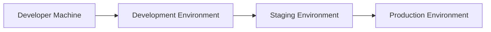
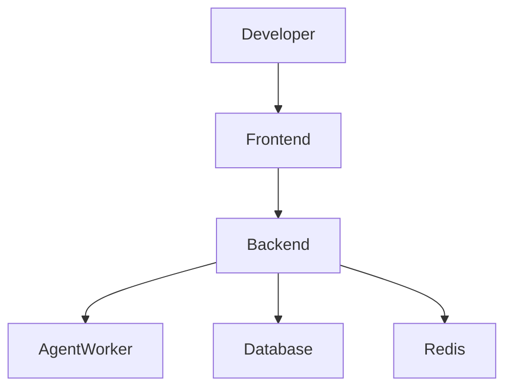
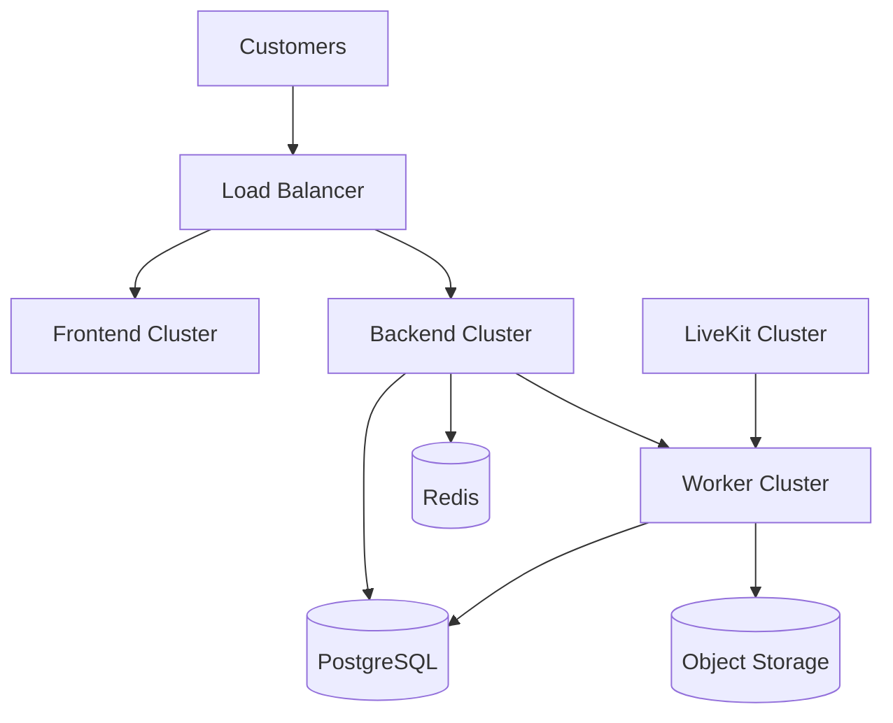
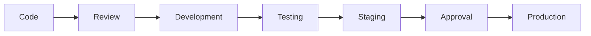

# Environment Architecture

**Document Version:** 1.0
**Project:** AI Voice Agent SaaS Platform
**Status:** Draft
**Last Updated:** 2026-07-23

---

# 1. Overview

This document defines the environment architecture used throughout the AI Voice Agent SaaS Platform lifecycle.

The platform separates environments to ensure:

* Safe development
* Controlled testing
* Production stability
* Security isolation
* Reliable deployments

The primary environments are:

1. Local Development
2. Development Server
3. Staging
4. Production

---

# 2. Environment Strategy



---

# 3. Environment Goals

| Environment | Purpose                    |
| ----------- | -------------------------- |
| Local       | Individual development     |
| Development | Shared engineering testing |
| Staging     | Production validation      |
| Production  | Customer workloads         |

---

# 4. Local Development Environment

## Purpose

Used by developers for feature development and debugging.

---

## Local Components

```text
Developer Machine

├── Frontend Application

├── FastAPI Backend

├── LiveKit Server

├── Agent Worker

├── PostgreSQL

├── Redis

└── Docker Compose
```

---

## Recommended Tools

Frontend:

* Node.js
* pnpm
* Next.js

Backend:

* Python
* Virtual Environment
* FastAPI

Infrastructure:

* Docker Desktop
* Local databases

---

# 5. Local Development Data

Local environment uses isolated data.

Example:

```text
local_database

local_storage

local_redis
```

Production data must never be copied directly into local environments without sanitization.

---

# 6. Development Environment

## Purpose

Shared environment for engineering teams.

Used for:

* Feature testing
* API testing
* Integration testing

---

## Architecture



---

# 7. Staging Environment

## Purpose

Production-like validation environment.

Used before releasing changes.

---

## Characteristics

Should match production:

* Same infrastructure pattern
* Same deployment process
* Similar configuration

---

## Staging Components

```text
Staging

├── Frontend Service

├── API Services

├── Agent Workers

├── PostgreSQL

├── Redis

├── Object Storage

└── Monitoring
```

---

# 8. Production Environment

## Purpose

Customer-facing SaaS platform.

---

## Production Requirements

Must provide:

* High availability
* Monitoring
* Backups
* Security controls
* Scaling capability

---

## Production Architecture



---

# 9. Environment Configuration Management

Each environment has separate configuration.

Example:

```text
config/

├── local.env

├── development.env

├── staging.env

└── production.env
```

---

# 10. Configuration Categories

## Application Configuration

Examples:

* API URLs
* Feature flags
* Service settings

---

## Database Configuration

Examples:

* Connection strings
* Pool sizes
* Migration settings

---

## AI Configuration

Examples:

* Model provider
* Model names
* Token limits

---

## Voice Configuration

Examples:

* LiveKit URL
* SIP configuration
* Voice settings

---

# 11. Environment Variables

Sensitive values must use environment variables.

Example:

```env
DATABASE_URL=

REDIS_URL=

OPENAI_API_KEY=

TWILIO_ACCOUNT_SID=

TWILIO_AUTH_TOKEN=

LIVEKIT_API_KEY=

LIVEKIT_API_SECRET=
```

---

# 12. Secret Management

Production secrets must not be stored in:

* Git repositories
* Source files
* Documentation

Recommended solutions:

* Cloud Secret Manager
* Kubernetes Secrets
* Vault systems

---

# 13. Database Environment Strategy

Each environment has separate databases.

Example:

```text
Development

postgres_dev


Staging

postgres_stage


Production

postgres_prod
```

---

# 14. Deployment Promotion Flow

Changes move through environments:



---

# 15. Database Migration Strategy

Database changes follow controlled migration.

Process:

```text
Create Migration

↓

Test Locally

↓

Apply Development

↓

Apply Staging

↓

Apply Production
```

---

# 16. Feature Flag Strategy

Feature flags allow controlled releases.

Examples:

```text
new_voice_model=false

advanced_rag=true

beta_agent_builder=true
```

---

# 17. Monitoring Per Environment

## Development

Monitor:

* Errors
* Debug logs

---

## Staging

Monitor:

* Performance
* Integration failures

---

## Production

Monitor:

* Availability
* Latency
* Security events
* Customer impact

---

# 18. Backup Strategy

## Development

Optional backups.

---

## Staging

Regular snapshots.

---

## Production

Required:

* Automated backups
* Point-in-time recovery
* Restore testing

---

# 19. Access Control

Environment access must follow:

| Environment | Access                     |
| ----------- | -------------------------- |
| Local       | Developer                  |
| Development | Engineering Team           |
| Staging     | Engineering + QA           |
| Production  | Authorized Operations Team |

---

# 20. Disaster Recovery Relationship

Production environment requires:

* Backup environment
* Recovery procedures
* Failover planning

---

# 21. Related Documents

| Document                      | Purpose                   |
| ----------------------------- | ------------------------- |
| 06_Deployment_Architecture.md | Deployment model          |
| 07_Security_Architecture.md   | Security controls         |
| 32_Deployment_Configs         | Environment configuration |
| 35_CI_CD                      | Deployment automation     |
| 38_Runbooks                   | Operational procedures    |

---

# 22. Conclusion

The environment architecture provides a controlled path from development to production.

This separation enables:

* Safer releases
* Better testing
* Improved security
* Reliable customer operations

---

**End of Document**
