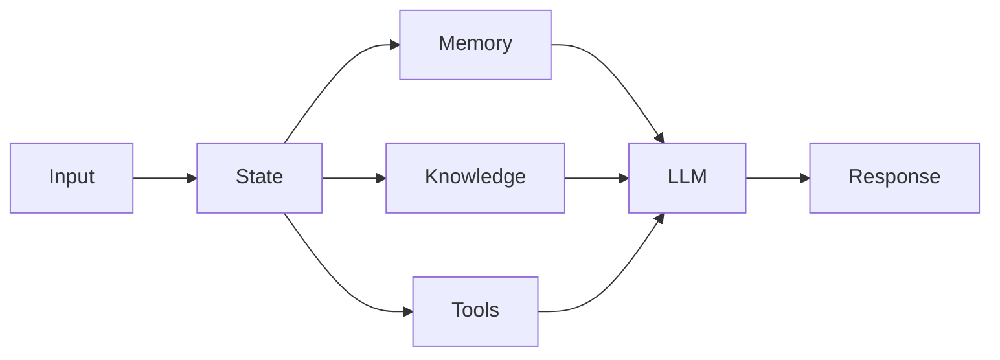

# Architecture Guidelines

**Document Version:** 1.0
**Project:** AI Voice Agent SaaS Platform
**Status:** Draft
**Last Updated:** 2026-07-23

---

# 1. Overview

This document defines the engineering and architecture guidelines for building, extending, and maintaining the AI Voice Agent SaaS Platform.

These guidelines ensure:

* Consistent engineering practices
* Maintainable architecture
* Secure development
* Scalable implementation
* Predictable system behavior

All new features and services should follow these principles.

---

# 2. Core Architecture Principles

## 2.1 Design for Scalability

Every component should be designed with future growth in mind.

Consider:

* Increased users
* Increased calls
* Increased AI workload
* Increased data volume

Avoid designs that only work for small deployments.

---

## 2.2 Prefer Simplicity

The simplest solution that satisfies requirements should be preferred.

Avoid:

* Unnecessary services
* Complex infrastructure
* Premature optimization

---

## 2.3 Separation of Concerns

Each layer should have a clear responsibility.

Example:

```text id="zq6v0y"
Frontend

Responsible:
- User interface


Backend

Responsible:
- Business logic


Database

Responsible:
- Data persistence


Agent Runtime

Responsible:
- AI behavior
```

---

# 3. Service Design Guidelines

## 3.1 Service Responsibilities

Each service should:

* Own a specific business capability
* Control its own logic
* Expose clear interfaces

---

Example:

Good:

```text id="j3qv4h"
Call Service

Owns:
- Call lifecycle
- Call records
- Call events
```

Bad:

```text id="y9pk3x"
Call Service

Owns:
- Calls
- Users
- Billing
- Knowledge
- Authentication
```

---

# 4. API Design Guidelines

## 4.1 API Versioning

All public APIs must be versioned.

Example:

```text id="h3a2j8"
/api/v1/agents

/api/v1/calls

/api/v1/knowledge
```

---

## 4.2 REST Standards

Use standard HTTP methods:

| Method | Purpose         |
| ------ | --------------- |
| GET    | Retrieve data   |
| POST   | Create resource |
| PUT    | Update resource |
| DELETE | Remove resource |

---

# 5. API Response Standards

Successful response:

```json id="z8m6m5"
{
"success": true,
"data": {}
}
```

---

Error response:

```json id="1d7gq5"
{
"success": false,
"error":{
 "code":"INVALID_REQUEST",
 "message":"Validation failed"
}
}
```

---

# 6. Database Guidelines

## 6.1 Schema Design

Database tables should:

* Have clear ownership
* Use meaningful names
* Include timestamps

Standard fields:

```sql id="3u8w9c"
id

created_at

updated_at

organization_id
```

---

# 7. Multi-Tenant Data Rules

Every tenant-owned table must include:

```sql id="v4q5n1"
organization_id
```

Example:

```sql id="9h0f1n"
agents

id

organization_id

name

configuration
```

---

# 8. Database Access Rules

Applications should:

* Use ORM/repository patterns
* Use parameterized queries
* Avoid raw unrestricted SQL

---

# 9. AI Agent Development Guidelines

## 9.1 Agent Responsibilities

Agents should:

* Follow defined instructions
* Use approved tools
* Maintain conversation state
* Respect permissions

---

## 9.2 Agent Architecture

Recommended:



---

# 10. Prompt Engineering Guidelines

Prompts should:

* Be version controlled
* Be documented
* Avoid hidden assumptions
* Define boundaries

---

Example:

```text id="q0nz5n"
Role:

You are a customer service assistant.

Rules:

- Be accurate
- Use company knowledge
- Escalate when required
```

---

# 11. RAG Development Guidelines

Knowledge pipelines should follow:

```text id="rj2r1n"
Upload

↓

Extract

↓

Clean

↓

Chunk

↓

Embed

↓

Store

↓

Retrieve

↓

Generate
```

---

## Retrieval Rules

Always consider:

* Tenant filtering
* Metadata filtering
* Context limits
* Relevance scoring

---

# 12. Voice System Guidelines

## Voice Latency

Prioritize:

* Fast audio streaming
* Efficient processing
* Small response delays

---

## Call Reliability

Handle:

* Network failures
* Agent failures
* Provider failures

---

# 13. Event Design Guidelines

Events should:

* Have clear names
* Contain required metadata
* Be versioned

Example:

```json id="x7t9pp"
{
"event":"call.completed",
"call_id":"123",
"timestamp":"2026-07-23"
}
```

---

# 14. Logging Guidelines

Every service should log:

* Request ID
* User ID
* Organization ID
* Operation
* Result

---

Example:

```text id="1vczn2"
Request:

POST /agents

Organization:

abc123

Result:

SUCCESS
```

---

# 15. Error Handling Guidelines

Errors should:

* Be predictable
* Have meaningful codes
* Avoid leaking sensitive information

---

Example:

```text id="6m3j4k"
AGENT_NOT_FOUND

CALL_NOT_CONNECTED

INVALID_CONFIGURATION
```

---

# 16. Security Guidelines

All components must implement:

* Authentication
* Authorization
* Input validation
* Secure secrets handling
* Audit logging

---

# 17. Testing Guidelines

Required testing levels:

## Unit Testing

Tests individual functions.

---

## Integration Testing

Tests service communication.

---

## End-to-End Testing

Tests complete workflows.

Example:

```text id="3kz4yc"
Phone Call

↓

AI Agent

↓

Database

↓

Analytics
```

---

# 18. Documentation Guidelines

Every major component requires:

* Overview
* Architecture
* API documentation
* Configuration
* Troubleshooting

---

# 19. Code Review Guidelines

Reviews should check:

## Architecture

* Correct component ownership
* Proper dependencies

## Security

* Secrets handling
* Permission checks

## Performance

* Database efficiency
* Resource usage

## Maintainability

* Clear structure
* Good documentation

---

# 20. Deprecation Guidelines

Deprecated features must include:

* Deprecation notice
* Migration path
* Removal timeline

---

# 21. Production Readiness Checklist

Before release:

## Architecture

☐ Design reviewed
☐ Dependencies documented

## Security

☐ Permissions tested
☐ Secrets protected

## Performance

☐ Load tested
☐ Monitoring added

## Operations

☐ Deployment documented
☐ Rollback plan available

---

# 22. Related Documents

| Document                     | Purpose                 |
| ---------------------------- | ----------------------- |
| 01_System_Overview.md        | System foundation       |
| 03_Component_Architecture.md | Component design        |
| 07_Security_Architecture.md  | Security                |
| 29_Database_Schema           | Database implementation |
| 30_OpenAPI_Specs             | API definitions         |

---

# 23. Conclusion

These architecture guidelines establish consistent engineering practices for the AI Voice Agent SaaS Platform.

Following these standards ensures the platform remains:

* Scalable
* Secure
* Maintainable
* Production-ready

---

**End of Document**
