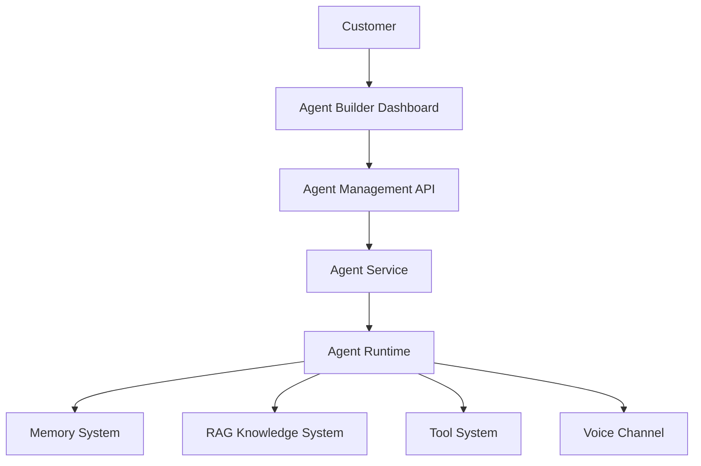
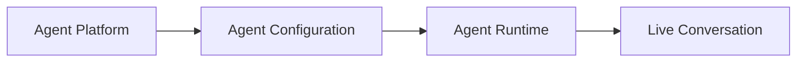

# Agent Platform Overview

**Document Version:** 1.0
**Project:** AI Voice Agent SaaS Platform
**Status:** Draft
**Last Updated:** 2026-07-23

---

# 1. Overview

The Agent Platform is the core application layer responsible for creating, configuring, deploying, and managing AI voice agents.

It provides the foundation that allows businesses to build intelligent conversational agents for different use cases.

Examples:

* Receptionist Agent
* Sales Agent
* Customer Support Agent
* Appointment Booking Agent
* Lead Qualification Agent
* Medical Assistant Agent

---

# 2. Purpose

The Agent Platform enables customers to:

* Create AI agents
* Configure agent behavior
* Assign voices
* Connect knowledge sources
* Define workflows
* Configure tools
* Deploy agents to phone channels
* Monitor performance

---

# 3. Agent Platform Architecture



---

# 4. Agent Platform Responsibilities

The platform manages the complete agent lifecycle.

Lifecycle:

```text
Create

↓

Configure

↓

Validate

↓

Deploy

↓

Execute

↓

Monitor

↓

Improve
```

---

# 5. Agent Lifecycle

## 5.1 Agent Creation

A customer creates an agent by defining:

* Name
* Purpose
* Industry
* Communication style
* Voice
* Model
* Instructions

Example:

```json
{
"name":"Appointment Assistant",
"purpose":"Schedule customer appointments",
"voice":"friendly",
"model":"GPT"
}
```

---

# 5.2 Agent Configuration

Agents contain configurable properties.

Configuration areas:

```text
Agent

├── Identity

├── Instructions

├── Personality

├── Voice

├── Knowledge

├── Tools

├── Workflows

└── Security
```

---

# 6. Agent Identity Model

Every agent has:

## Name

Human-readable identifier.

Example:

```text
Sarah - Reception Agent
```

---

## Purpose

Defines the primary responsibility.

Example:

```text
Handles incoming customer calls
and schedules appointments.
```

---

## Role

Defines behavior.

Examples:

* Sales Representative
* Support Specialist
* Receptionist

---

# 7. Agent Configuration Components

## 7.1 Instructions

Defines agent behavior.

Example:

```text
You are a professional receptionist.

Rules:

- Be polite
- Answer customer questions
- Schedule appointments
- Escalate complex issues
```

---

## 7.2 Personality

Controls communication style.

Parameters:

* Tone
* Formality
* Response length
* Conversation style

Example:

```text
Friendly

Professional

Concise
```

---

## 7.3 Voice Configuration

Defines voice behavior.

Settings:

* Voice provider
* Voice model
* Language
* Speed
* Pitch

---

## 7.4 Knowledge Configuration

Connects the agent to business information.

Sources:

* Documents
* Websites
* FAQs
* Databases

---

## 7.5 Tool Configuration

Defines available actions.

Examples:

* Book appointment
* Search CRM
* Send email
* Create ticket

---

# 8. Agent Runtime Relationship

The Agent Platform creates configuration.

The Agent Runtime executes it.



---

# 9. Agent Data Model Overview

Main entities:

```text
Organization

    |

Agent

    |

Agent Configuration

    |

Agent Tools

    |

Agent Knowledge

    |

Agent Deployments
```

---

# 10. Multi-Agent Support

The platform supports multiple agents per organization.

Example:

```text
Company A

├── Sales Agent

├── Support Agent

├── Reception Agent

└── Booking Agent
```

---

# 11. Agent Deployment Model

Agents can be deployed to:

## Phone

Using:

* Twilio SIP
* LiveKit

---

## Web

Using:

* WebRTC
* Web chat

---

## APIs

Using:

* External integrations

---

# 12. Agent Assignment

Calls are routed to agents based on:

* Phone number
* Business rules
* Customer intent
* Schedule
* Availability

Example:

```text
Incoming Call

↓

Routing Engine

↓

Select Agent

↓

Start Session
```

---

# 13. Agent Security

Agents must enforce:

## Tenant Isolation

Each agent belongs to:

```sql
organization_id
```

---

## Permission Control

Users can only manage authorized agents.

---

## Tool Restrictions

Agents can only execute approved tools.

---

# 14. Agent Performance Metrics

The platform tracks:

## Conversation Metrics

* Call duration
* Response time
* Completion rate

---

## AI Metrics

* Token usage
* Model latency
* Tool usage

---

## Business Metrics

* Leads generated
* Appointments booked
* Customer satisfaction

---

# 15. Agent Versioning

Agent configurations should support versions.

Example:

```text
Agent

Version 1.0

↓

Version 1.1

↓

Version 2.0
```

Benefits:

* Rollback
* Testing
* Experimentation

---

# 16. Agent Platform Components

| Component             | Purpose             |
| --------------------- | ------------------- |
| Agent Service         | Manage agents       |
| Configuration Service | Store settings      |
| Runtime Engine        | Execute agents      |
| Tool Manager          | Control actions     |
| Knowledge Manager     | Manage RAG          |
| Deployment Manager    | Deploy agents       |
| Analytics Service     | Measure performance |

---

# 17. Future Capabilities

Planned features:

* Visual agent builder
* Agent marketplace
* Agent templates
* A/B testing
* Automated optimization
* Multi-agent collaboration

---

# 18. Related Documents

| Document                  | Purpose               |
| ------------------------- | --------------------- |
| 02_Agent_Data_Model.md    | Agent database design |
| 03_Agent_Runtime.md       | Execution engine      |
| 04_Agent_Configuration.md | Configuration details |
| 05_Agent_Tools.md         | Tool system           |
| 06_Agent_Deployment.md    | Deployment lifecycle  |

---

# 19. Conclusion

The Agent Platform provides the management foundation for creating intelligent AI voice agents.

It separates:

* Agent configuration
* Runtime execution
* Knowledge access
* Tool usage
* Deployment

This architecture enables businesses to build scalable, customizable AI employees.

---

**End of Document**
