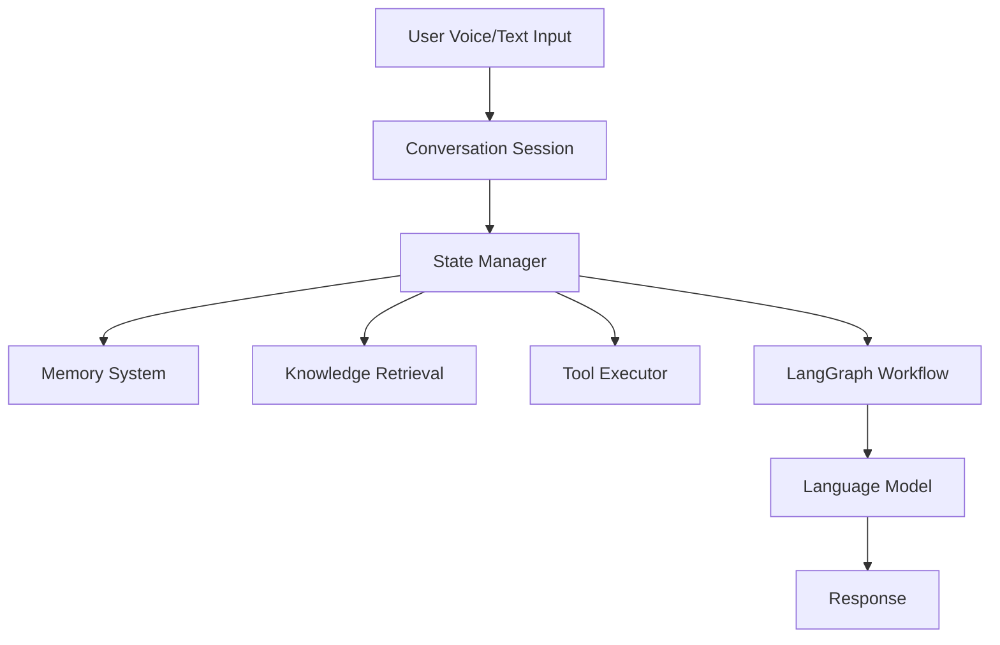
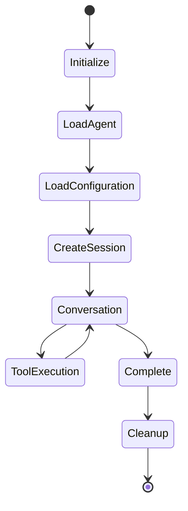
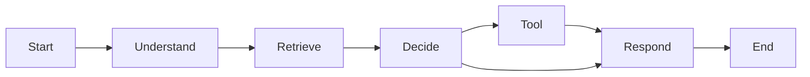
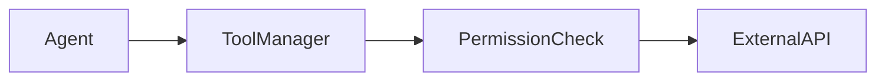
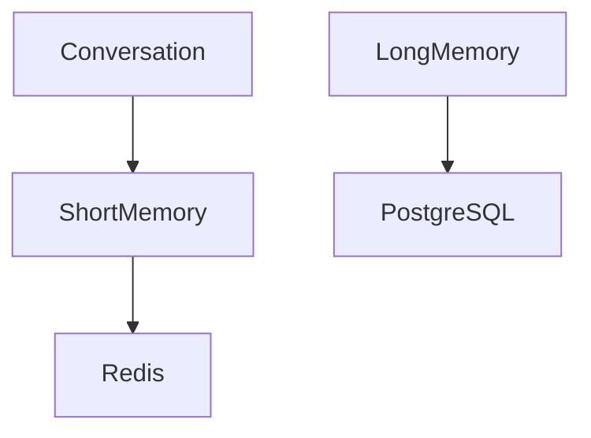

# Agent Runtime

**Document Version:** 1.0
**Project:** AI Voice Agent SaaS Platform
**Status:** Draft
**Last Updated:** 2026-07-23

---

# 1. Overview

The Agent Runtime is the execution engine responsible for running AI agents during live interactions.

It transforms agent configuration into an active conversational system capable of:

* Understanding user input
* Maintaining conversation state
* Retrieving knowledge
* Calling external tools
* Generating responses
* Managing workflows
* Handling human escalation

The Agent Runtime is the bridge between:

```text
Agent Configuration

        ↓

Runtime Execution

        ↓

Live Conversation
```

---

# 2. Agent Runtime Architecture



---

# 3. Runtime Responsibilities

The runtime manages:

## Conversation Execution

* Receive messages
* Maintain context
* Generate responses

---

## State Management

Tracks:

* Current conversation state
* User information
* Workflow progress
* Tool results

---

## AI Reasoning

Handles:

* Model calls
* Prompt construction
* Response generation

---

## Action Execution

Controls:

* Tool calling
* External APIs
* Business workflows

---

# 4. Runtime Lifecycle



---

# 5. Agent Initialization Flow

When a conversation starts:

```text
Incoming Request

↓

Identify Agent

↓

Load Agent Version

↓

Load Configuration

↓

Initialize Memory

↓

Initialize Tools

↓

Start Session
```

---

# 6. Runtime Components

## 6.1 Session Manager

Responsible for:

* Creating sessions
* Tracking active conversations
* Managing lifecycle

Example:

```json id="4g5m9j"
{
"session_id":"abc123",

"agent_id":"agent001",

"status":"active"
}
```

---

# 6.2 State Manager

Maintains runtime state.

Example:

```json id="a7y4qw"
{
"user_intent":"booking",

"step":"collect_phone",

"customer_name":"John"
}
```

---

# 6.3 Memory Manager

Handles conversation memory.

Types:

## Short-Term Memory

Current conversation context.

Example:

* Previous messages
* Current task

## Long-Term Memory

Stored user/business information.

Example:

* Customer preferences
* Previous interactions

---

# 6.4 Prompt Manager

Builds prompts dynamically.

Input:

```text
Agent Instructions

+

Conversation History

+

Retrieved Knowledge

+

Tool Results
```

Output:

```text
Final Model Prompt
```

---

# 6.5 Model Gateway

Provides abstraction over AI providers.

Responsibilities:

* Model selection
* Request handling
* Token tracking
* Error handling

---

Example:

```text
Agent Runtime

        ↓

Model Gateway

        ↓

OpenAI / Other Models
```

---

# 7. LangGraph Workflow Engine

The runtime uses graph-based execution.

Example:



---

# 8. Agent Decision Process

Example:

User:

> "I want to book an appointment"

Runtime:

```text
Receive Message

↓

Detect Intent

↓

Check Required Information

↓

Call Booking Tool

↓

Confirm Appointment
```

---

# 9. Tool Execution Architecture

Tools are executed through a controlled layer.



---

# 10. Tool Security Rules

Agents must not:

* Access unrestricted systems
* Execute unknown tools
* Modify data without permission

Every tool requires:

* Definition
* Permissions
* Validation
* Logging

---

# 11. Knowledge Retrieval Flow

The runtime integrates with RAG.

```text
User Question

↓

Embedding Generation

↓

Vector Search

↓

Retrieve Context

↓

Add Context To Prompt

↓

Generate Answer
```

---

# 12. Runtime Memory Architecture



---

# 13. Voice Runtime Integration

The runtime connects with voice infrastructure.

```text
Caller

↓

Twilio

↓

LiveKit

↓

Voice Agent Worker

↓

Agent Runtime

↓

Response Audio
```

---

# 14. Human Escalation

The runtime supports human transfer.

Example:

```text
User Request

↓

Agent Evaluation

↓

Escalation Required

↓

Transfer Workflow

↓

Human Agent
```

---

# 15. Runtime Error Handling

Errors must be handled gracefully.

Examples:

## Model Failure

Fallback model.

---

## Tool Failure

Retry or alternative action.

---

## Network Failure

Reconnect session.

---

Example:

```text
Failure

↓

Log Error

↓

Apply Recovery

↓

Continue Conversation
```

---

# 16. Runtime Observability

Track:

## Performance

* Response latency
* Model latency
* Tool latency

## Quality

* Successful tasks
* Failed tasks
* Escalations

## Cost

* Token usage
* Model consumption

---

# 17. Runtime Scaling

Agent workers scale horizontally.

Example:

```text
Low Traffic

1 Worker


Medium Traffic

10 Workers


High Traffic

100+ Workers
```

---

# 18. Runtime Configuration

Runtime receives:

```json id="7x8j2v"
{
"agent_id":"123",

"version":"2",

"model":"GPT",

"voice":"assistant",

"tools":[
"calendar"
],

"memory":"enabled"
}
```

---

# 19. Runtime Security

Controls:

* Authentication
* Tenant validation
* Tool permissions
* Data filtering
* Audit logging

---

# 20. Future Enhancements

Possible additions:

* Multi-agent collaboration
* Autonomous workflows
* Self-improving agents
* Advanced planning
* Agent evaluation framework

---

# 21. Related Documents

| Document                      | Purpose               |
| ----------------------------- | --------------------- |
| 01_Agent_Platform_Overview.md | Agent platform        |
| 02_Agent_Data_Model.md        | Agent data structure  |
| 04_Agent_Configuration.md     | Configuration system  |
| 05_Agent_Tools.md             | Tools                 |
| 06_Agent_Deployment.md        | Deployment            |
| 31_Proto_gRPC_Definitions     | Runtime communication |

---

# 22. Conclusion

The Agent Runtime is the core intelligence execution layer of the platform.

It connects:

* Agent configuration
* AI models
* Memory
* Knowledge
* Tools
* Voice communication

to create a production-grade conversational AI system.

---

**End of Document**
