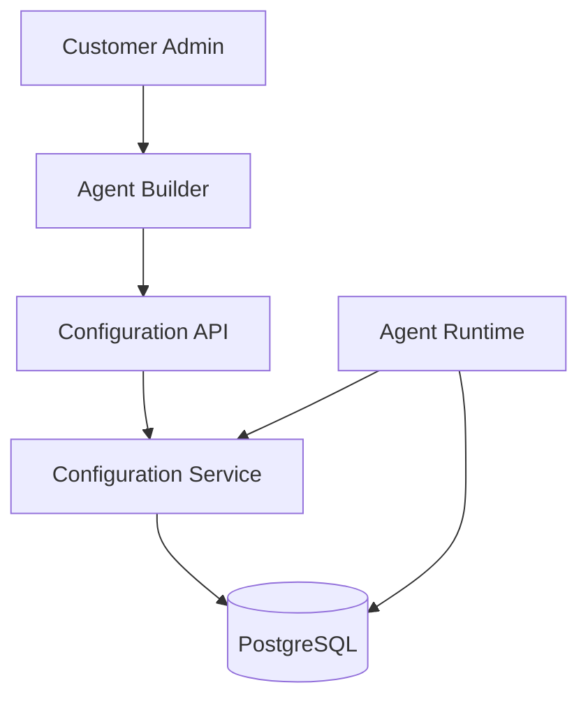
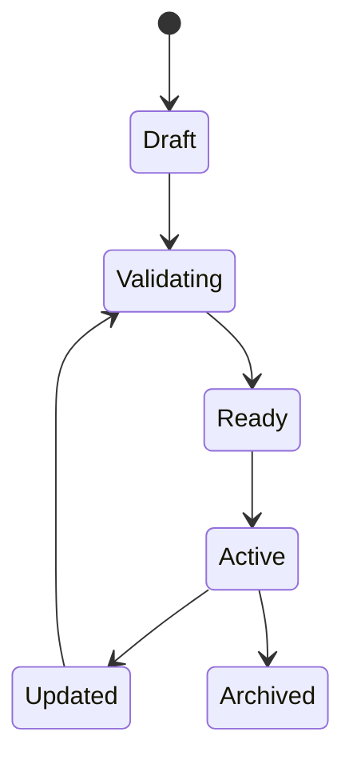

# Agent Configuration

**Document Version:** 1.0
**Project:** AI Voice Agent SaaS Platform
**Status:** Draft
**Last Updated:** 2026-07-23

---

# 1. Overview

This document defines the configuration system used to create and customize AI agents.

Agent Configuration controls how an AI agent behaves, communicates, reasons, and interacts with users.

The configuration layer separates:

```text
Business Configuration

        ↓

Agent Definition

        ↓

Runtime Behavior
```

This allows customers to customize agents without changing application code.

---

# 2. Configuration Architecture



---

# 3. Configuration Goals

The configuration system must support:

* No-code agent customization
* Version control
* Validation
* Rollback
* Tenant isolation
* Runtime loading
* Audit history

---

# 4. Agent Configuration Structure

A complete agent configuration contains:

```text
Agent Configuration

├── Identity

├── Instructions

├── Personality

├── Model Settings

├── Voice Settings

├── Knowledge Settings

├── Tool Settings

├── Workflow Settings

├── Security Settings

└── Deployment Settings
```

---

# 5. Agent Identity Configuration

Defines the basic identity of the agent.

Example:

```json
{
"name":"Front Desk Assistant",

"description":"Handles incoming customer calls",

"industry":"Healthcare",

"role":"Receptionist"
}
```

---

# 6. System Instructions

## Purpose

Defines the agent's core behavior.

Example:

```text
You are a professional front desk assistant.

Your responsibilities:

- Answer customer questions
- Collect required information
- Schedule appointments
- Escalate complex issues

Never provide information outside approved knowledge sources.
```

---

# 7. Personality Configuration

Controls communication style.

Configuration:

```json
{
"tone":"friendly",

"formality":"professional",

"response_style":"concise",

"empathy_level":"high"
}
```

---

# 8. Conversation Behavior Settings

Controls interaction rules.

Examples:

```json
{
"greeting":

"Welcome to our clinic, how may I help you?",

"max_conversation_time":

"30_minutes",

"silence_timeout":

"10_seconds"
}
```

---

# 9. Model Configuration

Defines AI model behavior.

Example:

```json
{
"provider":"OpenAI",

"model":"GPT",

"temperature":0.3,

"max_tokens":800,

"response_timeout":5000
}
```

---

# 10. Voice Configuration

Defines speech behavior.

Structure:

```json
{
"provider":"ElevenLabs",

"voice_id":"voice123",

"language":"en-US",

"speed":1.0,

"pitch":1.0
}
```

---

# 11. Knowledge Configuration

Controls connected knowledge sources.

Example:

```json
{
"knowledge_bases":[
"company_documents",
"faq_database"
],

"retrieval_mode":"semantic"
}
```

---

# 12. Tool Configuration

Defines available actions.

Example:

```json
{
"tools":[

{
"name":"calendar_booking",

"enabled":true
},

{
"name":"crm_lookup",

"enabled":true
}

]
}
```

---

# 13. Workflow Configuration

Defines business processes.

Example:

```text
Customer Request

↓

Identify Intent

↓

Collect Information

↓

Execute Action

↓

Confirm Result
```

---

# 14. Agent Guardrails

Guardrails define restrictions.

Examples:

```json
{
"allowed_topics":[
"company_services",
"appointments"
],

"blocked_actions":[
"delete_customer_data"
]
}
```

---

# 15. Configuration Validation

Before activation, configurations must be validated.

Validation checks:

## Required Fields

* Agent name
* Instructions
* Voice
* Model

---

## Security

* Tool permissions
* Tenant ownership

---

## Runtime Compatibility

* Supported models
* Supported voices

---

# 16. Configuration Lifecycle



---

# 17. Configuration Versioning

Every configuration change creates a version.

Example:

```text
Agent

Version 1

↓

Version 2

↓

Version 3
```

Each version stores:

* Configuration snapshot
* Creator
* Timestamp
* Change reason

---

# 18. Configuration Storage Model

Recommended database design:

```text
agent_configurations

id

agent_id

version

configuration_json

status

created_by

created_at
```

---

# 19. Runtime Configuration Loading

At conversation startup:

```text
Incoming Call

↓

Identify Agent

↓

Load Active Version

↓

Validate Configuration

↓

Initialize Runtime

↓

Start Conversation
```

---

# 20. Configuration Cache

Frequently used configurations may be cached.

Example:

```text
PostgreSQL

        ↓

Configuration Cache

        ↓

Agent Runtime
```

Redis can store:

* Active agent configuration
* Runtime settings
* Feature flags

---

# 21. Multi-Tenant Configuration Security

Every configuration request must validate:

```text
User

↓

Organization

↓

Agent Ownership

↓

Permission

↓

Configuration Access
```

---

# 22. Audit Logging

Configuration changes must create audit events.

Examples:

```text
agent.configuration.created

agent.configuration.updated

agent.configuration.activated

agent.configuration.rollback
```

---

# 23. Agent Templates

The platform can support reusable templates.

Examples:

```text
Sales Agent Template

Support Agent Template

Booking Agent Template

Receptionist Template
```

Template flow:

```text
Template

↓

Customize

↓

Create Agent

↓

Deploy
```

---

# 24. Configuration API Examples

## Create Agent

```
POST /api/v1/agents
```

---

## Update Configuration

```
PUT /api/v1/agents/{id}/configuration
```

---

## Activate Version

```
POST /api/v1/agents/{id}/activate
```

---

# 25. Future Enhancements

Potential improvements:

* Visual workflow builder
* AI-generated configurations
* Automatic prompt optimization
* Agent testing simulator
* Configuration recommendations

---

# 26. Related Documents

| Document                      | Purpose           |
| ----------------------------- | ----------------- |
| 01_Agent_Platform_Overview.md | Platform overview |
| 02_Agent_Data_Model.md        | Data model        |
| 03_Agent_Runtime.md           | Runtime execution |
| 05_Agent_Tools.md             | Tool management   |
| 06_Agent_Deployment.md        | Deployment        |

---

# 27. Conclusion

The Agent Configuration system provides a flexible control layer for creating intelligent AI agents.

It enables:

* Business customization
* Safe configuration changes
* Runtime flexibility
* Scalable agent management

---

**End of Document**
