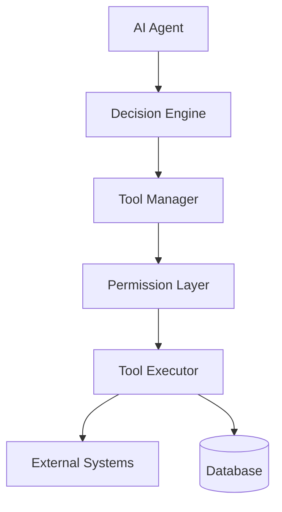
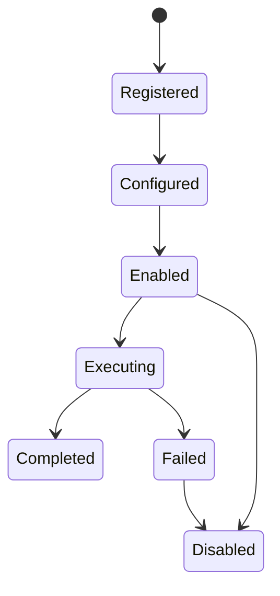
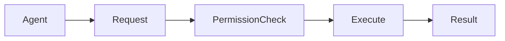

# Agent Tools

**Document Version:** 1.0
**Project:** AI Voice Agent SaaS Platform
**Status:** Draft
**Last Updated:** 2026-07-23

---

# 1. Overview

Agent Tools provide AI agents with controlled access to external capabilities and business systems.

Tools allow agents to perform actions beyond conversation.

Examples:

* Schedule appointments
* Search customer records
* Create tickets
* Send notifications
* Process transactions
* Retrieve external information

The tool system separates:

```text
AI Reasoning

↓

Tool Selection

↓

Permission Validation

↓

Tool Execution

↓

Result Processing
```

---

# 2. Tool Architecture



---

# 3. Tool System Responsibilities

The Tool System manages:

* Tool registration
* Tool discovery
* Tool permissions
* Input validation
* Execution
* Error handling
* Logging
* Monitoring

---

# 4. Tool Lifecycle



---

# 5. Tool Definition Model

Every tool contains:

```text
Tool

├── Identity

├── Description

├── Input Schema

├── Output Schema

├── Permissions

├── Configuration

└── Execution Handler
```

---

# 6. Tool Example

Example:

Appointment Booking Tool

```json id="b9v0lm"
{
"name":"create_appointment",

"description":"Creates a customer appointment",

"input_schema":{
"date":"string",
"time":"string",
"customer_id":"string"
},

"permissions":[
"appointment:create"
]
}
```

---

# 7. Built-In Tool Categories

## Communication Tools

Examples:

* Send SMS
* Send Email
* Send Notification

---

## Business Tools

Examples:

* CRM lookup
* Appointment booking
* Order management

---

## Data Tools

Examples:

* Database search
* Knowledge lookup
* Reporting

---

## Workflow Tools

Examples:

* Start workflow
* Trigger automation
* Create task

---

# 8. Tool Registry

The Tool Registry stores available tools.

Example:

```text id="4z0mwm"
Tool Registry

├── Calendar Tool

├── CRM Tool

├── Email Tool

├── Payment Tool

└── Search Tool
```

---

# 9. Tool Registration Model

Database concept:

```text id="5vph3n"
tools

id

name

description

type

version

status

configuration
```

---

# 10. Tool Assignment

Tools are assigned to agents.

Relationship:

```text
Organization

↓

Agent

↓

Available Tools

↓

Permissions
```

---

# 11. Tool Configuration

Example:

```json id="5u6xmg"
{
"tool":"calendar",

"settings":{

"timezone":"America/New_York",

"calendar_id":"primary"

}
}
```

---

# 12. Tool Permission Model

AI agents must not have unlimited access.

Permission flow:



---

# 13. Tool Input Validation

Before execution:

Validate:

* Required fields
* Data types
* Allowed values
* Tenant ownership

Example:

Invalid:

```json
{
"appointment_date":"abc"
}
```

Valid:

```json
{
"appointment_date":"2026-08-01"
}
```

---

# 14. Tool Execution Flow

Example:

Customer:

> "Book me tomorrow at 3 PM"

Flow:

```text id="ph0lxp"
User Request

↓

Agent Understanding

↓

Select Booking Tool

↓

Validate Input

↓

Execute API

↓

Receive Result

↓

Generate Response
```

---

# 15. Tool Result Handling

Tool results should be structured.

Example:

```json id="x5u8hy"
{
"success":true,

"appointment_id":"12345",

"message":"Appointment created"
}
```

---

# 16. Tool Error Handling

Possible errors:

```text
TOOL_NOT_AVAILABLE

INVALID_INPUT

PERMISSION_DENIED

EXTERNAL_API_ERROR

TIMEOUT
```

---

Recovery strategies:

* Retry
* Alternative tool
* Human escalation
* Inform user

---

# 17. External API Integration

Tools connect to external systems.

Examples:

```text
AI Agent

↓

Tool Layer

↓

CRM API

↓

CRM System
```

---

# 18. Webhook-Based Tools

Some tools trigger events.

Example:

```text
Agent Action

↓

Webhook

↓

External System

↓

Callback

↓

Agent Response
```

---

# 19. Tool Security

Security controls:

## Authentication

Tools use:

* API keys
* OAuth
* Service credentials

---

## Authorization

Check:

* Organization
* Agent
* User permissions

---

## Data Protection

Prevent:

* Unauthorized access
* Data leakage
* Injection attacks

---

# 20. Tool Audit Logging

Every execution records:

```text id="g2tq4d"
tool_name

agent_id

organization_id

request

response

timestamp

execution_status
```

---

# 21. Tool Monitoring

Track:

## Performance

* Execution latency
* Failure rate

## Usage

* Number of calls
* Popular tools

## Reliability

* External API health

---

# 22. Tool Versioning

Tools should support versions.

Example:

```text id="8m8w9d"
Calendar Tool

v1

↓

v2

↓

v3
```

Benefits:

* Safe upgrades
* Compatibility
* Rollback

---

# 23. MCP Compatibility

Future support:

Model Context Protocol (MCP) allows standardized tool connections.

Architecture:

```text
AI Agent

↓

MCP Client

↓

MCP Server

↓

External Capability
```

---

# 24. Example Agent Tool Set

Customer Support Agent:

```text
Tools:

✓ Search Knowledge

✓ Lookup Customer

✓ Create Ticket

✓ Send Email

✓ Transfer Call
```

---

# 25. Future Enhancements

Potential additions:

* Visual tool builder
* Tool marketplace
* Automatic tool discovery
* AI-generated tool schemas
* Advanced workflow integration

---

# 26. Related Documents

| Document                      | Purpose            |
| ----------------------------- | ------------------ |
| 01_Agent_Platform_Overview.md | Agent architecture |
| 03_Agent_Runtime.md           | Runtime execution  |
| 04_Agent_Configuration.md     | Configuration      |
| 06_Agent_Deployment.md        | Deployment         |
| 30_OpenAPI_Specs              | API definitions    |

---

# 27. Conclusion

The Agent Tool System provides secure and extensible access to external capabilities.

It enables AI agents to move beyond conversation and perform meaningful business actions while maintaining security and control.

---

**End of Document**
