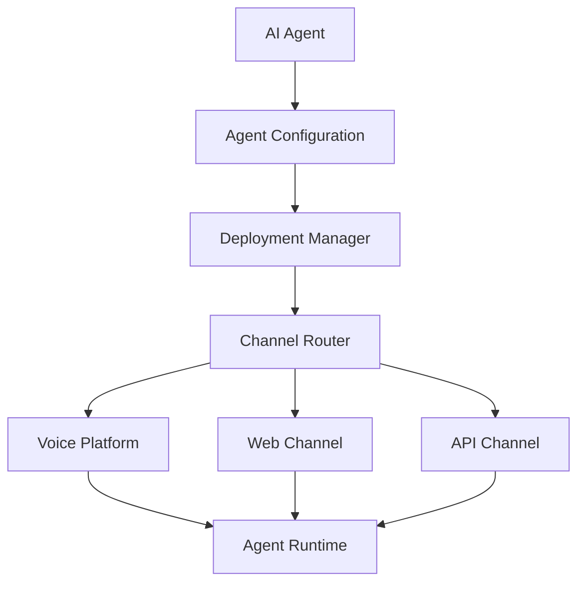
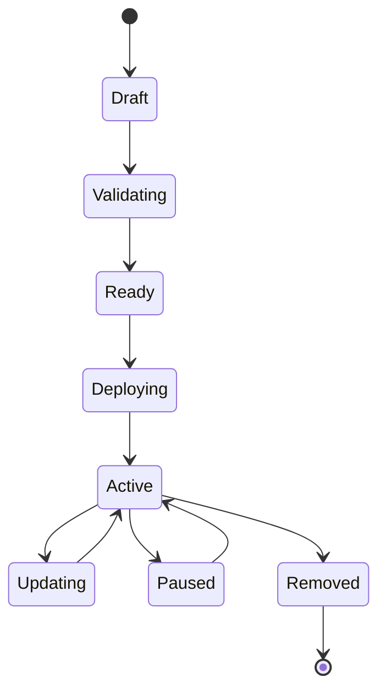
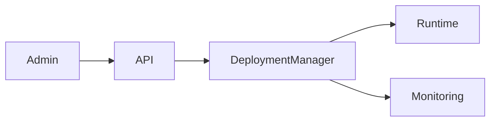
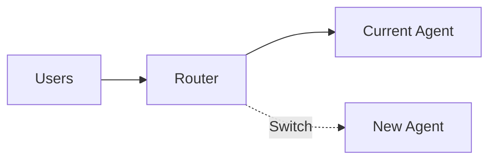
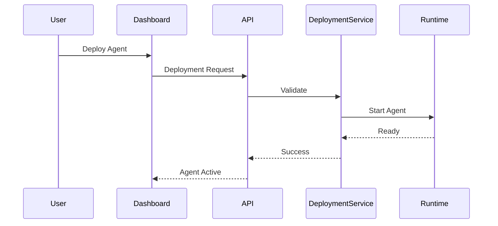

# Agent Deployment

**Document Version:** 1.0
**Project:** AI Voice Agent SaaS Platform
**Status:** Draft
**Last Updated:** 2026-07-23

---

# 1. Overview

This document defines how AI agents are deployed, activated, and managed across different communication channels.

Agent Deployment transforms a configured agent into a live production service.

The deployment lifecycle is:

```text id="d1a4k7"
Agent Configuration

↓

Validation

↓

Deployment Creation

↓

Channel Assignment

↓

Activation

↓

Live Conversations
```

---

# 2. Deployment Architecture



---

# 3. Deployment Responsibilities

The Deployment System manages:

* Agent activation
* Channel assignment
* Runtime configuration
* Deployment versions
* Availability status
* Rollback operations

---

# 4. Deployment Lifecycle



---

# 5. Deployment Types

The platform supports multiple deployment channels.

---

# 5.1 Phone Deployment

Purpose:

Connect AI agents to phone numbers.

Architecture:

```text id="n9x6pw"
Customer Phone Number

↓

Twilio SIP

↓

LiveKit

↓

Agent Runtime
```

---

# 5.2 Web Voice Deployment

Purpose:

Allow customers to interact through browsers.

Architecture:

```text id="1q2d7v"
Browser

↓

WebRTC

↓

LiveKit

↓

Agent Runtime
```

---

# 5.3 API Deployment

Purpose:

Allow external systems to interact with agents.

Example:

```text id="7d8k4s"
External Application

↓

API Gateway

↓

Agent Runtime
```

---

# 6. Deployment Configuration

A deployment contains:

```json id="k8w3v1"
{
"agent_id":"agent123",

"version":"1.0",

"channel":"phone",

"status":"active",

"configuration":{

"phone_number":"+123456789"

}
}
```

---

# 7. Deployment Manager

The Deployment Manager controls:

* Creation
* Updates
* Activation
* Deactivation
* Monitoring

---

Architecture:



---

# 8. Agent Routing

Routing determines which agent handles an interaction.

Example:

```text id="p7k9w2"
Incoming Call

↓

Phone Number Lookup

↓

Organization Lookup

↓

Routing Rules

↓

Agent Selection

↓

Start Session
```

---

# 9. Routing Rules

Rules may consider:

## Customer Information

Example:

* Existing customer
* New customer

---

## Business Rules

Example:

* Sales calls
* Support calls
* Billing calls

---

## Time Rules

Example:

* Business hours
* After-hours agent

---

# 10. Deployment Validation

Before activation:

Check:

## Agent Configuration

✓ Instructions exist
✓ Model configured
✓ Voice configured

---

## Tools

✓ Tools available
✓ Permissions valid

---

## Knowledge

✓ Knowledge sources connected

---

## Infrastructure

✓ Runtime available
✓ Channel connected

---

# 11. Deployment Versioning

Deployments should support versions.

Example:

```text id="f5m7v8"
Production Deployment

Version 1

↓

Version 2

↓

Rollback Version 1
```

---

# 12. Blue-Green Deployment

For production safety:



Benefits:

* Zero downtime
* Safe testing
* Fast rollback

---

# 13. Agent Rollback

Rollback process:

```text id="j4n8m5"
Failure Detected

↓

Select Previous Version

↓

Update Routing

↓

Restart Sessions

↓

Monitor
```

---

# 14. Deployment Monitoring

Monitor:

## Availability

* Agent online status
* Connection health

---

## Performance

* Response latency
* Call quality

---

## Business

* Completed tasks
* Failed conversations

---

# 15. Deployment Events

Important events:

```text id="m3v6q8"
deployment.created

deployment.started

deployment.completed

deployment.failed

deployment.updated

deployment.rollback
```

---

# 16. Deployment Security

Security controls:

## Access Control

Only authorized users can deploy agents.

---

## Configuration Protection

Sensitive values protected.

Examples:

* API keys
* Credentials
* Integration tokens

---

## Tenant Isolation

Every deployment belongs to:

```sql id="x9p4w7"
organization_id
```

---

# 17. Deployment Database Model

Recommended tables:

```text id="v8m2q5"
agent_deployments

id

agent_id

version_id

channel

status

configuration

created_at

updated_at
```

---

# 18. Production Deployment Flow



---

# 19. Multi-Agent Deployment

Organizations can deploy multiple agents.

Example:

```text id="s8q2m4"
Company

├── Sales Agent

│   └── Phone Channel


├── Support Agent

│   └── Web Channel


└── Booking Agent

    └── Phone Channel
```

---

# 20. Future Enhancements

Potential improvements:

* Automatic scaling
* Agent marketplace deployment
* Multi-region deployment
* Deployment analytics
* Automated testing before release

---

# 21. Related Documents

| Document                      | Purpose                   |
| ----------------------------- | ------------------------- |
| 01_Agent_Platform_Overview.md | Platform overview         |
| 03_Agent_Runtime.md           | Runtime engine            |
| 04_Agent_Configuration.md     | Configuration             |
| 05_Agent_Tools.md             | Tools                     |
| 06_Deployment_Architecture.md | Infrastructure deployment |
| 32_Deployment_Configs         | Deployment files          |

---

# 22. Conclusion

The Agent Deployment system provides the operational layer required to move AI agents from configuration into production.

It enables:

* Multi-channel deployment
* Safe releases
* Version control
* Monitoring
* Enterprise scalability

---

**End of Document**
