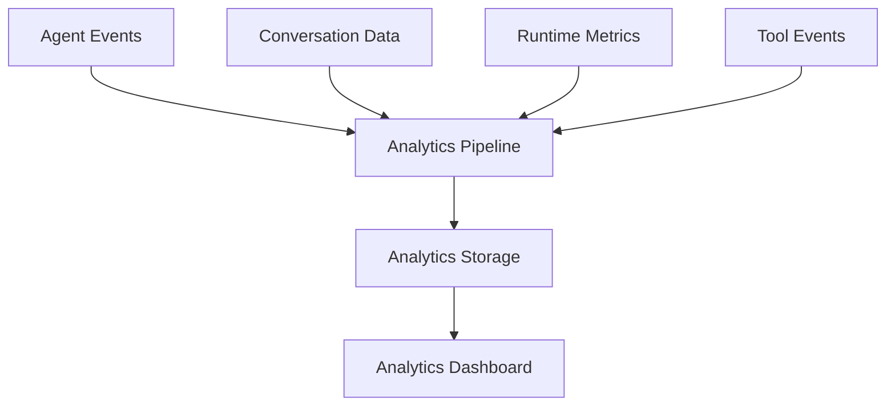

# Agent Analytics

**Document Version:** 1.0
**Project:** AI Voice Agent SaaS Platform
**Status:** Draft
**Last Updated:** 2026-07-23

---

# 1. Overview

This document defines the analytics system for measuring AI agent performance, customer interactions, operational efficiency, and business outcomes.

Agent Analytics provides visibility into:

* Agent usage
* Conversation quality
* Call performance
* Business results
* AI costs
* System reliability

The analytics system transforms raw interaction data into actionable insights.

---

# 2. Analytics Architecture



---

# 3. Analytics Goals

The analytics platform should answer:

## Operational Questions

* How many conversations occurred?
* Are agents available?
* Are calls completing successfully?

---

## Performance Questions

* How fast are responses?
* Which tools are slow?
* Where are failures occurring?

---

## Business Questions

* How many leads were generated?
* How many appointments were booked?
* How many customers were helped?

---

# 4. Analytics Data Sources

Analytics collects data from:

```text
Agent Runtime

↓

Conversation Service

↓

Voice Platform

↓

Tool System

↓

Database

↓

Analytics Pipeline
```

---

# 5. Core Analytics Entities

Main entities:

```text
Organization

    |

Agent

    |

Conversation

    |

Message

    |

Tool Execution

    |

Outcome
```

---

# 6. Conversation Analytics

Tracks every customer interaction.

Metrics:

* Total conversations
* Average duration
* Completion rate
* Abandonment rate
* Escalation rate

---

Example:

```json
{
"conversation_id":"conv123",

"duration_seconds":240,

"status":"completed",

"agent":"booking_agent"
}
```

---

# 7. Voice Analytics

For phone-based agents.

Tracks:

## Call Metrics

* Incoming calls
* Outgoing calls
* Answer rate
* Missed calls
* Call duration

---

## Audio Quality

Measures:

* Connection quality
* Interruptions
* Latency
* Dropped calls

---

# 8. Agent Performance Metrics

## Response Metrics

Measures:

* Response latency
* Processing time
* Completion speed

---

## Intelligence Metrics

Measures:

* Intent accuracy
* Tool selection accuracy
* Knowledge accuracy

---

# 9. Business Outcome Analytics

Tracks business value.

Examples:

## Sales Agent

Metrics:

* Leads captured
* Qualified leads
* Conversion rate

---

## Booking Agent

Metrics:

* Appointments created
* Completed bookings
* Cancellations

---

## Support Agent

Metrics:

* Tickets resolved
* Escalations
* Customer satisfaction

---

# 10. AI Cost Analytics

Tracks AI resource usage.

Metrics:

* Token consumption
* Model requests
* Speech minutes
* TTS usage

---

Example:

```text
Agent

↓

LLM Usage

↓

Token Cost

↓

Monthly Spend
```

---

# 11. Tool Analytics

Tracks external action usage.

Metrics:

* Tool calls
* Success rate
* Failure rate
* Execution time

---

Example:

```json
{
"tool":"calendar_booking",

"executions":500,

"success_rate":98
}
```

---

# 12. Knowledge Analytics

Measures RAG performance.

Metrics:

* Documents accessed
* Retrieval accuracy
* Missing information
* Knowledge failures

---

# 13. Conversation Quality Evaluation

Quality scoring includes:

## Accuracy

Did the agent provide correct information?

---

## Helpfulness

Did the agent solve the request?

---

## Safety

Did the agent follow rules?

---

## Experience

Was the conversation natural?

---

# 14. Analytics Event Model

Events are captured as:

```json
{
"event":"conversation.completed",

"agent_id":"123",

"organization_id":"456",

"timestamp":"2026-07-23",

"metadata":{}
}
```

---

# 15. Important Analytics Events

## Agent Events

```text
agent.created

agent.updated

agent.deployed
```

---

## Conversation Events

```text
conversation.started

message.received

message.generated

conversation.completed
```

---

## Tool Events

```text
tool.started

tool.completed

tool.failed
```

---

# 16. Real-Time Analytics

Some metrics require immediate visibility.

Examples:

* Active calls
* Current agent status
* System health

Architecture:

```text
Runtime

↓

Event Stream

↓

Real-Time Dashboard
```

---

# 17. Reporting System

Reports include:

## Daily Reports

* Calls
* Usage
* Failures

---

## Weekly Reports

* Trends
* Performance

---

## Monthly Reports

* Cost
* Business impact

---

# 18. Analytics Dashboard

Dashboard sections:

```text
Analytics Dashboard

├── Overview

├── Conversations

├── Agent Performance

├── Costs

├── Tools

├── Knowledge

└── Reports
```

---

# 19. Multi-Tenant Analytics

Every metric must support tenant isolation.

Required:

```sql
organization_id
```

Example:

```text
Company A

Only sees Company A analytics
```

---

# 20. Data Retention

Retention policies:

Example:

| Data             | Retention    |
| ---------------- | ------------ |
| Active metrics   | Long-term    |
| Debug logs       | Limited      |
| Audio recordings | Configurable |
| Raw events       | Configurable |

---

# 21. Privacy Considerations

Analytics must support:

* Data masking
* Access control
* Audit logging
* Customer privacy settings

---

# 22. Analytics Architecture Evolution

Initial:

```text
PostgreSQL

↓

Analytics Queries
```

Future:

```text
PostgreSQL

↓

Event Streaming

↓

Data Warehouse

↓

BI Platform
```

---

# 23. Future Enhancements

Potential additions:

* AI quality scoring
* Predictive analytics
* Agent optimization recommendations
* Customer sentiment analysis
* Automated performance tuning

---

# 24. Related Documents

| Document                      | Purpose         |
| ----------------------------- | --------------- |
| 03_Agent_Runtime.md           | Runtime data    |
| 07_Agent_Testing_Framework.md | Quality testing |
| 37_Observability              | Monitoring      |
| 29_Database_Schema            | Data storage    |
| 30_OpenAPI_Specs              | API contracts   |

---

# 25. Conclusion

Agent Analytics provides the measurement layer required to operate AI agents at scale.

It enables organizations to understand:

* Agent effectiveness
* Customer experience
* Operational performance
* Business impact

---

**End of Document**
