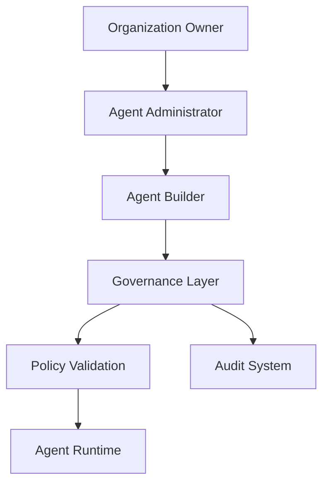
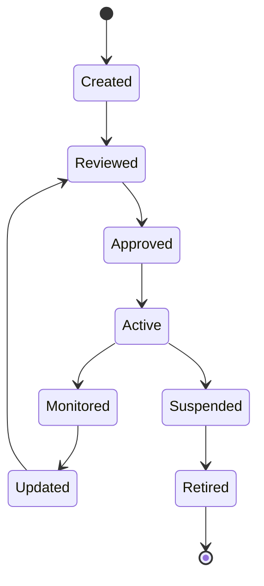

# Agent Governance

**Document Version:** 1.0
**Project:** AI Voice Agent SaaS Platform
**Status:** Draft
**Last Updated:** 2026-07-23

---

# 1. Overview

This document defines the governance framework for managing AI agents throughout their lifecycle.

Agent Governance ensures that AI agents operate:

* Safely
* Reliably
* Transparently
* Within business rules
* According to security requirements

Governance applies from agent creation through retirement.

---

# 2. Governance Objectives

The governance framework provides:

* Controlled agent creation
* Configuration approval
* Security enforcement
* Version management
* Auditability
* Compliance support

---

# 3. Governance Architecture



---

# 4. Agent Governance Lifecycle



---

# 5. Agent Ownership Model

Every agent must have ownership.

Ownership hierarchy:

```text
Organization

↓

Team

↓

Agent Owner

↓

Agent
```

---

# 6. Roles and Responsibilities

## Organization Owner

Responsible for:

* Organization policies
* User permissions
* Compliance decisions

---

## Agent Administrator

Responsible for:

* Agent creation
* Configuration management
* Deployment approval

---

## Agent Developer

Responsible for:

* Prompts
* Tools
* Workflows
* Testing

---

## Operations Team

Responsible for:

* Monitoring
* Incident handling
* Production stability

---

# 7. Agent Approval Process

Production agents require approval.

Process:

```text
Agent Created

↓

Configuration Review

↓

Security Review

↓

Testing

↓

Approval

↓

Production Deployment
```

---

# 8. Configuration Governance

Controlled configuration areas:

## Prompts

Require:

* Version control
* Review history
* Testing

---

## Tools

Require:

* Permission approval
* Security validation

---

## Knowledge Sources

Require:

* Source ownership
* Accuracy validation

---

# 9. Agent Version Governance

Every production change creates a version.

Example:

```text
Agent v1.0

↓

Approved Change

↓

Agent v1.1

↓

Deployment Review
```

---

# 10. Change Management

Changes are classified:

## Minor Changes

Examples:

* Prompt improvements
* Voice adjustments

---

## Major Changes

Examples:

* New tools
* Workflow changes
* Model changes

---

Major changes require additional testing.

---

# 11. Agent Policy Rules

Agents must follow:

## Business Rules

Example:

* Approved communication style
* Allowed actions

---

## Security Rules

Example:

* No unauthorized data access
* No secret disclosure

---

## Safety Rules

Example:

* Escalate sensitive requests
* Avoid unsupported claims

---

# 12. Prompt Governance

Prompts must:

* Have owners
* Be versioned
* Be reviewed
* Be tested

---

Prompt lifecycle:

```text
Draft

↓

Review

↓

Test

↓

Approve

↓

Deploy
```

---

# 13. Tool Governance

Every tool requires:

## Registration

Document:

* Purpose
* Owner
* Inputs
* Outputs

---

## Security Review

Verify:

* Permissions
* Data access
* Failure handling

---

## Monitoring

Track:

* Usage
* Errors
* Performance

---

# 14. Knowledge Governance

Knowledge sources require:

* Source ownership
* Update schedule
* Accuracy checks

Example:

```text
Company Policy Documents

Owner:

HR Department

Review:

Monthly
```

---

# 15. Agent Security Governance

Security controls:

## Access Control

Users only access authorized agents.

---

## Data Isolation

Tenant boundaries enforced.

---

## Audit Logging

All important actions recorded.

---

# 16. Audit Requirements

Record:

## Agent Changes

* Who changed configuration
* What changed
* When changed

---

## Runtime Actions

* Tool calls
* Decisions
* Errors

---

Example:

```json
{
"event":"agent.configuration.updated",

"user":"admin",

"timestamp":"2026-07-23",

"changes":[
"updated_prompt"
]
}
```

---

# 17. Agent Compliance Controls

Support:

* Data privacy requirements
* Customer policies
* Industry requirements

---

Examples:

Healthcare:

* Protected information controls

Finance:

* Transaction restrictions

---

# 18. Monitoring Governance

Monitor:

## Quality

* Incorrect answers
* Failed tasks

---

## Safety

* Policy violations
* Unauthorized actions

---

## Performance

* Latency
* Availability

---

# 19. Agent Retirement Process

Agents should not simply be deleted.

Process:

```text
Active Agent

↓

Disable New Sessions

↓

Archive Data

↓

Remove Deployment

↓

Retire Agent
```

---

# 20. Agent Governance Database Model

Recommended entities:

```text
agent_policies

agent_reviews

agent_versions

agent_audit_logs

agent_approvals

agent_owners
```

---

# 21. Governance Dashboard

Administrators should view:

```text
Governance Dashboard

├── Active Agents

├── Pending Reviews

├── Policy Violations

├── Version History

├── Audit Logs

└── Security Events
```

---

# 22. Future Enhancements

Potential additions:

* Automated compliance checking
* AI behavior scoring
* Governance automation
* Policy-as-code
* Enterprise approval workflows

---

# 23. Related Documents

| Document                      | Purpose       |
| ----------------------------- | ------------- |
| 02_Agent_Data_Model.md        | Agent data    |
| 04_Agent_Configuration.md     | Configuration |
| 05_Agent_Tools.md             | Tools         |
| 07_Agent_Testing_Framework.md | Testing       |
| 07_Security_Architecture.md   | Security      |

---

# 24. Conclusion

Agent Governance provides the operational control framework required for enterprise AI agents.

It ensures agents remain:

* Safe
* Auditable
* Controlled
* Business-aligned
* Production-ready

---

**End of Document**
