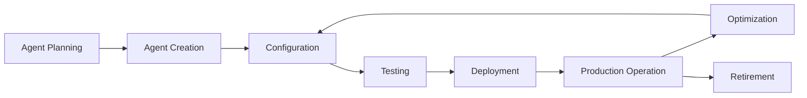
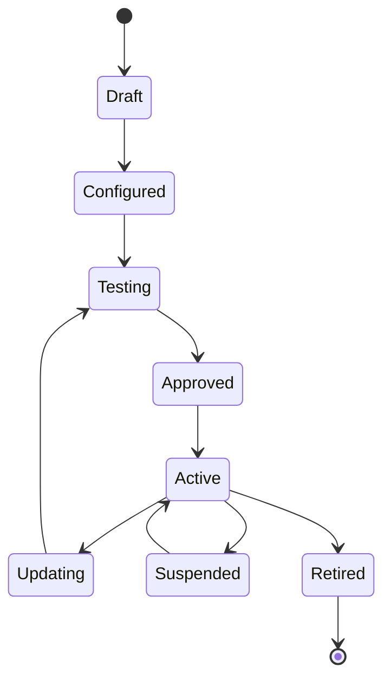
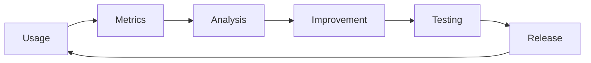

# Agent Lifecycle Management

**Document Version:** 1.0
**Project:** AI Voice Agent SaaS Platform
**Status:** Draft
**Last Updated:** 2026-07-23

---

# 1. Overview

This document defines the complete lifecycle management process for AI agents.

Agent Lifecycle Management controls an agent from initial creation until retirement.

The lifecycle includes:

* Planning
* Creation
* Configuration
* Testing
* Deployment
* Monitoring
* Improvement
* Retirement

---

# 2. Lifecycle Architecture



---

# 3. Lifecycle Goals

The lifecycle system ensures:

* Controlled agent releases
* Reliable operation
* Continuous improvement
* Version tracking
* Business alignment

---

# 4. Agent Lifecycle Stages

```text id="w5t7n2"
Stage 1  Planning

Stage 2  Creation

Stage 3  Configuration

Stage 4  Validation

Stage 5  Deployment

Stage 6  Monitoring

Stage 7  Optimization

Stage 8  Retirement
```

---

# 5. Stage 1: Agent Planning

## Purpose

Define why the agent exists.

Questions:

* What problem does it solve?
* Who will use it?
* What actions can it perform?
* What success metrics apply?

---

## Planning Information

Example:

```json id="x2r9m4"
{
"name":"Customer Support Agent",

"purpose":"Handle customer inquiries",

"channels":[
"phone",
"web"
],

"goals":[
"reduce response time",
"increase resolution rate"
]
}
```

---

# 6. Stage 2: Agent Creation

The agent record is created.

Created information:

* Agent name
* Organization
* Owner
* Purpose
* Initial status

Initial state:

```text id="v7k1m8"
Draft
```

---

# 7. Stage 3: Agent Configuration

Configuration includes:

```text id="p6z2w9"
Agent Identity

+

Instructions

+

Personality

+

Model

+

Voice

+

Knowledge

+

Tools

+

Workflows
```

---

# 8. Stage 4: Agent Validation

Before deployment, validate:

## Configuration

Check:

* Required fields
* Compatible settings

---

## Security

Check:

* Permissions
* Data access

---

## Behavior

Check:

* Expected responses
* Workflow execution

---

# 9. Stage 5: Agent Testing

Testing includes:

```text id="m3q8x1"
Functional Testing

↓

Conversation Testing

↓

Tool Testing

↓

Performance Testing

↓

Safety Testing
```

---

# 10. Stage 6: Agent Deployment

Deployment process:

```text id="s8n4q6"
Approved Agent

↓

Create Deployment

↓

Assign Channel

↓

Activate Runtime

↓

Accept Conversations
```

---

# 11. Stage 7: Production Operation

During operation, monitor:

## Technical Metrics

* Availability
* Latency
* Errors

---

## AI Metrics

* Accuracy
* Tool success
* Conversation quality

---

## Business Metrics

* Revenue impact
* Customer satisfaction
* Task completion

---

# 12. Stage 8: Optimization

Agents improve through:

* Prompt updates
* Knowledge updates
* Workflow improvements
* Model changes

Optimization cycle:

```text id="k5x7v2"
Analyze

↓

Identify Problem

↓

Update Configuration

↓

Test

↓

Deploy Improvement
```

---

# 13. Agent Version Management

Every lifecycle change creates versions.

Example:

```text id="n9v3q5"
Agent

v1.0

↓

v1.1

↓

v2.0
```

Each version stores:

* Configuration snapshot
* Tests
* Deployment history

---

# 14. Agent State Model



---

# 15. Agent Change Management

Changes are categorized.

## Configuration Changes

Examples:

* Prompt updates
* Voice changes

---

## Capability Changes

Examples:

* New tools
* New workflows

---

## Infrastructure Changes

Examples:

* Runtime upgrades
* Model changes

---

# 16. Rollback Strategy

If an update fails:

```text id="r7m2k8"
Problem Detected

↓

Stop New Deployment

↓

Restore Previous Version

↓

Verify Health

↓

Continue Operation
```

---

# 17. Agent Monitoring Loop

Continuous improvement:



---

# 18. Agent Retirement

Agents are retired when:

* Business need ends
* Replacement exists
* Cost is too high
* Policy requires removal

---

## Retirement Process

```text id="h6v8n3"
Disable Deployment

↓

Archive Configuration

↓

Preserve Audit Data

↓

Remove Active Resources
```

---

# 19. Lifecycle Database Entities

Recommended tables:

```text id="m8q2v5"
agents

agent_versions

agent_deployments

agent_reviews

agent_audit_logs

agent_metrics

agent_events
```

---

# 20. Lifecycle Automation

Future automation:

* Automatic testing
* Deployment pipelines
* Performance alerts
* Optimization recommendations

---

# 21. Governance Integration

Lifecycle integrates with governance:

```text id="x4n7k2"
Lifecycle

+

Governance

+

Security

+

Monitoring

=

Controlled AI Operations
```

---

# 22. Related Documents

| Document                      | Purpose           |
| ----------------------------- | ----------------- |
| 01_Agent_Platform_Overview.md | Platform overview |
| 02_Agent_Data_Model.md        | Agent data        |
| 04_Agent_Configuration.md     | Configuration     |
| 06_Agent_Deployment.md        | Deployment        |
| 09_Agent_Governance.md        | Governance        |

---

# 23. Conclusion

Agent Lifecycle Management provides a structured approach for operating AI agents from creation to retirement.

It enables:

* Reliable releases
* Controlled changes
* Continuous improvement
* Enterprise-level management

---

**End of Document**
