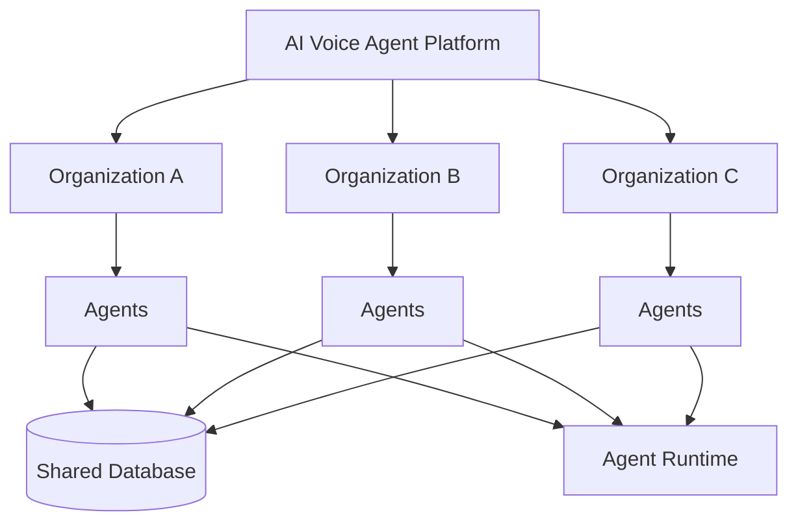
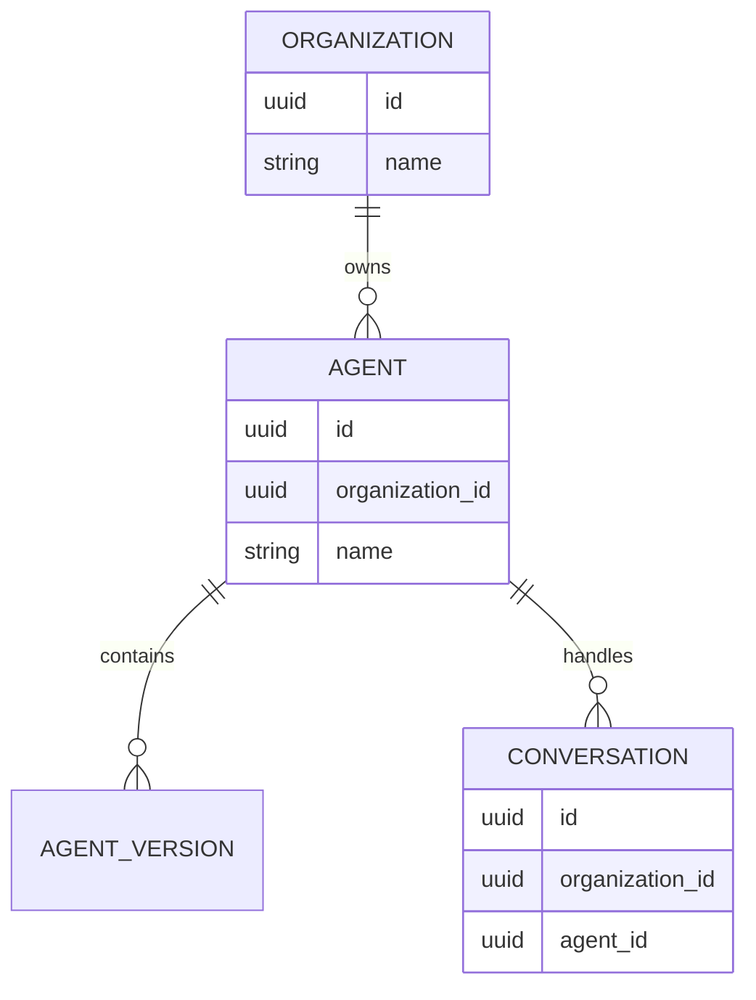
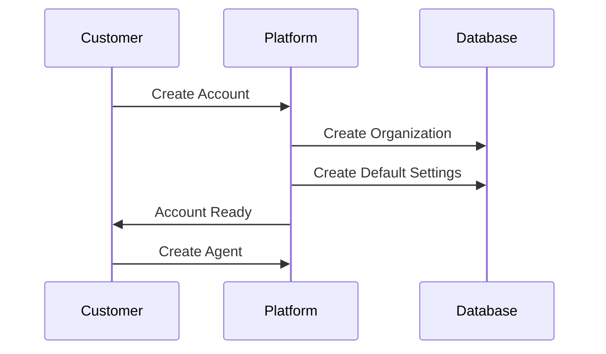

# Agent Multi-Tenancy

**Document Version:** 1.0
**Project:** AI Voice Agent SaaS Platform
**Status:** Draft
**Last Updated:** 2026-07-23

---

# 1. Overview

This document defines the multi-tenancy architecture for managing AI agents across multiple customer organizations.

The AI Voice Agent SaaS Platform is designed as a multi-tenant system where multiple businesses can securely create and operate their own AI agents on a shared platform.

The architecture provides:

* Data isolation
* Configuration isolation
* Resource control
* Secure access boundaries
* Tenant-specific customization

---

# 2. Multi-Tenant Architecture



---

# 3. Multi-Tenancy Goals

The architecture must provide:

## Security Isolation

One customer must never access another customer's data.

---

## Configuration Isolation

Each organization manages only its own:

* Agents
* Knowledge bases
* Tools
* Users
* Settings

---

## Resource Isolation

Control:

* AI usage
* Storage
* Voice minutes
* API limits

---

# 4. Tenant Model

The top-level entity is:

```text
Organization
```

Each organization represents a customer account.

Example:

```text
Organization

    |

    ├── Users

    ├── Agents

    ├── Knowledge Bases

    ├── Conversations

    ├── Integrations

    └── Billing
```

---

# 5. Tenant Data Ownership

Every tenant-owned resource must contain:

```sql
organization_id
```

Example:

```sql
agents

id

organization_id

name

configuration
```

---

# 6. Tenant Isolation Strategy

The platform uses logical isolation.

Architecture:

```text
Shared Infrastructure

        +

Tenant Identifier

        +

Access Policies

        +

Application Filtering

        =

Secure Multi-Tenant System
```

---

# 7. Database Isolation

Recommended approach:

## Shared Database

All tenants share the same PostgreSQL database.

Advantages:

* Lower cost
* Easier operations
* Simple scaling

---

## Tenant Separation

Using:

```sql
organization_id
```

Example:

```sql
SELECT *
FROM agents
WHERE organization_id = current_tenant;
```

---

# 8. PostgreSQL Row Level Security

PostgreSQL RLS can enforce tenant boundaries.

Example:

```sql
CREATE POLICY tenant_isolation
ON agents
USING (
organization_id = current_setting('app.organization_id')::uuid
);
```

---

# 9. Agent Isolation Model

Each agent belongs to exactly one organization.

Relationship:



---

# 10. Runtime Tenant Context

Every runtime session carries tenant information.

Example:

```json
{
"organization_id":"org_123",

"agent_id":"agent_456",

"session_id":"session_789"
}
```

---

# 11. Tenant-Aware Request Flow

```text
User Request

↓

Authentication

↓

Identify Organization

↓

Validate Permissions

↓

Load Tenant Resources

↓

Execute Operation
```

---

# 12. Agent Runtime Isolation

During execution:

Runtime must know:

* Organization
* Agent
* User
* Permissions

Example:

```text
Conversation Session

{

organization_id

agent_id

configuration

memory_namespace

}
```

---

# 13. Memory Isolation

Memory must be tenant-aware.

Example:

Redis keys:

```text
tenant:{org_id}:session:{session_id}
```

---

# 14. Vector Database Isolation

RAG data must be isolated.

Example:

Embedding metadata:

```json
{
"organization_id":"org123",

"document_id":"doc456",

"agent_id":"agent789"
}
```

Retrieval:

```text
Search

↓

Filter Organization

↓

Return Allowed Knowledge
```

---

# 15. Tool Isolation

Tools must respect tenant boundaries.

Example:

Bad:

```text
Agent

↓

Access All CRM Data
```

---

Correct:

```text
Agent

↓

Tenant CRM Connection

↓

Tenant Data Only
```

---

# 16. User Roles Within Tenant

Example roles:

| Role      | Permissions      |
| --------- | ---------------- |
| Owner     | Full access      |
| Admin     | Manage agents    |
| Developer | Configure agents |
| Viewer    | Read-only        |

---

# 17. Tenant Resource Limits

Organizations may have limits:

Examples:

* Number of agents
* Voice minutes
* API requests
* Storage usage
* AI tokens

---

# 18. Usage Tracking

Track usage by tenant:

```json
{
"organization_id":"org123",

"voice_minutes":500,

"tokens_used":200000,

"storage_used":"5GB"
}
```

---

# 19. Tenant Security Controls

Required controls:

* Authentication
* Authorization
* Tenant validation
* Audit logging
* Data encryption

---

# 20. Tenant Onboarding Flow



---

# 21. Tenant Offboarding

Process:

```text
Disable Account

↓

Stop Deployments

↓

Archive Data

↓

Export Data

↓

Delete According To Policy
```

---

# 22. Tenant Monitoring

Monitor:

* Usage
* Errors
* Security events
* Performance

---

# 23. Future Scaling Options

Current:

```text
Shared Database
```

Future:

```text
Large Enterprise Tenant

↓

Dedicated Database

↓

Dedicated Runtime Resources
```

---

# 24. Related Documents

| Document                      | Purpose           |
| ----------------------------- | ----------------- |
| 02_Agent_Data_Model.md        | Agent data model  |
| 03_Agent_Runtime.md           | Runtime execution |
| 07_Agent_Testing_Framework.md | Testing           |
| 09_Agent_Governance.md        | Governance        |
| 07_Security_Architecture.md   | Security          |

---

# 25. Conclusion

The Agent Multi-Tenancy architecture enables the platform to securely serve many organizations while maintaining isolation and scalability.

It provides the foundation for a production-grade SaaS AI agent platform.

---

**End of Document**
