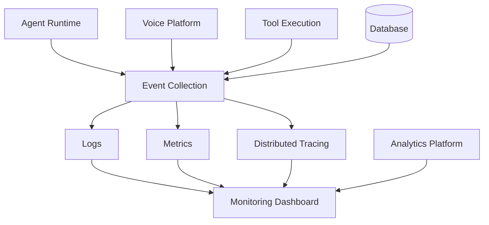

# Agent Observability

**Document Version:** 1.0
**Project:** AI Voice Agent SaaS Platform
**Status:** Draft
**Last Updated:** 2026-07-23

---

# 1. Overview

This document defines the observability architecture for monitoring AI agents throughout their operational lifecycle.

Agent Observability provides visibility into:

* Agent health
* Conversation execution
* AI performance
* Tool execution
* Voice quality
* System reliability
* Customer experience

Observability enables teams to understand not only **what happened**, but also **why it happened**.

---

# 2. Observability Goals

The observability system should answer:

## Availability

* Is the agent running?
* Are conversations being handled?
* Are services healthy?

---

## Performance

* How fast does the agent respond?
* Where is latency occurring?
* Which components are slow?

---

## Quality

* Are responses accurate?
* Are tasks completed?
* Are users satisfied?

---

## Cost

* How much AI usage is consumed?
* Which agents generate the highest cost?

---

# 3. Observability Architecture



---

# 4. Three Pillars of Observability

The platform follows the standard observability model:

```text
Logs

+

Metrics

+

Traces

=

Complete System Visibility
```

---

# 5. Logging System

## Purpose

Logs provide detailed information about system events.

---

## Agent Runtime Logs

Examples:

```text
Agent Started

Conversation Created

Tool Executed

Response Generated

Session Completed
```

---

## Required Log Metadata

Every log should contain:

```json
{
"timestamp":"2026-07-23",

"service":"agent-runtime",

"organization_id":"org123",

"agent_id":"agent456",

"conversation_id":"conv789",

"request_id":"req001"
}
```

---

# 6. Log Levels

Standard levels:

| Level    | Purpose                 |
| -------- | ----------------------- |
| DEBUG    | Development information |
| INFO     | Normal operations       |
| WARN     | Potential problems      |
| ERROR    | Failures                |
| CRITICAL | System-impacting issues |

---

# 7. Metrics System

Metrics provide numerical measurements.

---

## Agent Metrics

Examples:

* Active agents
* Conversations per agent
* Completion rate
* Failure rate

---

## Runtime Metrics

Examples:

* Response latency
* Token usage
* Model latency
* Memory usage

---

## Voice Metrics

Examples:

* Call duration
* Audio latency
* Connection quality
* Dropped calls

---

# 8. Key Performance Indicators

## Conversation KPIs

| Metric           | Description              |
| ---------------- | ------------------------ |
| Completion Rate  | Successful conversations |
| Average Duration | Conversation length      |
| Escalation Rate  | Human transfers          |
| Abandonment Rate | Failed conversations     |

---

## AI KPIs

| Metric            | Description        |
| ----------------- | ------------------ |
| Response Time     | AI response speed  |
| Accuracy Score    | Response quality   |
| Tool Success Rate | Action reliability |

---

# 9. Distributed Tracing

Tracing follows a request across services.

Example:

```text
Incoming Call

↓

Twilio

↓

LiveKit

↓

Agent Runtime

↓

LLM

↓

Tool

↓

Database

↓

Response
```

---

# 10. Trace Example

```json
{
"trace_id":"trace123",

"spans":[

"voice_received",

"speech_to_text",

"llm_request",

"tool_execution",

"text_to_speech"

]
}
```

---

# 11. Conversation Tracing

Every conversation should have a trace.

Tracks:

* User input
* Agent decisions
* Tool calls
* Generated responses
* Errors

---

# 12. AI Decision Observability

AI systems require additional visibility.

Track:

## Model

* Model name
* Tokens used
* Latency

---

## Prompt

* Prompt version
* Context size

---

## Retrieval

* Documents retrieved
* Relevance scores

---

# 13. Tool Observability

Track every tool execution.

Example:

```json
{
"tool":"calendar_booking",

"status":"success",

"execution_time_ms":250
}
```

---

Metrics:

* Success rate
* Failure rate
* Average duration
* Timeout count

---

# 14. RAG Observability

Monitor:

## Retrieval

* Query
* Retrieved chunks
* Similarity score

---

## Generation

* Context used
* Final response

---

Important failures:

* Missing knowledge
* Incorrect retrieval
* Hallucination risk

---

# 15. Voice Observability

Voice pipeline monitoring:

```text
Caller Audio

↓

STT Latency

↓

Agent Processing

↓

LLM Latency

↓

TTS Latency

↓

Caller Response
```

---

Track:

* Total response latency
* Interruptions
* Audio quality
* Connection failures

---

# 16. Alerting System

Alerts notify operators about problems.

---

## Critical Alerts

Examples:

* Agent unavailable
* Database failure
* Voice outage

---

## Warning Alerts

Examples:

* Increased latency
* High error rate
* Token usage spike

---

# 17. Health Checks

Every service exposes health information.

Example:

```text
GET /health
```

Checks:

* Database connection
* Redis connection
* External services
* Runtime availability

---

# 18. Agent Health Model

Agent status:

```text
Healthy

↓

Warning

↓

Degraded

↓

Failed
```

---

# 19. Monitoring Dashboard

Dashboard sections:

```text
Agent Monitoring

├── Active Agents

├── Active Conversations

├── System Health

├── Errors

├── Latency

├── AI Costs

└── Quality Scores
```

---

# 20. Multi-Tenant Observability

Observability data must support tenant isolation.

Example:

```text
Organization A

Only sees:

- Own agents
- Own conversations
- Own usage
```

---

# 21. Security Considerations

Observability data may contain sensitive information.

Controls:

* Access restrictions
* Data masking
* Retention policies
* Audit logs

---

# 22. Recommended Technology Stack

Possible implementation:

## Metrics

* Prometheus

## Visualization

* Grafana

## Logging

* Loki / Elasticsearch

## Tracing

* OpenTelemetry

---

# 23. Incident Investigation Flow

```text
Alert Triggered

↓

Open Dashboard

↓

Review Metrics

↓

Inspect Logs

↓

Analyze Trace

↓

Identify Root Cause

↓

Apply Fix
```

---

# 24. Future Enhancements

Potential additions:

* AI-powered incident analysis
* Automatic anomaly detection
* Agent quality monitoring
* Predictive failure detection

---

# 25. Related Documents

| Document                      | Purpose              |
| ----------------------------- | -------------------- |
| 03_Agent_Runtime.md           | Runtime architecture |
| 07_Agent_Testing_Framework.md | Testing              |
| 08_Agent_Analytics.md         | Analytics            |
| 09_Agent_Governance.md        | Governance           |
| 37_Observability              | Platform monitoring  |

---

# 26. Conclusion

Agent Observability provides the visibility required to operate AI agents reliably at production scale.

It enables teams to monitor:

* Performance
* Reliability
* Quality
* Cost
* Customer experience

---

**End of Document**
