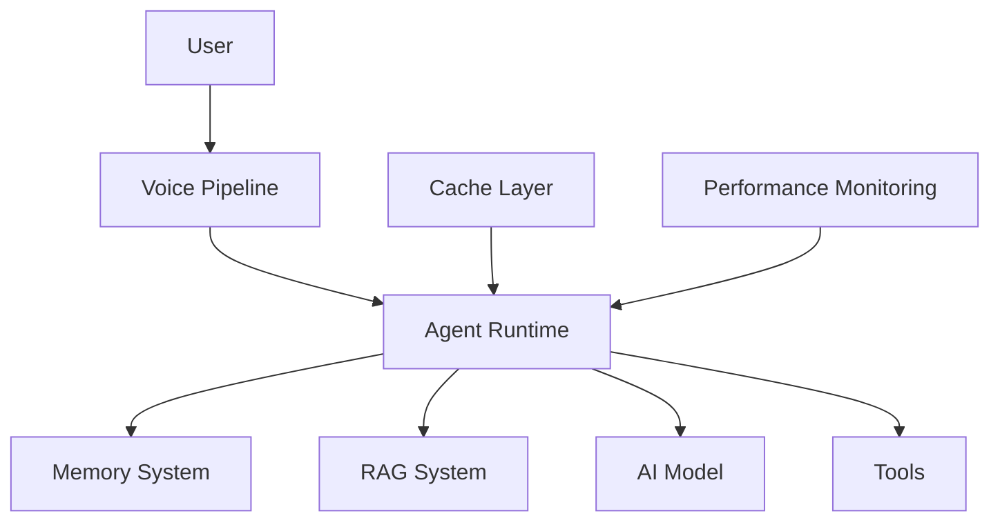
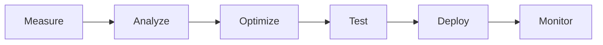

# Agent Performance Optimization

**Document Version:** 1.0
**Project:** AI Voice Agent SaaS Platform
**Status:** Draft
**Last Updated:** 2026-07-23

---

# 1. Overview

This document defines strategies for optimizing AI agent performance across the entire execution pipeline.

Performance optimization focuses on:

* Faster responses
* Lower latency
* Reduced AI costs
* Higher reliability
* Better user experience

AI agent performance depends on multiple layers:

```text id="q8m4z7"
Voice Input

↓

Speech Processing

↓

Agent Reasoning

↓

Tool Execution

↓

Knowledge Retrieval

↓

Response Generation

↓

Voice Output
```

---

# 2. Performance Objectives

The platform should optimize:

## User Experience

* Natural conversations
* Fast responses
* Minimal interruptions

---

## Infrastructure

* Efficient resource usage
* Horizontal scalability
* Reduced operational cost

---

## AI Efficiency

* Better prompts
* Smaller context windows
* Optimized model selection

---

# 3. Performance Architecture



---

# 4. Performance Metrics

Important measurements:

| Metric              | Description               |
| ------------------- | ------------------------- |
| Response Latency    | Time until agent responds |
| First Token Latency | LLM response start time   |
| Tool Latency        | External action duration  |
| STT Latency         | Speech recognition delay  |
| TTS Latency         | Speech generation delay   |
| Error Rate          | Failed executions         |

---

# 5. Voice Pipeline Optimization

The voice pipeline has multiple latency points.

```text id="x4n7p2"
Caller Speech

↓

STT

↓

LLM

↓

TTS

↓

Caller Hears Response
```

Optimization methods:

* Streaming speech recognition
* Streaming responses
* Faster TTS models
* Voice activity detection tuning

---

# 6. Agent Runtime Optimization

Runtime improvements:

## Efficient State Management

Avoid unnecessary state loading.

---

## Parallel Execution

Run independent operations simultaneously.

Example:

```text id="z9m2q6"
Load User Profile

        +

Load Preferences

        +

Load Knowledge

        ↓

Combine Context
```

---

# 7. Model Optimization

Different tasks require different models.

Example:

```text id="n5q8r3"
Simple FAQ

↓

Small Model


Complex Reasoning

↓

Large Model
```

Benefits:

* Lower cost
* Faster responses
* Better scalability

---

# 8. Prompt Optimization

Large prompts increase latency and cost.

Optimization:

## Remove Unnecessary Instructions

Before:

```text id="a6k3v9"
Very large system prompt
```

After:

```text id="m8q2x5"
Focused instructions
```

---

## Use Prompt Templates

Reusable templates:

* Reduce duplication
* Improve consistency

---

# 9. Context Window Optimization

Avoid sending unnecessary history.

Use:

* Conversation summaries
* Relevant memory retrieval
* Context filtering

---

Example:

```text id="p3x7k9"
Old Conversation

↓

Summarizer

↓

Compact Memory

↓

Agent Context
```

---

# 10. Memory Optimization

Memory layers:

```text id="f6q8m2"
Short-Term Memory

↓

Conversation Memory

↓

Long-Term Memory
```

Optimization:

* Store only useful information
* Remove duplicates
* Apply expiration rules

---

# 11. RAG Performance Optimization

Improve retrieval speed:

## Better Chunking

Avoid:

* Too large chunks
* Too small chunks

---

## Metadata Filtering

Example:

```text id="k4m7z8"
Search

↓

Organization Filter

↓

Agent Filter

↓

Relevant Documents
```

---

## Vector Optimization

Use:

* Proper indexing
* Embedding models
* Similarity thresholds

---

# 12. Tool Execution Optimization

Tools can become bottlenecks.

Improve by:

* Caching results
* Parallel calls
* Timeout management
* Retry policies

---

Example:

```text id="w5p9x1"
Agent

↓

Tool Request

↓

Cache Check

↓

Execute Only If Needed
```

---

# 13. Caching Strategy

Cache frequently used data:

Examples:

* Agent configuration
* Knowledge metadata
* User preferences
* Tool responses

---

Architecture:

```text id="y7m3q6"
PostgreSQL

↓

Redis Cache

↓

Agent Runtime
```

---

# 14. Database Optimization

Improve database performance:

* Proper indexing
* Query optimization
* Connection pooling
* Partitioning

---

Important indexes:

```sql id="j8v4n5"
organization_id

agent_id

conversation_id

created_at
```

---

# 15. Scaling Strategy

Support increasing demand.

## Horizontal Scaling

Add more workers:

```text id="r6q2m9"
Agent Worker 1

Agent Worker 2

Agent Worker 3
```

---

## Load Balancing

Distribute sessions:

```text id="x8m4q7"
Users

↓

Load Balancer

↓

Agent Workers
```

---

# 16. Resource Optimization

Monitor:

* CPU usage
* Memory usage
* GPU usage
* Network usage

---

Avoid:

* Memory leaks
* Idle resources
* Excessive logging

---

# 17. Cost Optimization

AI costs come from:

* LLM tokens
* Speech minutes
* Storage
* External APIs

---

Optimization methods:

* Smaller models
* Context reduction
* Caching
* Usage limits

---

# 18. Performance Testing

Test:

## Load Testing

Example:

```text id="e7m2k4"
100 simultaneous calls

↓

500 simultaneous calls
```

---

## Stress Testing

Find system limits.

---

## Endurance Testing

Long-running stability.

---

# 19. Performance Monitoring

Track:

```text id="c9n5x2"
Latency

+

Errors

+

Resource Usage

+

Cost

=

Performance Health
```

---

# 20. Performance Alerts

Examples:

Alert when:

* Response latency increases
* Tool failures increase
* Costs spike
* Runtime resources exceed limits

---

# 21. Optimization Workflow



---

# 22. Performance Best Practices

Recommended practices:

* Use streaming everywhere possible
* Keep prompts optimized
* Cache stable data
* Monitor every pipeline stage
* Test before production changes

---

# 23. Future Enhancements

Potential improvements:

* Automatic performance tuning
* AI cost optimizer
* Dynamic model routing
* Predictive scaling

---

# 24. Related Documents

| Document                   | Purpose           |
| -------------------------- | ----------------- |
| 03_Agent_Runtime.md        | Runtime execution |
| 08_Agent_Analytics.md      | Analytics         |
| 12_Agent_Observability.md  | Monitoring        |
| 13_Agent_Security_Model.md | Security          |
| 29_Database_Schema         | Data layer        |

---

# 25. Conclusion

Agent Performance Optimization ensures AI agents deliver fast, reliable, and cost-effective experiences.

It provides the foundation for operating AI voice agents at enterprise scale.

---

**End of Document**
