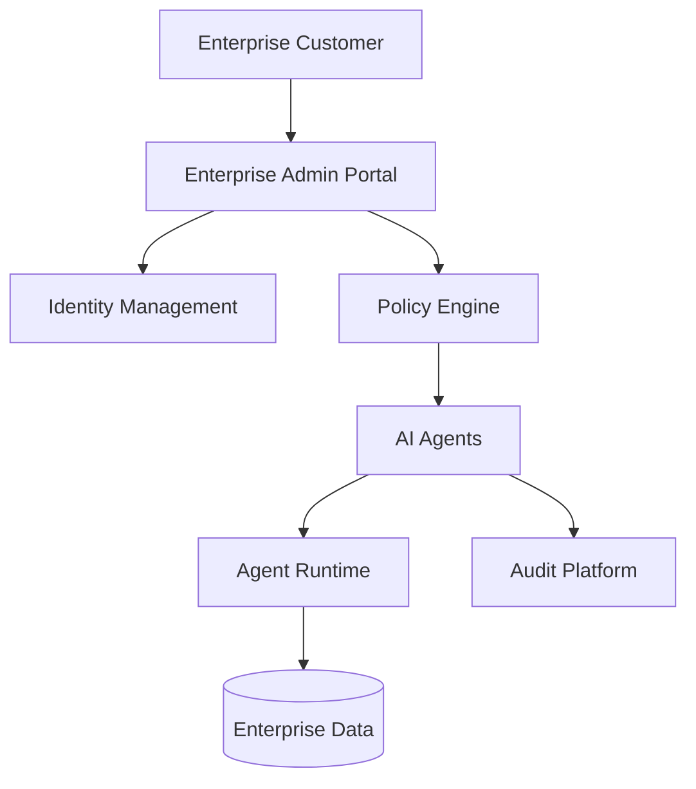

# Agent Enterprise Features

**Document Version:** 1.0
**Project:** AI Voice Agent SaaS Platform
**Status:** Draft
**Last Updated:** 2026-07-23

---

# 1. Overview

This document defines enterprise-grade capabilities required to operate AI agents for large organizations.

Enterprise customers require additional capabilities beyond basic agent creation and deployment.

These features provide:

* Advanced administration
* Security controls
* Compliance readiness
* Scalability
* Customization
* Operational management

---

# 2. Enterprise Architecture



---

# 3. Enterprise Capability Areas

```text
Enterprise AI Platform

├── Organization Management

├── Identity & Access Management

├── Security Controls

├── Compliance

├── Customization

├── Scaling

├── Reporting

└── Support Operations
```

---

# 4. Organization Management

Enterprise organizations may contain:

```text
Enterprise

├── Departments

│

├── Teams

│

├── Users

│

├── Agents

│

└── Resources
```

---

# 5. Organization Hierarchy

Example:

```text
Company

↓

Business Unit

↓

Department

↓

Team

↓

Agent
```

Benefits:

* Better access control
* Resource ownership
* Reporting separation

---

# 6. Enterprise User Management

Supports:

* Multiple users
* Multiple roles
* Department permissions
* Administrative delegation

---

Example roles:

| Role             | Responsibility    |
| ---------------- | ----------------- |
| Enterprise Owner | Full control      |
| Platform Admin   | Manage platform   |
| Security Admin   | Security policies |
| Agent Manager    | Manage agents     |
| Analyst          | View reports      |

---

# 7. Single Sign-On (SSO)

Enterprise authentication support:

Examples:

* SAML
* OAuth
* OpenID Connect

Flow:

```text
User

↓

Enterprise Identity Provider

↓

AI Platform

↓

Authorized Access
```

---

# 8. Identity Federation

Allows organizations to manage identity externally.

Benefits:

* Centralized authentication
* Existing security policies
* Easier employee management

---

# 9. Advanced Role-Based Access Control

Enterprise RBAC supports:

```text
User

↓

Role

↓

Permissions

↓

Resources
```

Example:

```text
Support Manager

Can:

✓ View support agents

✓ Edit workflows


Cannot:

✗ Access billing agents
```

---

# 10. Attribute-Based Access Control

ABAC adds contextual rules.

Examples:

Allow access when:

```text
Department = Support

AND

Location = Approved Region

AND

Role = Manager
```

---

# 11. Enterprise Security Policies

Organizations can define:

* Password rules
* Session policies
* Data retention
* Tool restrictions
* Agent restrictions

---

# 12. Custom Agent Branding

Enterprise customers can customize:

* Agent name
* Voice
* Greeting
* Personality
* Response style

Example:

```text
Default:

"Hello, how can I help?"


Enterprise:

"Welcome to ABC Healthcare Support."
```

---

# 13. Custom Knowledge Management

Enterprise knowledge sources:

* Internal documents
* Policies
* Product databases
* Training materials

Security:

```text
Document

↓

Access Rules

↓

Agent Permission

↓

Retrieval
```

---

# 14. Enterprise Integrations

Common integrations:

## CRM

Examples:

* Customer records
* Sales pipelines

---

## ERP

Examples:

* Orders
* Inventory

---

## Communication

Examples:

* Email
* Messaging systems

---

# 15. Private AI Models

Enterprise customers may require:

* Dedicated models
* Private inference
* Custom fine-tuning

Architecture:

```text
Enterprise Data

↓

Private AI Model

↓

Agent Runtime
```

---

# 16. Dedicated Resources

Large customers may require:

* Dedicated runtime workers
* Dedicated databases
* Dedicated environments

Example:

```text
Shared Platform

        OR

Enterprise Dedicated Environment
```

---

# 17. Compliance Features

Enterprise readiness includes:

* Audit trails
* Data governance
* Access records
* Retention policies

---

# 18. Audit Management

Track:

```text
User Actions

+

Agent Changes

+

Data Access

+

Security Events
```

Example:

```json
{
"event":"agent.updated",

"user":"admin",

"time":"2026-07-23"
}
```

---

# 19. Data Residency

Support regional requirements.

Examples:

```text
US Region

EU Region

Asia Region
```

Benefits:

* Regulatory support
* Lower latency
* Customer requirements

---

# 20. Enterprise Reporting

Reports include:

## Operational Reports

* Agent usage
* Availability
* Performance

---

## Business Reports

* Leads
* Revenue impact
* Customer outcomes

---

## Security Reports

* Access history
* Policy violations

---

# 21. Service Management

Enterprise operations require:

* SLA monitoring
* Incident management
* Support workflows

---

# 22. Enterprise Deployment Models

Supported models:

## Shared SaaS

```text
Multiple Customers

↓

Shared Platform
```

---

## Dedicated Tenant

```text
One Customer

↓

Dedicated Resources
```

---

## Private Deployment

```text
Customer Infrastructure

↓

AI Agent Platform
```

---

# 23. Disaster Recovery

Enterprise requirements:

* Backup strategy
* Recovery procedures
* Availability targets

---

Recovery flow:

```text
Failure

↓

Detect

↓

Recover

↓

Restore Service
```

---

# 24. Enterprise Observability

Additional monitoring:

* Organization health
* Usage trends
* Security events
* Cost analysis

---

# 25. Enterprise Governance

Includes:

* Approval workflows
* Change management
* Policy enforcement

---

# 26. Future Enhancements

Potential additions:

* Enterprise marketplace
* Private agent environments
* Advanced compliance automation
* AI governance center
* Enterprise API management

---

# 27. Related Documents

| Document                             | Purpose       |
| ------------------------------------ | ------------- |
| 09_Agent_Governance.md               | Governance    |
| 11_Agent_Multi_Tenancy.md            | Multi-tenancy |
| 13_Agent_Security_Model.md           | Security      |
| 12_Agent_Observability.md            | Monitoring    |
| 14_Agent_Performance_Optimization.md | Performance   |

---

# 28. Conclusion

Enterprise features transform the AI Voice Agent Platform from a simple agent builder into a secure, scalable enterprise automation platform.

They enable:

* Large organization support
* Strong security controls
* Compliance readiness
* Enterprise operations

---

**End of Document**
