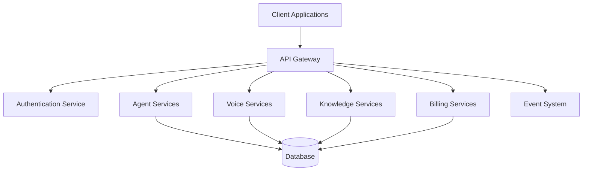
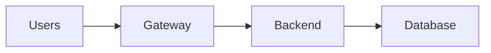

# Agent API Gateway

**Document Version:** 1.0
**Project:** AI Voice Agent SaaS Platform
**Status:** Draft
**Last Updated:** 2026-07-23

---

# 1. Overview

This document defines the API Gateway architecture for the AI Voice Agent Platform.

The API Gateway provides a unified entry point for:

* Web dashboard requests
* External integrations
* Mobile applications
* Internal services
* Agent management operations

It handles:

* Authentication
* Authorization
* Routing
* Rate limiting
* Request validation
* Observability
* Security enforcement

---

# 2. API Gateway Architecture



---

# 3. API Gateway Responsibilities

The API Gateway manages:

```text id="d2j7x9"
Request Handling

↓

Security Validation

↓

Service Routing

↓

Response Processing

↓

Logging
```

---

# 4. Supported API Consumers

The gateway supports:

## Web Dashboard

Used by:

* Organization admins
* Developers
* Operators

---

## External Applications

Examples:

* CRM systems
* Mobile apps
* Partner platforms

---

## Internal Services

Examples:

* Agent Runtime
* Workflow Engine
* Analytics Service

---

# 5. API Request Flow

```text id="h8m3q5"
Client Request

↓

API Gateway

↓

Authentication

↓

Authorization

↓

Route Request

↓

Backend Service

↓

Response
```

---

# 6. Authentication

Supported methods:

## JWT Authentication

For application users.

Example:

```http
Authorization: Bearer <token>
```

---

## API Keys

For external integrations.

Example:

```http
X-API-Key: <key>
```

---

## Service Authentication

For internal services.

Examples:

* mTLS
* Service tokens

---

# 7. Authorization Layer

Authorization checks:

* User identity
* Organization ownership
* Role permissions
* Resource access

Example:

```text id="a8x2m6"
User

↓

Role

↓

Permission

↓

Agent Resource
```

---

# 8. Tenant Routing

Every request receives tenant context.

Example:

```json id="j7n5p4"
{
"organization_id":"org123",

"user_id":"user456",

"role":"admin"
}
```

---

# 9. API Versioning

The platform uses versioned APIs.

Example:

```http id="v3s8m1"
GET /api/v1/agents
```

Future:

```http
GET /api/v2/agents
```

Benefits:

* Backward compatibility
* Safer upgrades
* Controlled changes

---

# 10. Core API Domains

API Gateway routes:

```text id="k6v9z3"
Authentication APIs

Agent APIs

Conversation APIs

Voice APIs

Knowledge APIs

Tool APIs

Analytics APIs

Billing APIs

Administration APIs
```

---

# 11. Agent Management APIs

Examples:

Create agent:

```http
POST /api/v1/agents
```

---

List agents:

```http
GET /api/v1/agents
```

---

Update agent:

```http
PUT /api/v1/agents/{id}
```

---

Delete agent:

```http
DELETE /api/v1/agents/{id}
```

---

# 12. Conversation APIs

Examples:

Create conversation:

```http
POST /api/v1/conversations
```

---

Get conversation:

```http
GET /api/v1/conversations/{id}
```

---

Conversation events:

```http
GET /api/v1/conversations/{id}/events
```

---

# 13. Voice APIs

Handles:

* Call control
* SIP connections
* Voice sessions
* Transfers

Examples:

```http
POST /api/v1/calls/start

POST /api/v1/calls/transfer

POST /api/v1/calls/end
```

---

# 14. Knowledge APIs

Manage RAG resources.

Examples:

Upload document:

```http
POST /api/v1/knowledge/documents
```

---

Search:

```http
POST /api/v1/knowledge/search
```

---

# 15. Tool APIs

Manage agent capabilities.

Examples:

Register tool:

```http
POST /api/v1/tools
```

---

Assign tool:

```http
POST /api/v1/agents/{id}/tools
```

---

# 16. Rate Limiting

Protect platform resources.

Limits may apply to:

* Requests per minute
* Voice calls
* AI usage
* External API calls

Example:

```text id="w3n7q2"
Free Plan

100 requests/min


Enterprise

Unlimited / Custom
```

---

# 17. Request Validation

Validate:

* Headers
* Parameters
* Payload
* Permissions

Required headers:

```http
X-Request-ID

X-Correlation-ID

Idempotency-Key
```

---

# 18. Idempotency Support

Important for:

* Payments
* Call creation
* Deployments

Example:

```http
Idempotency-Key:
abc-123
```

Prevents duplicate operations.

---

# 19. Error Handling

Standard error format:

```json id="s4k8m2"
{
"error":{

"code":"AGENT_NOT_FOUND",

"message":"Agent does not exist",

"request_id":"req123"

}
}
```

---

# 20. API Gateway Observability

Track:

* Requests
* Latency
* Errors
* Authentication failures
* Rate limits

---

# 21. Security Controls

Gateway protects against:

* Unauthorized access
* API abuse
* Injection attacks
* Invalid requests

---

Controls:

* WAF
* Rate limiting
* Input validation
* Token verification

---

# 22. Internal Service Communication

Services communicate using:

```text id="p7m2x8"
API Gateway

↓

Service APIs

OR

↓

Message Queue
```

---

# 23. API Documentation

The platform uses:

* OpenAPI specifications
* API documentation portal
* Version history

Location:

```text id="n8q5m1"
30_OpenAPI_Specs/
```

---

# 24. Deployment Architecture

Example:



---

# 25. Future Enhancements

Potential additions:

* GraphQL gateway
* API marketplace
* Developer portal
* Advanced API analytics
* Automated API governance

---

# 26. Related Documents

| Document                   | Purpose          |
| -------------------------- | ---------------- |
| 30_OpenAPI_Specs           | API contracts    |
| 13_Agent_Security_Model.md | Security         |
| 11_Agent_Multi_Tenancy.md  | Tenant isolation |
| 12_Agent_Observability.md  | Monitoring       |
| 29_Database_Schema         | Data model       |

---

# 27. Conclusion

The Agent API Gateway provides the secure communication layer between users, applications, and AI agent services.

It enables:

* Secure API access
* Service separation
* Scalability
* Enterprise integration

---

**End of Document**
