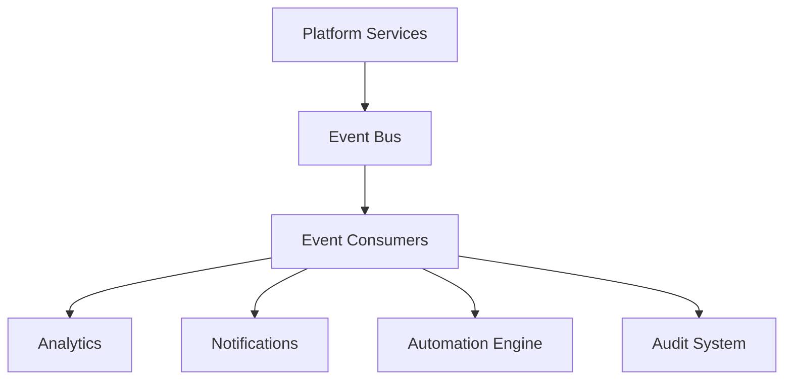

# Agent Event System

**Document Version:** 1.0
**Project:** AI Voice Agent SaaS Platform
**Status:** Draft
**Last Updated:** 2026-07-23

---

# 1. Overview

This document defines the event-driven architecture used by the AI Voice Agent Platform.

The Event System enables communication between platform components through asynchronous events.

Events provide:

* Loose coupling
* Scalability
* Auditability
* Real-time processing
* Reliable workflows

---

# 2. Event-Driven Architecture



---

# 3. Event System Goals

The event system provides:

* Real-time communication
* Reliable processing
* Service decoupling
* Historical tracking
* Workflow triggering

---

# 4. Event Flow

```text
Service Action

↓

Create Event

↓

Publish Event

↓

Event Bus

↓

Subscribers Receive Event

↓

Execute Actions
```

---

# 5. Event Architecture Components

```text
Event System

├── Event Producer

├── Event Schema

├── Event Broker

├── Event Consumer

├── Event Processor

└── Event Storage
```

---

# 6. Event Producers

Services generating events:

## Agent Service

Examples:

* Agent created
* Agent updated
* Agent deployed

---

## Conversation Service

Examples:

* Conversation started
* Message received
* Conversation completed

---

## Tool Service

Examples:

* Tool executed
* Tool failed

---

## Voice Service

Examples:

* Call started
* Call ended

---

# 7. Event Consumers

Consumers process events.

Examples:

* Analytics Service
* Notification Service
* Audit Service
* Billing Service
* Workflow Engine

---

# 8. Event Structure

All events follow a standard format.

Example:

```json
{
"event_id":"evt123",

"event_type":"conversation.started",

"organization_id":"org456",

"timestamp":"2026-07-23T10:00:00Z",

"source":"conversation-service",

"data":{}
}
```

---

# 9. Event Naming Convention

Format:

```text
domain.entity.action
```

Examples:

```text
agent.created

agent.updated

conversation.started

conversation.completed

tool.executed

call.transferred
```

---

# 10. Agent Lifecycle Events

Examples:

```text
agent.created

agent.configured

agent.tested

agent.approved

agent.deployed

agent.updated

agent.retired
```

---

# 11. Conversation Events

Conversation lifecycle:

```text
conversation.created

conversation.started

message.received

message.generated

tool.called

conversation.completed
```

---

# 12. Voice Events

Voice events:

```text
call.received

call.connected

call.recording.started

call.transferred

call.completed

call.failed
```

---

# 13. Tool Events

Tool execution events:

```text
tool.requested

tool.started

tool.completed

tool.failed
```

Example:

```json
{
"event_type":"tool.completed",

"tool":"calendar_booking",

"execution_time":250
}
```

---

# 14. Knowledge Events

RAG-related events:

```text
document.uploaded

document.processed

embedding.created

knowledge.updated

retrieval.completed
```

---

# 15. Event Reliability

The system must support:

## Delivery Guarantees

Options:

* At most once
* At least once
* Exactly once where required

---

## Retry Handling

Failed events:

```text
Failed Event

↓

Retry Queue

↓

Reprocess

↓

Success / Dead Letter Queue
```

---

# 16. Event Ordering

Some events require ordering.

Example:

```text
conversation.started

↓

message.received

↓

conversation.completed
```

---

Ordering can be maintained using:

* Partition keys
* Sequence numbers
* Timestamps

---

# 17. Event Idempotency

Consumers must handle duplicate events.

Example:

```json
{
"event_id":"evt123"
}
```

Store processed event IDs:

```text
processed_events

event_id

processed_at
```

---

# 18. Event Storage

Important events are stored for:

* Audit
* Debugging
* Analytics

Example table:

```text
events

id

organization_id

event_type

payload

created_at
```

---

# 19. Real-Time Event Processing

Example:

```text
Customer Call

↓

Call Started Event

↓

Analytics Update

↓

Dashboard Update

↓

Notification
```

---

# 20. Event Bus Technology

Possible implementations:

## Initial Architecture

```text
PostgreSQL Events

+

Background Workers
```

---

## Scalable Architecture

```text
Application

↓

Message Broker

↓

Consumers
```

Possible technologies:

* Redis Streams
* RabbitMQ
* Apache Kafka
* NATS

---

# 21. Event Security

Events must include:

* Organization context
* Access validation
* Sensitive data controls

---

Never publish:

* Passwords
* API secrets
* Private credentials

---

# 22. Event Monitoring

Monitor:

* Event throughput
* Processing latency
* Failed events
* Consumer health

---

# 23. Event-Based Automation

Events can trigger workflows.

Example:

```text
conversation.completed

↓

Evaluate Satisfaction

↓

Send Survey

↓

Update CRM
```

---

# 24. Event-Driven Billing

Usage events support billing.

Examples:

```text
voice.minute.used

token.consumed

storage.used

tool.executed
```

---

# 25. Event-Driven Analytics

Analytics consumes:

* Conversation events
* Usage events
* Performance events

---

Flow:

```text
Events

↓

Analytics Pipeline

↓

Reports

↓

Business Insights
```

---

# 26. Future Enhancements

Potential improvements:

* Enterprise event streaming
* Event replay system
* Real-time AI monitoring
* Advanced workflow triggers

---

# 27. Related Documents

| Document                  | Purpose      |
| ------------------------- | ------------ |
| 08_Agent_Analytics.md     | Analytics    |
| 12_Agent_Observability.md | Monitoring   |
| 16_Agent_API_Gateway.md   | APIs         |
| 03_Agent_Runtime.md       | Runtime      |
| 29_Database_Schema        | Data storage |

---

# 28. Conclusion

The Agent Event System provides the communication backbone for the AI Voice Agent Platform.

It enables:

* Scalable architecture
* Real-time processing
* Reliable integrations
* Operational visibility

---

**End of Document**
