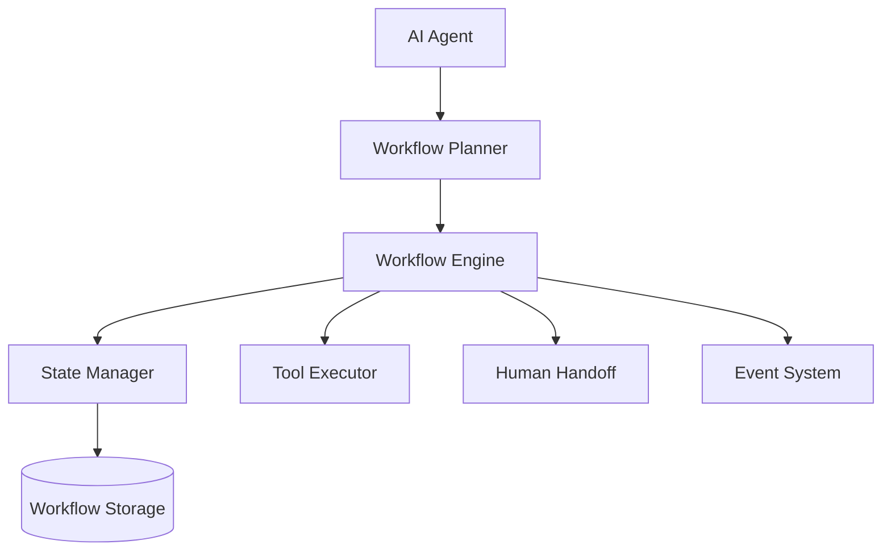
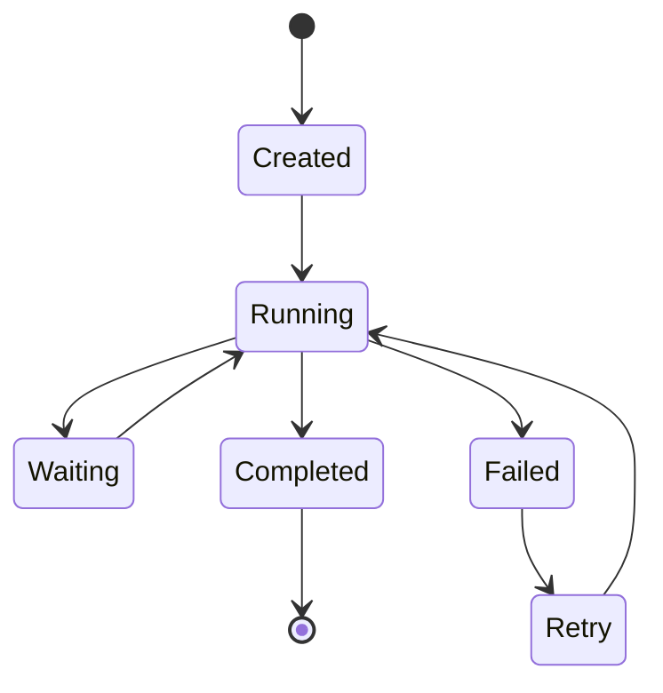
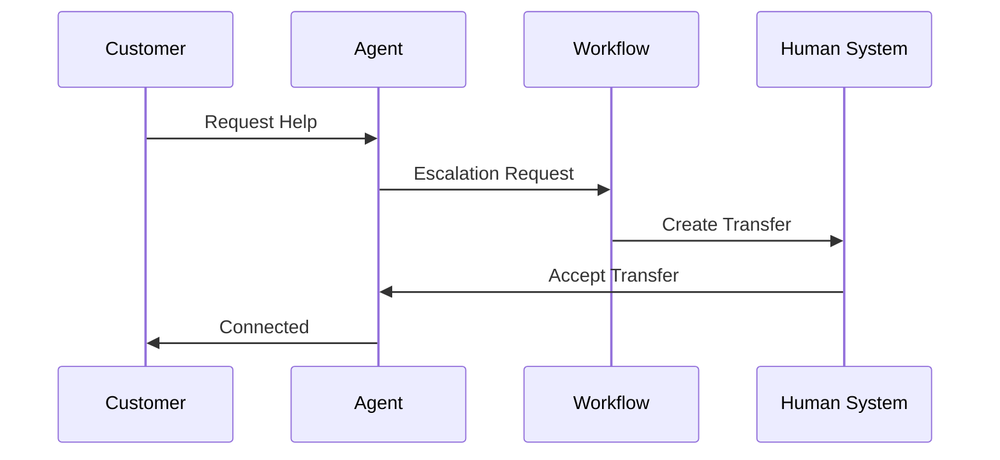

# Agent Workflow Engine

**Document Version:** 1.0
**Project:** AI Voice Agent SaaS Platform
**Status:** Draft
**Last Updated:** 2026-07-23

---

# 1. Overview

This document defines the Workflow Engine architecture used to orchestrate AI agent tasks, business processes, and multi-step automation.

The Workflow Engine enables agents to execute structured processes instead of relying only on free-form AI responses.

It manages:

* Task execution
* Decision logic
* Tool orchestration
* Human escalation
* State management
* Error handling

---

# 2. Workflow Engine Purpose

AI agents require workflows for:

* Predictable execution
* Business rule enforcement
* Complex operations
* Multi-step tasks
* Enterprise automation

Example:

```text
Customer Request

↓

Identify Intent

↓

Validate Information

↓

Execute Action

↓

Confirm Result

↓

Complete Conversation
```

---

# 3. Workflow Architecture



---

# 4. Workflow Components

```text
Workflow Engine

├── Workflow Definition

├── Execution Engine

├── State Management

├── Decision Engine

├── Tool Router

├── Error Handler

└── Monitoring
```

---

# 5. Workflow Definition

A workflow defines:

* Steps
* Conditions
* Actions
* Inputs
* Outputs

Example:

```yaml id="7gq3r9"
workflow:
  name: appointment_booking

  steps:

    - collect_customer_info

    - check_calendar

    - create_booking

    - send_confirmation
```

---

# 6. Workflow Execution Model



---

# 7. Workflow Types

## Conversation Workflows

Used for:

* Customer support
* Sales calls
* Reception

---

## Business Workflows

Used for:

* Booking
* Orders
* CRM updates

---

## System Workflows

Used for:

* Agent deployment
* Monitoring
* Maintenance

---

# 8. Workflow State Management

Long-running workflows require persistent state.

Example:

```json id="x7m2q5"
{
"workflow_id":"wf123",

"status":"waiting",

"current_step":"calendar_check",

"context":{

"customer_id":"cust123"

}
}
```

---

# 9. State Storage

Recommended storage:

## PostgreSQL

Stores:

* Workflow definitions
* Execution history
* State snapshots

---

## Redis

Stores:

* Active sessions
* Temporary state
* Fast lookups

---

Architecture:

```text
Workflow Runtime

↓

Redis

↓

PostgreSQL
```

---

# 10. Workflow Nodes

Common node types:

## AI Node

Uses language models.

Example:

```text
Analyze Customer Intent
```

---

## Tool Node

Calls external systems.

Example:

```text
Create Calendar Event
```

---

## Condition Node

Decision logic.

Example:

```text
Customer Verified?

YES → Continue

NO → Request Information
```

---

## Human Node

Transfers to human.

Example:

```text
Escalate Support Case
```

---

# 11. Workflow Decision Engine

Controls branching.

Example:

```text
Customer Intent

        |

        |

   +----+----+

   |         |

Sales     Support
```

---

# 12. Tool Orchestration

Workflow Engine manages:

* Tool selection
* Parameters
* Execution
* Results

Example:

```text
Workflow

↓

CRM Tool

↓

Calendar Tool

↓

Notification Tool
```

---

# 13. Error Handling

Failures are handled through:

## Retry

Temporary failures.

Example:

```text
API Timeout

↓

Retry

↓

Success
```

---

## Fallback

Alternative action.

Example:

```text
Primary Tool Failed

↓

Use Backup Tool
```

---

## Escalation

Human intervention.

Example:

```text
Unable To Complete

↓

Human Agent
```

---

# 14. Human Handoff Workflow



---

# 15. Workflow Versioning

Workflows must support versions.

Example:

```text
Appointment Workflow

v1.0

↓

v1.1

↓

v2.0
```

Each version stores:

* Definition
* Changes
* Tests
* Deployment history

---

# 16. Workflow Testing

Testing includes:

## Unit Testing

Individual workflow steps.

---

## Scenario Testing

Complete conversations.

---

## Failure Testing

Error conditions.

---

Example:

```text
Customer

↓

Missing Information

↓

Agent Requests Data

↓

Workflow Continues
```

---

# 17. Workflow Security

Controls:

* Permission checks
* Tool restrictions
* Data validation
* Tenant isolation

---

# 18. Workflow Analytics

Track:

* Execution count
* Success rate
* Failure points
* Average completion time

---

Example:

```json id="r2k8m4"
{
"workflow":"booking",

"executions":1000,

"success_rate":"97%"
}
```

---

# 19. Workflow Integration With LangGraph

The platform can use LangGraph for:

* Stateful workflows
* Agent coordination
* Branching logic
* Human approval steps

Architecture:

```text
Agent Runtime

↓

LangGraph Workflow

↓

Tools / Memory / RAG
```

---

# 20. Workflow Integration With n8n

n8n can handle:

* External automation
* Business integrations
* Background workflows

Example:

```text
Conversation Completed

↓

n8n Workflow

↓

CRM Update

↓

Email Notification
```

---

# 21. Workflow Monitoring

Monitor:

* Active executions
* Failed workflows
* Execution latency
* Resource usage

---

# 22. Workflow Database Entities

Recommended tables:

```text
workflows

workflow_versions

workflow_executions

workflow_steps

workflow_events

workflow_variables
```

---

# 23. Future Enhancements

Potential additions:

* Visual workflow builder
* AI-generated workflows
* Workflow marketplace
* Automated optimization

---

# 24. Related Documents

| Document                      | Purpose           |
| ----------------------------- | ----------------- |
| 03_Agent_Runtime.md           | Runtime execution |
| 05_Agent_Tools.md             | Tool system       |
| 07_Agent_Testing_Framework.md | Testing           |
| 17_Agent_Event_System.md      | Events            |
| 29_Database_Schema            | Database design   |

---

# 25. Conclusion

The Agent Workflow Engine provides structured intelligence for enterprise AI agents.

It enables:

* Reliable automation
* Complex task execution
* Business process control
* Scalable AI operations

---

**End of Document**
