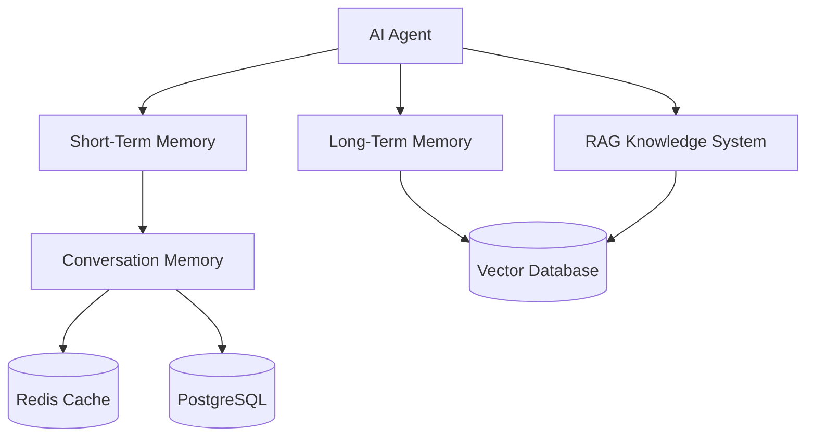
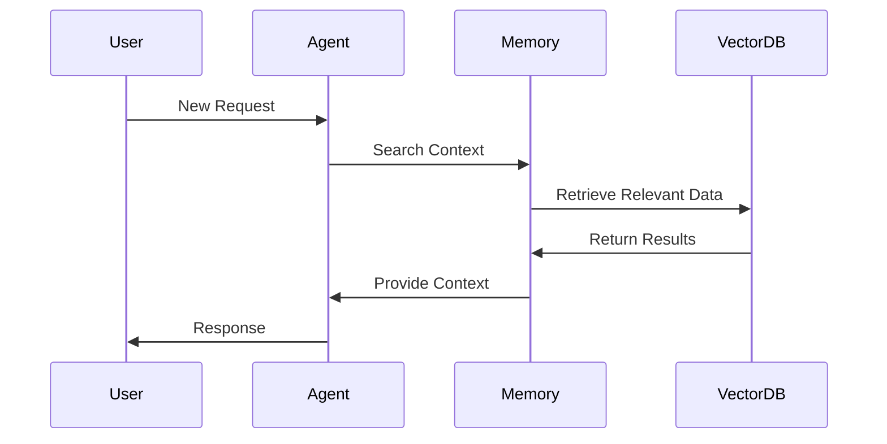
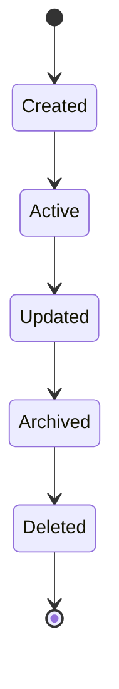

# Agent Memory Architecture

**Document Version:** 1.0
**Project:** AI Voice Agent SaaS Platform
**Status:** Draft
**Last Updated:** 2026-07-23

---

# 1. Overview

This document defines the memory architecture used by AI agents to maintain context, improve interactions, and provide personalized experiences.

Memory allows agents to:

* Remember conversation context
* Store user preferences
* Retrieve historical information
* Maintain workflow state
* Improve future interactions

The memory system is designed for:

* Multi-tenancy
* Scalability
* Privacy
* Real-time access

---

# 2. Memory Architecture Goals

The memory system provides:

## Context Awareness

Agents understand the current conversation.

---

## Personalization

Agents remember useful customer information.

---

## Long-Term Knowledge

Agents access historical information when needed.

---

## Controlled Storage

Organizations control memory policies.

---

# 3. Memory Architecture



---

# 4. Memory Types

The platform uses multiple memory layers.

```text
Memory System

├── Working Memory

├── Conversation Memory

├── User Memory

├── Agent Memory

└── Knowledge Memory
```

---

# 5. Working Memory

Working memory contains information needed during the active session.

Examples:

* Current user request
* Current workflow step
* Temporary variables
* Tool results

Storage:

```text
Redis
```

Example:

```json
{
"session_id":"session123",

"current_task":"booking",

"step":"confirm_time"
}
```

---

# 6. Conversation Memory

Conversation memory stores the interaction history.

Contains:

* User messages
* Agent responses
* Tool calls
* Events

Example:

```text
Customer:

"I need an appointment tomorrow"


Agent:

"What time works best?"
```

---

# 7. Conversation Memory Storage

Recommended architecture:

```text
Active Conversation

↓

Redis

↓

Conversation Database

↓

Archive Storage
```

---

# 8. User Memory

User memory stores useful long-term information.

Examples:

* Preferred language
* Previous requests
* Preferences
* Customer history

Example:

```json
{
"user_id":"user123",

"preferences":{

"language":"English",

"contact_method":"phone"

}
}
```

---

# 9. Agent Memory

Agent memory stores agent-specific information.

Examples:

* Agent behavior settings
* Previous improvements
* Performance history

Example:

```text
Support Agent

↓

Common Customer Issues

↓

Improved Responses
```

---

# 10. Knowledge Memory

Knowledge memory contains organizational information.

Examples:

* Documents
* Policies
* FAQs
* Product information

Implemented through:

* Embeddings
* Vector search
* Metadata filtering

---

# 11. Memory Retrieval Flow



---

# 12. Memory Pipeline

```text
User Input

↓

Context Detection

↓

Memory Search

↓

Context Ranking

↓

Context Injection

↓

AI Response
```

---

# 13. Memory Ranking

Not all memories are equal.

Ranking factors:

* Relevance
* Recency
* Importance
* Confidence

Example:

```text
Memory Score

=

Relevance

+

Recency

+

Importance
```

---

# 14. Memory Namespace Isolation

Multi-tenant systems require isolated memory.

Example Redis keys:

```text
tenant:{organization_id}:agent:{agent_id}:session:{id}
```

---

Vector metadata:

```json
{
"organization_id":"org123",

"agent_id":"agent456",

"user_id":"user789"
}
```

---

# 15. Memory Lifecycle



---

# 16. Memory Expiration Policies

Different memory types have different retention.

Example:

| Memory Type          | Retention    |
| -------------------- | ------------ |
| Working Memory       | Minutes      |
| Session Memory       | Hours/Days   |
| Conversation History | Configurable |
| User Preferences     | Long-term    |
| Audit Data           | Policy based |

---

# 17. Memory Compression

Long conversations require summarization.

Process:

```text
Long Conversation

↓

Summarization

↓

Compact Memory

↓

Future Context
```

---

Example:

Before:

```text
100 conversation messages
```

After:

```text
Customer prefers morning appointments.
Interested in annual service plan.
```

---

# 18. Memory Security

Protection:

* Access control
* Tenant isolation
* Encryption
* Data masking

---

Sensitive information should not be stored unnecessarily.

---

# 19. Memory and RAG Integration

Memory and RAG serve different purposes.

| System | Purpose               |
| ------ | --------------------- |
| Memory | Previous interactions |
| RAG    | External knowledge    |

Combined:

```text
Agent Context

=

Conversation Memory

+

User Memory

+

Retrieved Knowledge
```

---

# 20. Memory and LangChain

LangChain can provide:

* Memory abstractions
* Retrieval chains
* Context management

Example:

```text
Agent Runtime

↓

LangChain Memory

↓

Redis/PostgreSQL

↓

LLM
```

---

# 21. Memory and LangGraph

LangGraph provides:

* Stateful workflows
* Persistent execution state
* Agent checkpoints

Example:

```text
Workflow State

↓

Checkpoint

↓

Resume Execution
```

---

# 22. Memory Analytics

Track:

* Memory usage
* Retrieval frequency
* Search quality
* Storage growth

---

# 23. Memory Database Entities

Recommended tables:

```text
conversation_memory

user_memory

agent_memory

memory_embeddings

memory_events

memory_access_logs
```

---

# 24. Memory Failure Handling

Examples:

## Memory unavailable

Fallback:

```text
Continue without long-term memory
```

---

## Retrieval failure

Fallback:

```text
Use current conversation context
```

---

# 25. Future Enhancements

Potential additions:

* Automatic memory importance scoring
* AI memory management
* Memory cleanup automation
* Enterprise memory policies

---

# 26. Related Documents

| Document                    | Purpose             |
| --------------------------- | ------------------- |
| 03_Agent_Runtime.md         | Agent execution     |
| 04_RAG_Knowledge_System.md  | Knowledge retrieval |
| 18_Agent_Workflow_Engine.md | Workflows           |
| 11_Agent_Multi_Tenancy.md   | Tenant isolation    |
| 29_Database_Schema          | Database design     |

---

# 27. Conclusion

Agent Memory Architecture provides the foundation for intelligent, personalized, and context-aware AI agents.

It enables agents to maintain continuity while preserving security, scalability, and enterprise control.

---

**End of Document**
