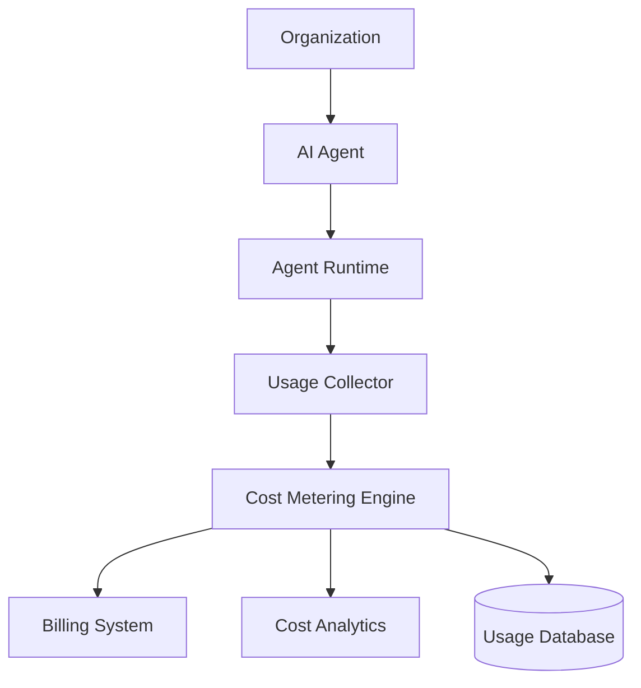

# Agent Cost Management

**Document Version:** 1.0
**Project:** AI Voice Agent SaaS Platform
**Status:** Draft
**Last Updated:** 2026-07-23

---

# 1. Overview

This document defines the cost management architecture for operating AI agents efficiently at SaaS scale.

AI agent platforms have multiple cost drivers:

* Large language model usage
* Speech-to-text processing
* Text-to-speech generation
* Voice infrastructure
* Vector search
* Storage
* External integrations
* Compute resources

Cost Management ensures the platform remains financially sustainable while maintaining quality.

---

# 2. Cost Management Objectives

The system must provide:

* Usage tracking
* Cost attribution
* Budget control
* Optimization recommendations
* Tenant billing support

---

# 3. Cost Architecture



---

# 4. Cost Categories

The platform tracks:

```text
Cost Management

├── AI Model Costs

├── Voice Costs

├── Infrastructure Costs

├── Storage Costs

├── Integration Costs

└── Operational Costs
```

---

# 5. AI Model Cost Tracking

Track:

* Input tokens
* Output tokens
* Model type
* Request count
* Processing time

Example:

```json
{
"organization_id":"org123",

"agent_id":"agent456",

"model":"gpt-model",

"input_tokens":1200,

"output_tokens":500
}
```

---

# 6. Voice Cost Tracking

Voice-related costs:

* Incoming minutes
* Outgoing minutes
* Recording storage
* Transcription
* Speech generation

Example:

```text
Call Started

↓

Track Duration

↓

Calculate Usage

↓

Record Cost
```

---

# 7. Usage Metering System

Every billable activity creates a usage event.

Example:

```json
{
"event_type":"voice.minute.used",

"organization_id":"org123",

"quantity":5
}
```

---

# 8. Usage Event Types

Examples:

```text
agent.execution.completed

voice.minute.used

llm.token.used

tts.character.used

stt.minute.used

storage.byte.used

tool.execution.completed
```

---

# 9. Cost Attribution Model

Every cost must map to:

```text
Organization

↓

Agent

↓

Conversation

↓

Operation
```

Example:

```text
Customer Support Agent

↓

Conversation #123

↓

5000 Tokens

↓

$0.05 Cost
```

---

# 10. Multi-Tenant Cost Isolation

Tenant costs must be separated.

Required fields:

```sql
organization_id

agent_id

conversation_id

usage_type

cost_amount
```

---

# 11. Cost Database Model

Recommended tables:

```text
usage_events

cost_records

billing_accounts

pricing_plans

tenant_usage_limits

cost_reports
```

---

# 12. Real-Time Cost Monitoring

The platform should provide:

* Current usage
* Estimated monthly cost
* Budget consumption
* Cost trends

Example:

```text
Organization Usage

AI Tokens:

75%

Voice Minutes:

60%

Storage:

40%
```

---

# 13. Budget Controls

Organizations can define limits.

Examples:

* Monthly AI budget
* Maximum calls
* Token limits
* Agent usage limits

---

Example:

```json
{
"monthly_budget":500,

"alert_threshold":80
}
```

---

# 14. Cost Alerts

Alert conditions:

## Warning

Example:

```text
80% budget consumed
```

---

## Critical

Example:

```text
100% budget consumed
```

---

Actions:

* Notify administrators
* Restrict usage
* Require approval

---

# 15. Cost Optimization Strategies

## Model Selection

Use smaller models where possible.

Example:

```text
Simple FAQ

↓

Small Model


Complex Reasoning

↓

Advanced Model
```

---

## Prompt Optimization

Reduce:

* Unnecessary context
* Duplicate instructions
* Large outputs

---

## Caching

Cache:

* Agent configuration
* Common responses
* Knowledge results

---

# 16. Conversation Cost Optimization

Optimize:

* Conversation length
* Context size
* Memory retrieval
* Tool calls

Example:

```text
Long History

↓

Summary

↓

Smaller Context

↓

Lower Cost
```

---

# 17. RAG Cost Optimization

Improve efficiency:

* Better chunking
* Metadata filtering
* Relevant retrieval only
* Embedding optimization

---

# 18. Infrastructure Cost Management

Monitor:

* CPU usage
* Memory usage
* Containers
* Database resources

---

Optimization:

* Autoscaling
* Resource limits
* Idle resource cleanup

---

# 19. Cost Reporting

Reports include:

## Organization Report

* Total usage
* Cost breakdown
* Trends

---

## Agent Report

* Most expensive agents
* Usage patterns

---

## Conversation Report

* Cost per interaction

---

# 20. Billing Integration

Cost system integrates with billing.

Flow:

```text
Usage Event

↓

Cost Calculation

↓

Invoice Generation

↓

Customer Billing
```

---

# 21. Subscription Plans

Example:

| Plan         | Features       |
| ------------ | -------------- |
| Starter      | Limited agents |
| Professional | More usage     |
| Enterprise   | Custom limits  |

---

# 22. Cost Governance

Administrators control:

* Pricing rules
* Usage policies
* Spending limits
* Approval requirements

---

# 23. Cost Analytics Dashboard

Dashboard:

```text
Cost Analytics

├── Total Spend

├── AI Usage

├── Voice Usage

├── Top Agents

├── Cost Trends

└── Forecasting
```

---

# 24. Cost Forecasting

Predict future usage.

Example:

```text
Current Usage

↓

Historical Trends

↓

Future Cost Estimate
```

---

# 25. Cost Security

Protect billing data:

* Access control
* Audit logging
* Encryption

---

# 26. Future Enhancements

Potential additions:

* AI cost optimizer
* Automatic model routing
* Dynamic pricing
* Cost anomaly detection

---

# 27. Related Documents

| Document                             | Purpose          |
| ------------------------------------ | ---------------- |
| 12_Agent_Observability.md            | Monitoring       |
| 14_Agent_Performance_Optimization.md | Optimization     |
| 11_Agent_Multi_Tenancy.md            | Tenant isolation |
| 17_Agent_Event_System.md             | Events           |
| 29_Database_Schema                   | Data model       |

---

# 28. Conclusion

Agent Cost Management provides financial visibility and control for operating AI agents at scale.

It enables:

* Predictable expenses
* Tenant billing
* Resource optimization
* Sustainable SaaS operations

---

**End of Document**
