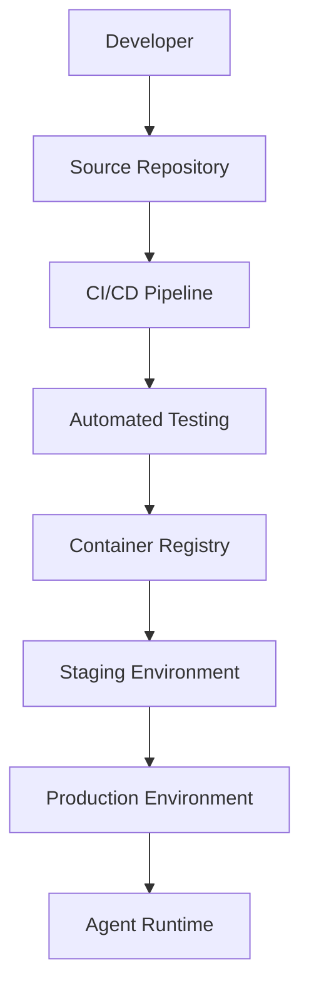
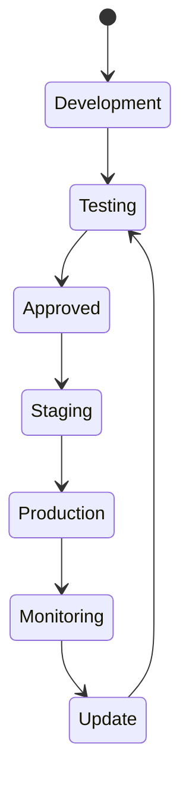

# Agent Deployment Strategy

**Document Version:** 1.0
**Project:** AI Voice Agent SaaS Platform
**Status:** Draft
**Last Updated:** 2026-07-23

---

# 1. Overview

This document defines the deployment strategy for AI agents across development, testing, staging, and production environments.

The deployment architecture ensures:

* Reliable agent releases
* Controlled changes
* Safe rollouts
* Version management
* High availability

---

# 2. Deployment Objectives

The deployment system provides:

* Automated releases
* Environment separation
* Rollback capability
* Deployment tracking
* Production stability

---

# 3. Deployment Architecture



---

# 4. Deployment Environments

The platform uses multiple environments.

```text
Environments

├── Local Development

├── Development

├── Testing

├── Staging

└── Production
```

---

# 5. Local Development Environment

Purpose:

* Feature development
* Debugging
* Agent experimentation

Includes:

* Local backend
* Local database
* Local agent runtime
* Test integrations

---

# 6. Development Environment

Purpose:

* Shared developer testing
* Integration testing

Contains:

* Latest code
* Development agents
* Test data

---

# 7. Testing Environment

Purpose:

* Automated validation
* Quality assurance

Tests:

* API tests
* Workflow tests
* Agent evaluations
* Security tests

---

# 8. Staging Environment

Staging mirrors production.

Used for:

* Final validation
* Customer acceptance testing
* Deployment rehearsal

---

# 9. Production Environment

Production provides:

* Customer-facing agents
* Live voice handling
* Real integrations
* Billing operations

---

# 10. Agent Deployment Lifecycle



---

# 11. Agent Deployment Package

A deployment contains:

```text
Agent Deployment

├── Agent Configuration

├── Prompt Version

├── Model Configuration

├── Tools

├── Workflow Version

├── Knowledge Version

└── Runtime Settings
```

---

# 12. Agent Versioning

Every deployment references a specific version.

Example:

```text
Customer Support Agent

Version 1.0

Configuration:

- Prompt v3
- Workflow v2
- Knowledge v5
```

---

# 13. Deployment Approval Process

Production deployments require:

```text
Agent Update

↓

Testing Complete

↓

Security Review

↓

Approval

↓

Production Release
```

---

# 14. Continuous Deployment Pipeline

```text
Code Change

↓

Build

↓

Test

↓

Package

↓

Deploy

↓

Monitor

↓

Approve
```

---

# 15. Container Deployment

Recommended architecture:

```text
Docker Container

↓

Agent Runtime

↓

Dependencies

↓

Configuration
```

---

# 16. Kubernetes Deployment

Production scaling can use Kubernetes.

Example:

```text
Kubernetes Cluster

├── Agent Runtime Pods

├── API Pods

├── Worker Pods

└── Monitoring Pods
```

---

# 17. Agent Runtime Scaling

Scale based on:

* Active calls
* Conversations
* CPU usage
* Memory usage

Example:

```text
Low Traffic

↓

2 Workers


High Traffic

↓

20 Workers
```

---

# 18. Blue-Green Deployment

Used for safer releases.

Process:

```text
Current Version

Blue Environment


New Version

Green Environment


Switch Traffic
```

Benefits:

* Minimal downtime
* Easy rollback

---

# 19. Canary Deployment

Release gradually.

Example:

```text
100 Customers

↓

5% Receive Update

↓

Monitor

↓

Expand Release
```

---

# 20. Rollback Strategy

If deployment fails:

```text
Detect Issue

↓

Stop Deployment

↓

Restore Previous Version

↓

Verify System

↓

Resume Service
```

---

# 21. Configuration Management

Configuration should be separated from code.

Stored:

* Environment variables
* Configuration service
* Secret manager

---

# 22. Secrets Management

Protected secrets:

* API keys
* Database credentials
* SIP credentials
* Cloud credentials

Never store secrets in:

* Source code
* Git repositories

---

# 23. Database Deployment

Database changes require:

* Migration scripts
* Backward compatibility
* Rollback plans

Example:

```text
Migration

↓

Test

↓

Deploy

↓

Verify
```

---

# 24. Knowledge Deployment

RAG updates require:

```text
New Documents

↓

Processing

↓

Embedding Generation

↓

Validation

↓

Available To Agent
```

---

# 25. Voice Deployment

Voice changes include:

* Phone routing
* SIP configuration
* Voice models
* Call workflows

Require testing before release.

---

# 26. Deployment Monitoring

Monitor:

* Deployment health
* Error rates
* Latency
* Call quality
* Agent behavior

---

# 27. Deployment Audit Trail

Record:

```json
{
"deployment_id":"deploy123",

"agent":"support-agent",

"version":"1.5",

"deployed_by":"admin",

"time":"2026-07-23"
}
```

---

# 28. Disaster Recovery

Deployment strategy supports:

* Backup restoration
* Multi-region deployment
* Recovery procedures

---

# 29. Future Enhancements

Potential additions:

* Automated agent deployment
* GitOps workflows
* Self-healing deployments
* Multi-region active-active architecture

---

# 30. Related Documents

| Document                         | Purpose    |
| -------------------------------- | ---------- |
| 10_Agent_Lifecycle_Management.md | Lifecycle  |
| 12_Agent_Observability.md        | Monitoring |
| 13_Agent_Security_Model.md       | Security   |
| 18_Agent_Workflow_Engine.md      | Workflows  |
| 35_CI_CD                         | Automation |

---

# 31. Conclusion

The Agent Deployment Strategy provides a controlled path from development to production.

It enables:

* Safe releases
* High availability
* Operational confidence
* Enterprise-grade deployment

---

**End of Document**
