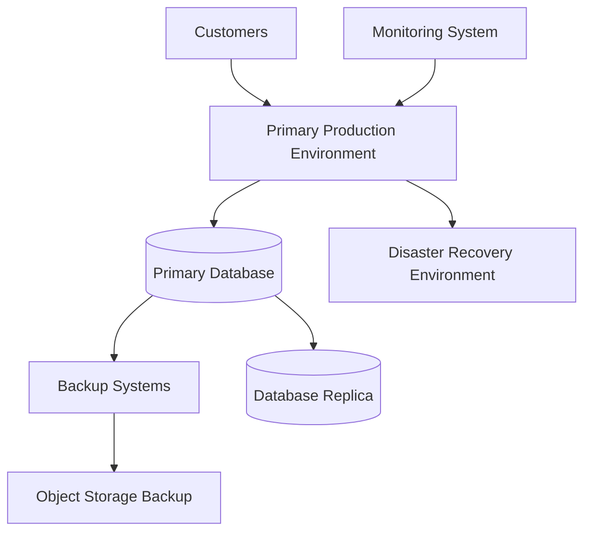

# Agent Disaster Recovery

**Document Version:** 1.0
**Project:** AI Voice Agent SaaS Platform
**Status:** Draft
**Last Updated:** 2026-07-23

---

# 1. Overview

This document defines the Disaster Recovery (DR) strategy for the AI Voice Agent SaaS Platform.

The objective of disaster recovery is to ensure the platform can continue operating or quickly recover after:

* Infrastructure failures
* Database failures
* Cloud outages
* Security incidents
* Application failures
* Data corruption

The DR strategy focuses on:

* Availability
* Data protection
* Recovery speed
* Business continuity

---

# 2. Disaster Recovery Objectives

The platform defines two primary targets:

## Recovery Time Objective (RTO)

Maximum acceptable downtime.

Example:

```text
Service Failure

↓

Recovery Started

↓

Service Restored
```

---

## Recovery Point Objective (RPO)

Maximum acceptable data loss.

Example:

```text
Last Backup

↓

Failure Event

↓

Restore Point
```

---

# 3. DR Architecture



---

# 4. Disaster Categories

```text
Disaster Recovery

├── Application Failure

├── Database Failure

├── Infrastructure Failure

├── Network Failure

├── Cloud Provider Failure

├── Security Incident

└── Data Corruption
```

---

# 5. High Availability Strategy

The platform reduces failures through:

* Multiple service instances
* Load balancing
* Health monitoring
* Automatic restart
* Database replication

---

Architecture:

```text
Customer Request

↓

Load Balancer

↓

Multiple Agent Workers

↓

Healthy Instance
```

---

# 6. Service Recovery Priority

Recovery order:

| Priority | Service                   |
| -------- | ------------------------- |
| 1        | Voice Call Infrastructure |
| 2        | Agent Runtime             |
| 3        | API Gateway               |
| 4        | Database                  |
| 5        | Knowledge System          |
| 6        | Analytics                 |
| 7        | Reporting                 |

---

# 7. Database Disaster Recovery

Database protection includes:

* Automated backups
* Point-in-time recovery
* Replication
* Migration backups

---

Recovery flow:

```text
Database Failure

↓

Detect Failure

↓

Promote Replica

↓

Reconnect Services

↓

Verify Data
```

---

# 8. PostgreSQL Recovery Strategy

Recommended:

## Primary Database

Handles production traffic.

---

## Read Replica

Used for:

* Failover
* Reporting
* Backup validation

---

## Backup Storage

Stores:

* Daily backups
* Snapshots
* Historical recovery points

---

# 9. Redis Recovery Strategy

Redis stores temporary state.

Recovery options:

* Persistence snapshots
* Replication
* Cache rebuilding

---

If Redis fails:

```text
Redis Failure

↓

Restart Instance

↓

Restore Data

↓

Rebuild Missing Cache
```

---

# 10. Voice Infrastructure Recovery

Voice systems require priority recovery.

Components:

* SIP connections
* Telephony provider
* LiveKit servers
* Voice workers

---

Recovery:

```text
Call Failure

↓

Detect Problem

↓

Redirect Traffic

↓

Restore Agent Connection
```

---

# 11. Agent Runtime Recovery

Agent workers should support:

* Automatic restart
* Session recovery
* Graceful shutdown

Example:

```text
Worker Failure

↓

New Worker Starts

↓

Restore Session State

↓

Continue Processing
```

---

# 12. Knowledge System Recovery

RAG recovery includes:

* Document backup
* Embedding backup
* Metadata recovery

Architecture:

```text
Documents

↓

Storage Backup

↓

Embedding Recovery

↓

Vector Database Restore
```

---

# 13. Backup Strategy

Backup types:

## Database Backup

Includes:

* Tables
* User data
* Conversations
* Configuration

---

## File Backup

Includes:

* Documents
* Audio recordings
* Agent assets

---

## Configuration Backup

Includes:

* Environment settings
* Deployment configuration
* Infrastructure definitions

---

# 14. Backup Schedule

Example:

| Data          | Frequency          |
| ------------- | ------------------ |
| Database      | Continuous / Daily |
| Documents     | Daily              |
| Configuration | Every Change       |
| Logs          | Continuous         |
| Recordings    | Policy Based       |

---

# 15. Disaster Recovery Testing

DR must be tested regularly.

Tests:

* Backup restoration
* Failover testing
* Service recovery
* Data validation

---

Example:

```text
Simulated Failure

↓

Execute Recovery Plan

↓

Measure RTO/RPO

↓

Improve Process
```

---

# 16. Multi-Region Recovery

Enterprise deployments may use:

```text
Primary Region

↓

Replication

↓

Secondary Region
```

Benefits:

* Regional outage protection
* Lower recovery time
* Enterprise compliance

---

# 17. Data Protection

Protection methods:

* Encryption at rest
* Encryption in transit
* Access controls
* Backup encryption

---

# 18. Security Incident Recovery

Security incidents require:

```text
Detection

↓

Isolation

↓

Investigation

↓

Recovery

↓

Post-Incident Review
```

---

# 19. Incident Response Integration

DR connects with:

* Monitoring
* Alerting
* Incident management
* Communication procedures

---

# 20. Recovery Automation

Automation reduces downtime.

Examples:

* Infrastructure recreation
* Database restoration
* Service restart
* Traffic switching

---

# 21. Infrastructure Recovery

Infrastructure definitions should be stored as code.

Examples:

```text
Terraform

Kubernetes YAML

Docker Configuration
```

Recovery:

```text
Infrastructure Failure

↓

Recreate Environment

↓

Deploy Services

↓

Restore Data
```

---

# 22. Disaster Recovery Runbook

Every failure scenario should have:

* Detection steps
* Recovery steps
* Verification steps
* Escalation contacts

---

# 23. Recovery Monitoring

After recovery monitor:

* System health
* Error rates
* Latency
* Call success
* Data consistency

---

# 24. Business Continuity

Business continuity ensures:

* Customers can continue operations
* Critical agents remain available
* Support channels remain active

---

# 25. Disaster Recovery Database Entities

Recommended tables:

```text
disaster_events

backup_records

recovery_jobs

failover_history

incident_reports
```

---

# 26. Future Enhancements

Potential improvements:

* Automated failover
* Multi-cloud recovery
* AI incident detection
* Self-healing infrastructure

---

# 27. Related Documents

| Document                        | Purpose             |
| ------------------------------- | ------------------- |
| 22_Agent_Deployment_Strategy.md | Deployment          |
| 12_Agent_Observability.md       | Monitoring          |
| 13_Agent_Security_Model.md      | Security            |
| 37_Observability                | Operations          |
| 38_Runbooks                     | Recovery procedures |

---

# 28. Conclusion

The Agent Disaster Recovery strategy ensures the AI Voice Agent Platform remains resilient during unexpected failures.

It provides:

* Business continuity
* Data protection
* Fast recovery
* Enterprise reliability

---

**End of Document**
