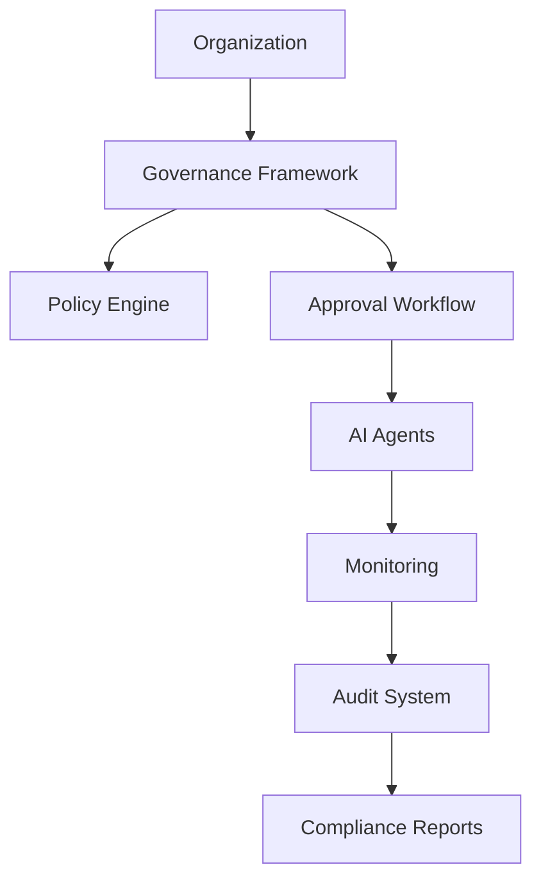
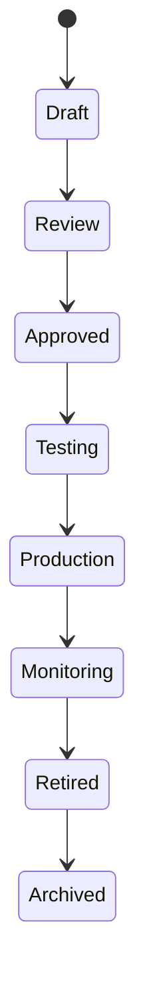

# Agent Governance Framework

**Document Version:** 1.0
**Project:** AI Voice Agent SaaS Platform
**Status:** Draft
**Last Updated:** 2026-07-23

---

# 1. Overview

This document defines the governance framework for managing AI agents throughout their lifecycle.

Agent governance ensures that AI agents operate:

* Safely
* Reliably
* Transparently
* According to business policies
* Within security boundaries

Governance covers:

* Agent creation
* Approval
* Deployment
* Monitoring
* Change management
* Retirement

---

# 2. Governance Objectives

The governance framework provides:

* Controlled agent lifecycle
* Risk management
* Compliance readiness
* Operational accountability
* Quality assurance

---

# 3. Governance Architecture



---

# 4. Governance Principles

The platform follows these principles:

## Responsibility

Every agent must have an owner.

---

## Transparency

Agent behavior must be explainable.

---

## Security

Agents must operate within defined permissions.

---

## Control

Changes require proper approval.

---

## Continuous Improvement

Agents must be evaluated and improved.

---

# 5. Agent Ownership Model

Every agent requires ownership metadata.

Example:

```json
{
"agent_id":"agent123",

"owner":"support-team",

"department":"customer-service",

"business_purpose":"customer_support"
}
```

---

# 6. Agent Lifecycle Governance



---

# 7. Agent Registration

Before deployment, every agent must register:

Required information:

* Agent name
* Purpose
* Owner
* Business domain
* Data access level
* Tools required
* Risk classification

---

# 8. Agent Classification

Agents should be classified.

Example:

| Level       | Description                       |
| ----------- | --------------------------------- |
| Low Risk    | FAQ and information               |
| Medium Risk | Business actions                  |
| High Risk   | Financial or sensitive operations |

---

# 9. Risk Assessment

Each agent requires evaluation of:

* Data sensitivity
* User impact
* Automation level
* External integrations
* Failure consequences

---

Example:

```text
Agent Risk Score

=

Data Sensitivity

+

Action Impact

+

Integration Complexity
```

---

# 10. Approval Workflow

Production agents require approval.

Process:

```text
Agent Created

↓

Security Review

↓

Business Review

↓

Testing

↓

Approval

↓

Deployment
```

---

# 11. Policy Management

Policies control:

* Agent behavior
* Tool usage
* Data access
* Communication rules

Example:

```yaml
policy:
  allow_external_tools: false

  max_response_length: 500

  require_human_transfer: true
```

---

# 12. Prompt Governance

Prompts are controlled assets.

Governance includes:

* Version control
* Review process
* Testing
* Approval

Example:

```text
Prompt v1

↓

Prompt v2

↓

Evaluation

↓

Production
```

---

# 13. Model Governance

Controls:

* Approved models
* Model versions
* Usage restrictions
* Performance evaluation

---

Example:

```text
Agent

↓

Approved Model List

↓

Selected Model
```

---

# 14. Tool Governance

Tools require:

* Registration
* Permission approval
* Security review

Example:

```text
Agent

↓

Allowed Tools

↓

Execution Permission
```

---

# 15. Knowledge Governance

Knowledge sources require:

* Ownership
* Approval
* Version tracking
* Access control

Example:

```text
Document

↓

Validation

↓

Embedding

↓

Agent Access
```

---

# 16. Human Oversight

Certain actions require human approval.

Examples:

* Financial transactions
* Sensitive decisions
* Customer complaints
* Security actions

---

# 17. Change Management

Agent changes must follow:

```text
Change Request

↓

Impact Analysis

↓

Testing

↓

Approval

↓

Deployment
```

---

# 18. Audit Requirements

Track:

* Who created agents
* Who changed configurations
* Who approved releases
* Who accessed data

Example:

```json
{
"action":"agent.updated",

"user":"admin",

"time":"2026-07-23"
}
```

---

# 19. Compliance Management

Governance supports:

* Data protection
* Access control
* Audit reporting
* Policy enforcement

---

# 20. Agent Monitoring Governance

Monitor:

* Accuracy
* Safety
* Performance
* Cost
* User feedback

---

# 21. Agent Retirement Process

Agents should not remain active indefinitely.

Retirement process:

```text
Disable Traffic

↓

Archive Configuration

↓

Preserve Audit Data

↓

Remove Resources
```

---

# 22. Governance Dashboard

Provides visibility into:

```text
Agent Governance

├── Active Agents

├── Pending Approvals

├── Risk Levels

├── Policy Violations

├── Changes

└── Audit Events
```

---

# 23. Multi-Tenant Governance

Each organization manages its own:

* Agents
* Policies
* Users
* Knowledge

Isolation is mandatory.

---

# 24. Governance Database Entities

Recommended tables:

```text
agent_registry

agent_owners

agent_policies

approval_requests

risk_assessments

audit_events

governance_reviews
```

---

# 25. Governance Integration

Works with:

* Security system
* Deployment pipeline
* Evaluation framework
* Observability platform

---

# 26. Future Enhancements

Potential additions:

* AI governance assistant
* Automated compliance checks
* Risk prediction
* Policy recommendation engine

---

# 27. Related Documents

| Document                         | Purpose               |
| -------------------------------- | --------------------- |
| 09_Agent_Governance.md           | Governance principles |
| 13_Agent_Security_Model.md       | Security              |
| 20_Agent_Evaluation_Framework.md | Evaluation            |
| 22_Agent_Deployment_Strategy.md  | Deployment            |
| 23_Agent_Disaster_Recovery.md    | Recovery              |

---

# 28. Conclusion

The Agent Governance Framework provides the operational control layer required to manage enterprise AI agents responsibly.

It ensures agents are:

* Controlled
* Auditable
* Secure
* Continuously improved

---

**End of Document**
