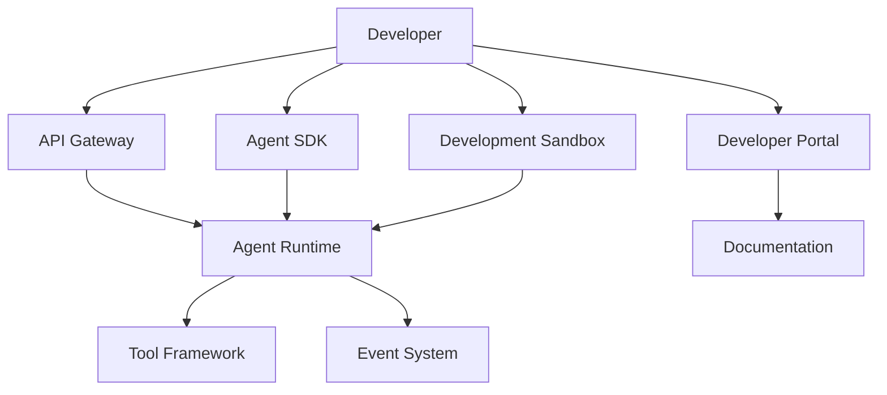
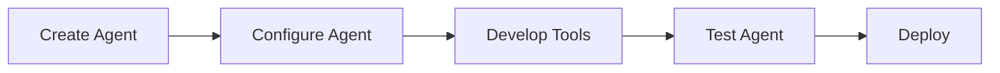

# Agent Developer Platform

**Document Version:** 1.0
**Project:** AI Voice Agent SaaS Platform
**Status:** Draft
**Last Updated:** 2026-07-23

---

# 1. Overview

This document defines the developer platform architecture that enables engineers, partners, and enterprise customers to build, extend, integrate, and manage AI agents.

The Developer Platform provides:

* Agent development tools
* APIs
* SDKs
* Documentation
* Testing environments
* Integration capabilities

It transforms the AI Voice Agent Platform into an extensible ecosystem.

---

# 2. Developer Platform Goals

The platform enables developers to:

* Create custom agents
* Build integrations
* Develop tools
* Extend workflows
* Access platform capabilities safely

---

# 3. Developer Platform Architecture



---

# 4. Developer Platform Components

```text
Developer Platform

├── Developer Portal

├── API Platform

├── SDK Framework

├── Agent Builder Tools

├── Testing Environment

├── Documentation

├── Marketplace

└── Community Resources
```

---

# 5. Developer Portal

The Developer Portal provides:

* API documentation
* Authentication management
* API key management
* Usage monitoring
* Application management

---

Example:

```text
Developer Portal

├── Applications

├── API Keys

├── Documentation

├── Webhooks

├── Usage

└── Logs
```

---

# 6. API Platform

Developers access platform capabilities through APIs.

Core APIs:

```text
Authentication API

Agent API

Conversation API

Voice API

Knowledge API

Workflow API

Tool API

Analytics API
```

---

# 7. SDK Architecture

SDKs simplify agent development.

Possible SDKs:

* Python SDK
* JavaScript SDK
* TypeScript SDK
* Mobile SDK

---

Example:

```python
from agent_sdk import Agent

agent = Agent(
    name="support_agent"
)

agent.deploy()
```

---

# 8. Agent Development Workflow



---

# 9. Agent SDK Capabilities

SDK provides:

* Agent creation
* Configuration management
* Tool registration
* Workflow management
* Conversation access
* Monitoring access

---

# 10. Custom Tool Development

Developers can create custom tools.

Example:

```text
Tool

├── Name

├── Description

├── Input Schema

├── Execution Logic

└── Output Schema
```

---

Example:

```json
{
"name":"check_inventory",

"description":"Check product availability",

"parameters":{

"product_id":"string"

}
}
```

---

# 11. Tool Marketplace

Future ecosystem:

Developers can publish:

* Tools
* Workflows
* Agent templates
* Integrations

---

Example:

```text
Marketplace

├── CRM Tools

├── Calendar Tools

├── Industry Agents

└── Automation Templates
```

---

# 12. Developer Authentication

Supported authentication:

* API keys
* OAuth
* Service accounts
* JWT tokens

---

Example:

```http
Authorization: Bearer API_TOKEN
```

---

# 13. Developer Sandbox

Sandbox provides:

* Test agents
* Mock integrations
* Simulated conversations
* Test data

---

Architecture:

```text
Developer

↓

Sandbox

↓

Test Runtime

↓

Mock Services
```

---

# 14. Local Agent Development

Developers should be able to run agents locally.

Example:

```text
Developer Machine

↓

Local Agent Runtime

↓

Local Database

↓

Test Integrations
```

---

# 15. Webhook System

Developers receive real-time events.

Examples:

```text
agent.created

conversation.started

call.completed

tool.executed

workflow.completed
```

---

Webhook flow:

```text
Platform Event

↓

Webhook Service

↓

Developer Application
```

---

# 16. Documentation System

Documentation includes:

* API references
* SDK guides
* Tutorials
* Examples
* Architecture guides

---

Documentation structure:

```text
docs/

├── API Reference

├── SDK Guides

├── Tutorials

├── Examples

└── Best Practices
```

---

# 17. Developer Testing Tools

Provide:

* Agent simulator
* Conversation replay
* API testing
* Workflow debugging

---

Example:

```text
Test Scenario

↓

Run Agent

↓

Capture Trace

↓

Analyze Result
```

---

# 18. Debugging Tools

Developers need:

* Execution traces
* Logs
* Tool calls
* Memory inspection
* Workflow state

---

Example:

```text
Conversation

↓

Agent Decision

↓

Tool Call

↓

Final Response
```

---

# 19. Version Management

Developers manage versions of:

* Agents
* Prompts
* Tools
* Workflows
* Knowledge sources

---

Example:

```text
Agent v1.0

↓

Agent v1.1

↓

Agent v2.0
```

---

# 20. Developer Usage Analytics

Track:

* API usage
* Requests
* Errors
* Agent executions
* Costs

---

# 21. Security Controls

Developer platform enforces:

* Permission management
* API restrictions
* Secret protection
* Tenant isolation

---

# 22. Enterprise Developer Features

Enterprise customers may require:

* Private SDKs
* Internal marketplaces
* Custom environments
* Dedicated API limits

---

# 23. Developer Experience Metrics

Measure:

* Time to first agent
* API success rate
* Documentation usage
* Developer satisfaction

---

# 24. Future Enhancements

Potential additions:

* Visual agent IDE
* AI coding assistant
* Agent templates
* Automated integration builder
* Developer marketplace

---

# 25. Related Documents

| Document                    | Purpose         |
| --------------------------- | --------------- |
| 16_Agent_API_Gateway.md     | API layer       |
| 18_Agent_Workflow_Engine.md | Workflow system |
| 17_Agent_Event_System.md    | Events          |
| 05_Agent_Tools.md           | Tools           |
| 30_OpenAPI_Specs            | API contracts   |

---

# 26. Conclusion

The Agent Developer Platform enables external developers and enterprise teams to extend the AI Voice Agent Platform.

It creates an ecosystem where developers can build:

* Custom agents
* Integrations
* Tools
* Automation solutions

---

**End of Document**
