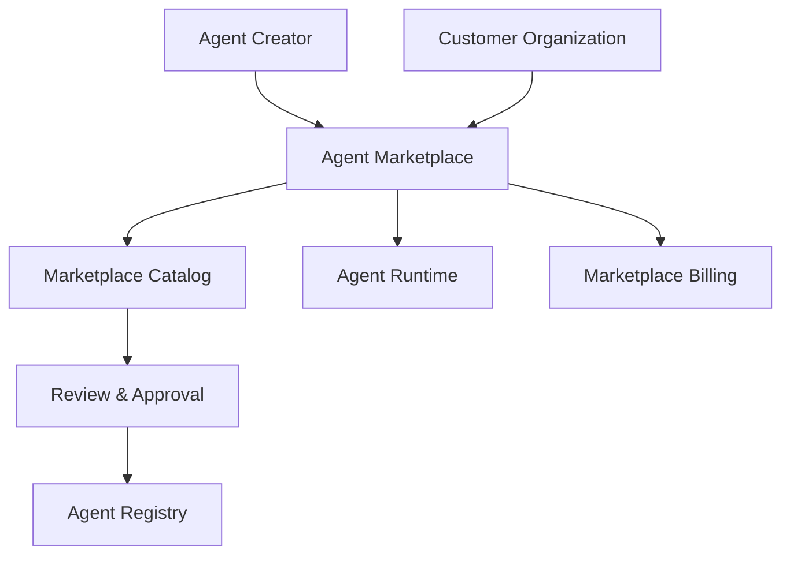
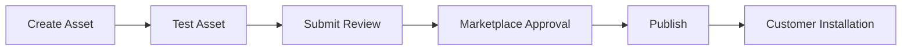

# Agent Marketplace

**Document Version:** 1.0
**Project:** AI Voice Agent SaaS Platform
**Status:** Draft
**Last Updated:** 2026-07-23

---

# 1. Overview

This document defines the architecture and operating model for an Agent Marketplace that enables organizations, developers, and partners to discover, share, install, and monetize AI agent assets.

The marketplace extends the AI Voice Agent Platform ecosystem by allowing reusable components such as:

* AI agents
* Agent templates
* Workflows
* Tools
* Knowledge packages
* Integrations

---

# 2. Marketplace Objectives

The marketplace provides:

* Faster agent deployment
* Reusable automation solutions
* Partner ecosystem growth
* Industry-specific solutions
* Community-driven innovation

---

# 3. Marketplace Architecture



---

# 4. Marketplace Components

```text
Agent Marketplace

├── Asset Catalog

├── Search Engine

├── Rating System

├── Review System

├── Installation System

├── Version Management

├── Billing System

└── Analytics
```

---

# 5. Marketplace Asset Types

The marketplace supports:

## AI Agents

Examples:

* Customer support agent
* Sales assistant
* Appointment scheduler
* Receptionist agent

---

## Agent Templates

Reusable configurations:

* Prompts
* Workflows
* Tools
* Settings

---

## Tools

Examples:

* CRM connectors
* Calendar integrations
* Payment tools

---

## Knowledge Packages

Examples:

* Industry FAQs
* Policy documents
* Product knowledge

---

# 6. Agent Publishing Workflow



---

# 7. Marketplace Registration

Each asset requires metadata.

Example:

```json
{
"name":"Healthcare Reception Agent",

"type":"agent",

"category":"healthcare",

"version":"1.0",

"publisher":"partner-company"
}
```

---

# 8. Asset Categories

Example categories:

```text
Business

├── Customer Support

├── Sales

├── Marketing

├── Healthcare

├── Finance

├── Scheduling

└── Operations
```

---

# 9. Search and Discovery

Marketplace search supports:

* Category filtering
* Industry filtering
* Rating filtering
* Compatibility filtering
* Feature search

---

Example:

```text
Search:

"Appointment Booking Agent"

↓

Healthcare Agents

↓

Compatible Solutions
```

---

# 10. Agent Installation Process

Customer installation:

```text
Select Agent

↓

Review Permissions

↓

Configure Settings

↓

Connect Integrations

↓

Deploy Agent
```

---

# 11. Permission Review

Before installation:

Display:

* Required tools
* Data access
* External integrations
* Required permissions

Example:

```text
Agent requires:

✓ Calendar Access

✓ CRM Access

✓ Customer Records
```

---

# 12. Version Management

Marketplace assets support versions.

Example:

```text
Customer Support Agent

v1.0

↓

v1.5

↓

v2.0
```

Customers can:

* Upgrade
* Downgrade
* Lock versions

---

# 13. Agent Reviews and Ratings

Customers can provide:

* Ratings
* Feedback
* Reviews
* Usage reports

---

Example:

```text
Agent Rating

★★★★★

Performance

Reliability

Ease of Setup
```

---

# 14. Marketplace Security Review

Every published asset requires:

* Security validation
* Permission analysis
* Code review
* Policy verification

---

# 15. Asset Verification Levels

Example:

| Level     | Description         |
| --------- | ------------------- |
| Basic     | Community published |
| Verified  | Platform reviewed   |
| Certified | Enterprise approved |

---

# 16. Marketplace Billing

Supports:

* Free assets
* Subscription pricing
* Usage-based pricing
* Enterprise licensing

---

Example:

```text
Agent Subscription

+

Usage Charges

+

Premium Features
```

---

# 17. Revenue Sharing

Partners may receive:

* Marketplace revenue share
* Licensing income
* Enterprise contracts

---

# 18. Marketplace Analytics

Track:

* Downloads
* Installations
* Active usage
* Revenue
* Ratings

---

# 19. Tenant Isolation

Installed marketplace assets remain isolated.

Example:

```text
Marketplace Agent

↓

Customer Organization

↓

Customer Data

↓

Customer Runtime
```

---

# 20. Marketplace Governance

Controls:

* Publishing rules
* Content standards
* Security requirements
* Removal process

---

# 21. Enterprise Marketplace

Enterprise customers may have private marketplaces.

Example:

```text
Company Internal Marketplace

├── Approved Agents

├── Internal Tools

├── Private Workflows

└── Company Knowledge
```

---

# 22. Marketplace Database Entities

Recommended tables:

```text
marketplace_assets

asset_versions

publishers

installations

reviews

ratings

subscriptions

marketplace_transactions
```

---

# 23. Marketplace Integration

Works with:

* Developer Platform
* Agent Runtime
* Billing System
* Governance Framework
* Security System

---

# 24. Future Enhancements

Potential additions:

* AI-generated agents
* Automated certification
* Partner marketplace
* Agent recommendation engine
* Industry solution bundles

---

# 25. Related Documents

| Document                         | Purpose             |
| -------------------------------- | ------------------- |
| 25_Agent_Developer_Platform.md   | Developer ecosystem |
| 18_Agent_Workflow_Engine.md      | Workflows           |
| 05_Agent_Tools.md                | Tools               |
| 24_Agent_Governance_Framework.md | Governance          |
| 21_Agent_Cost_Management.md      | Billing             |

---

# 26. Conclusion

The Agent Marketplace transforms the AI Voice Agent Platform into an extensible ecosystem.

It enables:

* Faster adoption
* Partner innovation
* Reusable AI solutions
* New revenue opportunities

---

**End of Document**
