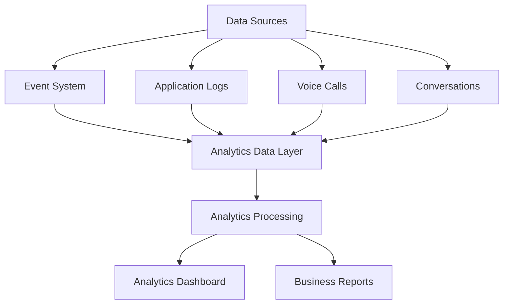

# Agent Analytics Platform

**Document Version:** 1.0
**Project:** AI Voice Agent SaaS Platform
**Status:** Draft
**Last Updated:** 2026-07-23

---

# 1. Overview

This document defines the analytics platform architecture for monitoring, measuring, and improving AI agent performance.

The Analytics Platform converts operational data into actionable insights.

It provides visibility into:

* Agent performance
* Customer interactions
* Business outcomes
* Usage patterns
* Costs
* System health

---

# 2. Analytics Objectives

The analytics platform enables:

* Data-driven decisions
* Agent optimization
* Customer insights
* Operational monitoring
* Revenue analysis

---

# 3. Analytics Architecture



---

# 4. Analytics Data Sources

The platform collects data from:

```text
Analytics Sources

├── Agent Runtime

├── Voice Platform

├── Conversation System

├── Workflow Engine

├── Tool Execution

├── Billing System

├── User Feedback

└── Infrastructure Monitoring
```

---

# 5. Analytics Data Pipeline

```text
Data Collection

↓

Event Processing

↓

Data Storage

↓

Analysis

↓

Visualization

↓

Decision Making
```

---

# 6. Analytics Categories

```text
Agent Analytics

├── Operational Analytics

├── Conversation Analytics

├── Performance Analytics

├── Business Analytics

├── Cost Analytics

└── Security Analytics
```

---

# 7. Agent Performance Analytics

Measures:

* Response time
* Success rate
* Task completion
* Error frequency
* Tool usage

Example:

```json
{
"agent":"support_agent",

"success_rate":"96%",

"avg_response_time":"1.8s"
}
```

---

# 8. Conversation Analytics

Tracks:

* Number of conversations
* Duration
* Topics
* Customer sentiment
* Resolution rate

---

Example:

```text
Conversation

↓

Transcript Analysis

↓

Intent Detection

↓

Outcome Classification
```

---

# 9. Voice Analytics

Voice metrics:

* Call volume
* Call duration
* Connection success
* Transfer rate
* Audio quality

---

Example:

```text
Inbound Calls

↓

Agent Handling

↓

Resolution

↓

Customer Feedback
```

---

# 10. Workflow Analytics

Measures workflow execution:

* Completion rate
* Failed steps
* Average execution time
* Common failure points

---

Example:

```text
Booking Workflow

1000 executions

↓

970 completed

↓

30 failed
```

---

# 11. Tool Analytics

Track:

* Tool usage
* Tool success rate
* Execution latency
* Failures

---

Example:

```json
{
"tool":"crm_lookup",

"calls":5000,

"success_rate":"99%"
}
```

---

# 12. Knowledge Analytics

RAG analytics:

* Search frequency
* Retrieval accuracy
* Missing information
* Document usage

---

Example:

```text
Question

↓

Retrieved Documents

↓

Answer Quality

↓

Feedback
```

---

# 13. Customer Analytics

Provides insights into:

* Customer behavior
* Common requests
* Satisfaction levels
* Engagement patterns

---

# 14. Business Analytics

Business metrics:

* Leads generated
* Appointments booked
* Sales conversions
* Customer retention

---

Example:

```text
AI Sales Agent

↓

Customer Conversations

↓

Qualified Leads

↓

Revenue Impact
```

---

# 15. Cost Analytics

Tracks:

* Token usage
* Voice minutes
* Infrastructure costs
* Cost per conversation

---

Example:

```text
Monthly Cost

=

AI Usage

+

Voice Usage

+

Infrastructure
```

---

# 16. Real-Time Analytics

Real-time dashboards show:

* Active calls
* Current agents
* System status
* Errors

---

Architecture:

```text
Live Event

↓

Stream Processor

↓

Dashboard Update
```

---

# 17. Historical Analytics

Historical reporting includes:

* Daily trends
* Monthly reports
* Long-term analysis

---

Examples:

* Agent growth
* Usage trends
* Cost trends

---

# 18. Analytics Dashboard

Dashboard sections:

```text
Analytics Dashboard

├── Overview

├── Agent Performance

├── Conversations

├── Voice Metrics

├── Costs

├── Customers

└── System Health
```

---

# 19. Agent Quality Metrics

Quality indicators:

| Metric          | Purpose           |
| --------------- | ----------------- |
| Accuracy        | Correct responses |
| Resolution Rate | Task completion   |
| Escalation Rate | Human transfers   |
| Satisfaction    | Customer feedback |

---

# 20. Sentiment Analytics

Analyze:

* Customer emotions
* Satisfaction
* Frustration
* Urgency

---

Example:

```text
Conversation Transcript

↓

Sentiment Model

↓

Customer Mood Score
```

---

# 21. Analytics Storage Architecture

Recommended:

```text
Operational Database

↓

Event Pipeline

↓

Analytics Database

↓

Dashboard
```

---

# 22. Database Entities

Recommended tables:

```text
analytics_events

agent_metrics

conversation_metrics

call_metrics

usage_metrics

customer_metrics

performance_reports
```

---

# 23. Data Privacy

Analytics must support:

* Data masking
* Access controls
* Retention policies
* Tenant isolation

---

# 24. Analytics Alerts

Examples:

Alert when:

* Agent quality drops
* Call failures increase
* Costs exceed limits
* Latency increases

---

# 25. Analytics Integration

Connects with:

* Event System
* Observability Platform
* Billing System
* Evaluation Framework
* Governance Framework

---

# 26. Future Enhancements

Potential additions:

* Predictive analytics
* AI-generated insights
* Automated optimization
* Customer intelligence engine

---

# 27. Related Documents

| Document                         | Purpose             |
| -------------------------------- | ------------------- |
| 17_Agent_Event_System.md         | Event collection    |
| 20_Agent_Evaluation_Framework.md | Quality measurement |
| 21_Agent_Cost_Management.md      | Cost tracking       |
| 12_Agent_Observability.md        | Monitoring          |
| 24_Agent_Governance_Framework.md | Governance          |

---

# 28. Conclusion

The Agent Analytics Platform provides the intelligence layer needed to understand and improve AI agents.

It enables:

* Operational visibility
* Better customer experiences
* Cost optimization
* Continuous improvement

---

**End of Document**
