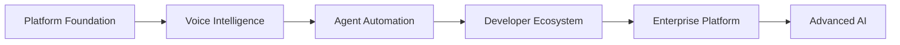

# Agent Platform Roadmap

**Document Version:** 1.0
**Project:** AI Voice Agent SaaS Platform
**Status:** Draft
**Last Updated:** 2026-07-23

---

# 1. Overview

This document defines the long-term roadmap for evolving the AI Voice Agent Platform from an initial production system into a complete enterprise AI agent ecosystem.

The roadmap organizes development into phases covering:

* Core platform capabilities
* Voice intelligence
* Agent automation
* Developer ecosystem
* Enterprise features
* Advanced AI capabilities

---

# 2. Roadmap Objectives

The roadmap focuses on:

* Building a reliable AI voice infrastructure
* Supporting multiple industries
* Creating an extensible agent ecosystem
* Enabling enterprise adoption
* Improving intelligence over time

---

# 3. Platform Evolution Strategy



---

# 4. Phase Overview

```text
Roadmap

Phase 1
Core Voice Agent Platform

Phase 2
Agent Intelligence Layer

Phase 3
Automation Platform

Phase 4
Developer Ecosystem

Phase 5
Enterprise AI Platform

Phase 6
Autonomous Agent Network
```

---

# 5. Phase 1 — Core Voice Agent Platform

## Objective

Build the production-ready foundation.

---

## Capabilities

Completed / Planned:

✓ Multi-tenant architecture

✓ Voice call handling

✓ SIP integration

✓ LiveKit integration

✓ STT pipeline

✓ LLM integration

✓ TTS pipeline

✓ Agent configuration

✓ Basic workflows

✓ Call recording

✓ Conversation storage

---

## Outcome

A reliable AI voice agent capable of handling customer conversations.

---

# 6. Phase 2 — Agent Intelligence Layer

## Objective

Make agents smarter and context-aware.

---

## Capabilities

Implement:

* Memory system
* RAG knowledge system
* Advanced reasoning
* Better context handling
* Agent evaluation
* Conversation learning

---

Architecture:

```text
Conversation

↓

Memory

↓

Knowledge Retrieval

↓

Reasoning

↓

Response
```

---

## Outcome

Agents understand customers better and provide personalized experiences.

---

# 7. Phase 3 — Automation Platform

## Objective

Allow businesses to automate complex workflows.

---

## Capabilities

Implement:

* Workflow builder
* Visual automation
* Business process automation
* Tool orchestration
* Event-driven actions

---

Example:

```text
Customer Calls

↓

AI Agent

↓

CRM Lookup

↓

Schedule Appointment

↓

Send Confirmation
```

---

## Outcome

Agents become operational workers rather than simple assistants.

---

# 8. Phase 4 — Developer Ecosystem

## Objective

Allow external developers to extend the platform.

---

## Capabilities

Implement:

* Developer portal
* SDKs
* APIs
* Webhooks
* Marketplace
* Custom tools

---

## Outcome

A platform ecosystem similar to application marketplaces.

---

# 9. Phase 5 — Enterprise AI Platform

## Objective

Support large organizations.

---

## Capabilities

Implement:

* Advanced security
* Compliance controls
* Private deployments
* Enterprise governance
* Multi-region availability
* Advanced analytics

---

## Outcome

Enterprise-ready AI infrastructure.

---

# 10. Phase 6 — Autonomous Agent Network

## Objective

Enable collaboration between multiple AI agents.

---

## Capabilities

Future:

* Agent-to-agent communication
* Agent teams
* Autonomous workflows
* Self-improving agents
* AI operations management

---

Example:

```text
Sales Agent

↓

Research Agent

↓

Scheduling Agent

↓

Support Agent
```

---

# 11. Current Development Priority

Recommended order:

```text
1. Production Voice Infrastructure

2. Agent Runtime

3. Memory + RAG

4. Workflow Engine

5. Analytics

6. Developer Platform

7. Marketplace

8. Enterprise Features
```

---

# 12. Technical Roadmap

## Backend

Future improvements:

* Service separation
* Event-driven architecture
* Distributed workers
* API expansion

---

## AI Layer

Improvements:

* Better models
* Model routing
* Evaluation pipelines
* Agent optimization

---

## Data Layer

Improvements:

* Advanced analytics
* Vector optimization
* Data warehouse
* Intelligence layer

---

# 13. Product Roadmap

Future products:

```text
AI Receptionist

AI Sales Agent

AI Support Agent

AI Booking Agent

AI Healthcare Assistant

AI Finance Assistant

AI Operations Agent
```

---

# 14. Platform Maturity Model

```text
Level 1

Basic AI Assistant


Level 2

Voice Automation


Level 3

Intelligent Agent


Level 4

Business Automation Platform


Level 5

Autonomous AI Organization
```

---

# 15. Success Metrics

Measure:

## Platform Metrics

* Active agents
* Calls handled
* Availability
* Latency

---

## Business Metrics

* Customer retention
* Revenue
* Cost reduction
* Automation percentage

---

## AI Metrics

* Accuracy
* Resolution rate
* Satisfaction score

---

# 16. Risks and Challenges

Potential challenges:

* AI reliability
* Cost management
* Data privacy
* Model dependency
* Integration complexity

---

# 17. Mitigation Strategy

Address risks through:

* Strong evaluation framework
* Observability
* Security controls
* Governance
* Continuous testing

---

# 18. Long-Term Vision

The platform evolves from:

```text
Voice Bot

↓

AI Agent

↓

AI Workforce Platform

↓

Autonomous Business Operations System
```

---

# 19. Related Documents

| Document                        | Purpose               |
| ------------------------------- | --------------------- |
| 01_System_Overview.md           | Platform architecture |
| 18_Agent_Workflow_Engine.md     | Automation            |
| 19_Agent_Memory_Architecture.md | Intelligence          |
| 26_Agent_Marketplace.md         | Ecosystem             |
| 27_Agent_Analytics_Platform.md  | Analytics             |

---

# 20. Conclusion

The Agent Platform Roadmap provides the strategic direction for building a scalable AI Voice Agent SaaS platform.

The long-term goal is to create a complete AI workforce platform capable of handling communication, automation, and business operations.

---

**End of Document**
