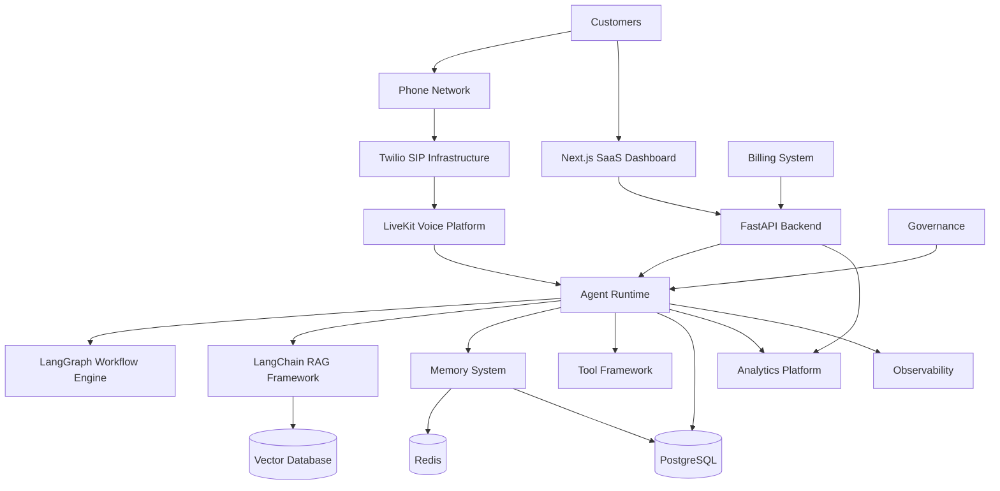
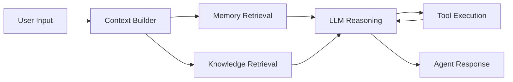

# Agent Platform Final Architecture

**Document Version:** 1.0
**Project:** AI Voice Agent SaaS Platform
**Status:** Draft
**Last Updated:** 2026-07-23

---

# 1. Overview

This document defines the final reference architecture for the AI Voice Agent SaaS Platform.

The architecture combines all major platform capabilities:

* Voice communication
* AI agent runtime
* Workflow automation
* Memory
* RAG knowledge
* Multi-tenancy
* Analytics
* Governance
* Developer ecosystem
* Enterprise operations

The architecture is designed for:

* Production scale
* Enterprise reliability
* Multi-tenant SaaS operation
* Future AI evolution

---

# 2. High-Level Architecture



---

# 3. Architecture Layers

The platform is divided into layers:

```text id="8x5v0k"
AI Voice Agent Platform

Layer 1
Communication Layer

Layer 2
Application Layer

Layer 3
Agent Intelligence Layer

Layer 4
Data Layer

Layer 5
Operations Layer

Layer 6
Business Platform Layer
```

---

# 4. Layer 1 — Communication Layer

Responsible for real-time communication.

Components:

* PSTN
* SIP
* Twilio
* LiveKit
* Voice streaming

Responsibilities:

* Receive calls
* Route calls
* Stream audio
* Manage sessions

---

# 5. Layer 2 — Application Layer

Provides business APIs.

Components:

* Next.js frontend
* FastAPI backend
* Authentication
* Tenant management

Responsibilities:

* User management
* Agent configuration
* Dashboard operations
* API access

---

# 6. Layer 3 — Agent Intelligence Layer

The core AI system.

Components:

```text id="j8r8d5"
Agent Runtime

├── LLM Engine

├── Prompt System

├── Memory

├── RAG

├── Tools

├── Workflow Engine

└── Evaluation System
```

---

# 7. Agent Runtime Architecture



---

# 8. Layer 4 — Data Layer

Data components:

```text id="8q5n8k"
Data Platform

├── PostgreSQL

├── Redis

├── Vector Database

├── Object Storage

└── Analytics Storage
```

---

# 9. PostgreSQL Responsibilities

Stores:

* Users
* Organizations
* Agents
* Conversations
* Configurations
* Billing data

---

# 10. Redis Responsibilities

Stores:

* Active sessions
* Temporary state
* Cache
* Real-time coordination

---

# 11. Vector Database Responsibilities

Stores:

* Document embeddings
* Knowledge vectors
* Semantic memory

Used by:

* RAG
* Memory retrieval
* Search

---

# 12. Layer 5 — Operations Layer

Provides production management.

Components:

* Observability
* Logging
* Metrics
* Tracing
* Alerts

---

# 13. Layer 6 — Business Platform Layer

Enterprise capabilities:

```text id="k4t3mm"
Business Platform

├── Billing

├── Analytics

├── Governance

├── Marketplace

├── Developer Platform

└── Administration
```

---

# 14. Multi-Tenant Architecture

Tenant isolation exists across:

```text id="k9a3q1"
Organization

↓

Agents

↓

Users

↓

Conversations

↓

Knowledge

↓

Usage
```

---

# 15. Security Architecture

Security controls:

* Authentication
* Authorization
* Encryption
* Audit logging
* Secret management
* Tenant isolation

---

# 16. Event-Driven Architecture

The platform uses events for:

* Analytics
* Notifications
* Automation
* Auditing

Example:

```text id="4m8y8r"
Call Completed

↓

Event Published

↓

Analytics Updated

↓

Billing Updated

↓

Customer Notification
```

---

# 17. Deployment Architecture

Production deployment:

```text id="6s4x6g"
Cloud Infrastructure

↓

Kubernetes

↓

Containers

↓

Agent Workers

↓

Monitoring
```

---

# 18. CI/CD Architecture

Pipeline:

```text id="b7h0r9"
Code Commit

↓

Build

↓

Testing

↓

Security Scan

↓

Deployment

↓

Monitoring
```

---

# 19. Observability Architecture

Monitor:

* Calls
* Agents
* APIs
* Databases
* Infrastructure

---

Metrics:

* Latency
* Errors
* Availability
* Cost
* Quality

---

# 20. AI Improvement Loop

Continuous improvement:

```text id="8x5p3z"
Production Conversations

↓

Analytics

↓

Evaluation

↓

Improvements

↓

New Agent Version

↓

Deployment
```

---

# 21. Final Technology Stack

## Frontend

* Next.js
* React
* TypeScript
* Tailwind CSS

---

## Backend

* Python
* FastAPI

---

## AI

* OpenAI Models
* LangChain
* LangGraph

---

## Voice

* Twilio SIP
* LiveKit

---

## Data

* PostgreSQL
* Redis
* Vector Database

---

## Infrastructure

* Docker
* Kubernetes
* Cloud Infrastructure

---

# 22. Future Architecture Evolution

Future capabilities:

* Autonomous agent teams
* AI operations layer
* Multi-agent collaboration
* Self-optimizing workflows

---

# 23. Final Architecture Vision

The complete platform becomes:

```text id="y0m0o5"
Communication Platform

+

AI Intelligence Engine

+

Automation Platform

+

Business Operating System

=

AI Workforce Platform
```

---

# 24. Related Documents

| Document                        | Purpose          |
| ------------------------------- | ---------------- |
| 01_System_Overview.md           | Overall system   |
| 18_Agent_Workflow_Engine.md     | Workflow         |
| 19_Agent_Memory_Architecture.md | Memory           |
| 27_Agent_Analytics_Platform.md  | Analytics        |
| 28_Agent_Platform_Roadmap.md    | Future direction |

---

# 25. Conclusion

The Agent Platform Final Architecture represents the complete blueprint for building a scalable enterprise AI Voice Agent SaaS platform.

It combines communication, intelligence, automation, data, and business systems into one unified architecture.

---

**End of Document**
