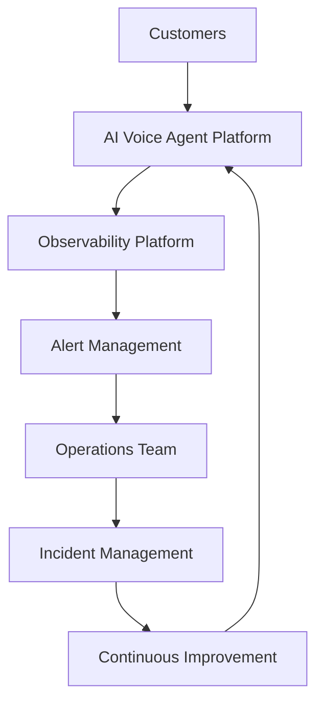
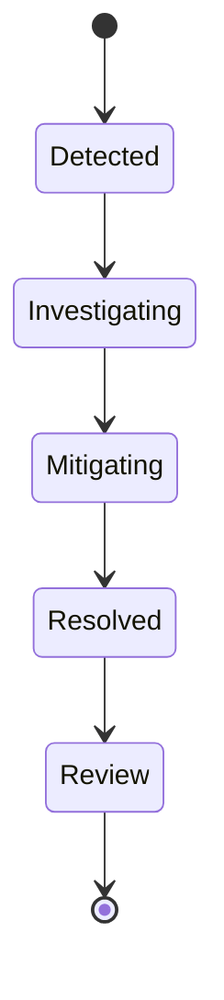

# Agent Platform Operations Model

**Document Version:** 1.0
**Project:** AI Voice Agent SaaS Platform
**Status:** Draft
**Last Updated:** 2026-07-23

---

# 1. Overview

This document defines the operational model for running, maintaining, monitoring, and improving the AI Voice Agent SaaS Platform in production.

The Operations Model establishes how teams manage:

* Platform reliability
* Agent availability
* Customer support
* Infrastructure
* Security
* Performance
* Continuous improvement

---

# 2. Operations Objectives

The operations model ensures:

* High availability
* Fast incident response
* Predictable performance
* Secure operations
* Continuous optimization

---

# 3. Operations Architecture



---

# 4. Operations Domains

```text
Platform Operations

├── Infrastructure Operations

├── Application Operations

├── AI Operations

├── Data Operations

├── Security Operations

├── Customer Operations

└── Business Operations
```

---

# 5. Infrastructure Operations

Responsible for:

* Cloud resources
* Containers
* Kubernetes
* Networking
* Storage

Tasks:

* Resource monitoring
* Scaling
* Backup management
* Infrastructure upgrades

---

# 6. Application Operations

Responsible for:

* Backend services
* Frontend services
* APIs
* Agent runtime

Activities:

* Deployment management
* Error monitoring
* Performance tuning
* Configuration management

---

# 7. AI Operations (AIOps)

AI operations manages:

* Models
* Prompts
* Agents
* Workflows
* Knowledge systems

Responsibilities:

* Model performance tracking
* Prompt optimization
* Agent evaluation
* Behavior improvement

---

# 8. Data Operations

Manages:

* PostgreSQL
* Redis
* Vector databases
* Analytics storage

Responsibilities:

* Backup validation
* Data quality
* Migration management
* Retention policies

---

# 9. Security Operations

Security operations manages:

* Authentication
* Authorization
* Secrets
* Threat detection
* Compliance

---

# 10. Customer Operations

Customer operations supports:

* Tenant onboarding
* Agent configuration
* Troubleshooting
* Usage questions

---

# 11. Monitoring Strategy

The platform monitors:

```text
Monitoring

├── Availability

├── Performance

├── Errors

├── Voice Quality

├── Agent Quality

├── Costs

└── Security Events
```

---

# 12. Service Level Objectives (SLO)

Example targets:

| Service           | Target      |
| ----------------- | ----------- |
| API Availability  | 99.9%       |
| Voice Service     | 99.95%      |
| Agent Response    | < 2 seconds |
| Data Availability | 99.9%       |

---

# 13. Incident Management

Incident lifecycle:



---

# 14. Incident Severity Levels

| Level | Description             |
| ----- | ----------------------- |
| SEV-1 | Complete service outage |
| SEV-2 | Major feature failure   |
| SEV-3 | Limited impact          |
| SEV-4 | Minor issue             |

---

# 15. Incident Response Process

```text
Detection

↓

Alert

↓

Assignment

↓

Investigation

↓

Resolution

↓

Post Incident Review
```

---

# 16. On-Call Operations

Production requires:

* On-call rotation
* Escalation paths
* Incident ownership
* Response procedures

---

# 17. Maintenance Operations

Regular activities:

* Security updates
* Dependency upgrades
* Database maintenance
* Infrastructure optimization

---

# 18. Release Operations

Release process:

```text
Development

↓

Testing

↓

Approval

↓

Deployment

↓

Monitoring
```

---

# 19. Agent Operations

Agent lifecycle operations:

```text
Create Agent

↓

Configure

↓

Test

↓

Deploy

↓

Monitor

↓

Improve

↓

Retire
```

---

# 20. Agent Health Monitoring

Track:

* Response quality
* Failure rate
* Tool errors
* Conversation outcomes
* Customer feedback

---

# 21. Voice Operations

Monitor:

* Call connections
* SIP status
* Audio quality
* Latency
* Transfers

---

# 22. Cost Operations

Monitor:

* Token usage
* Voice minutes
* Infrastructure costs
* Customer consumption

---

# 23. Capacity Planning

Forecast:

* User growth
* Call volume
* Compute requirements
* Storage growth

---

# 24. Operational Dashboards

Dashboards:

```text
Operations Dashboard

├── Platform Health

├── Agent Health

├── Voice Metrics

├── Infrastructure

├── Costs

└── Security
```

---

# 25. Operational Automation

Automate:

* Service restart
* Scaling
* Backup jobs
* Alert handling
* Deployment workflows

---

# 26. Operational Documentation

Maintain:

* Runbooks
* Architecture documents
* Recovery procedures
* Troubleshooting guides

---

# 27. Operational Database Entities

Recommended tables:

```text
service_health

incident_records

maintenance_jobs

deployment_history

operational_metrics

alert_events
```

---

# 28. Continuous Improvement Loop

```text
Production Data

↓

Analysis

↓

Identify Improvements

↓

Implement Changes

↓

Measure Results
```

---

# 29. Future Enhancements

Potential improvements:

* AI operations assistant
* Automated incident resolution
* Predictive failure detection
* Self-healing infrastructure

---

# 30. Related Documents

| Document                        | Purpose               |
| ------------------------------- | --------------------- |
| 22_Agent_Deployment_Strategy.md | Deployment            |
| 23_Agent_Disaster_Recovery.md   | Recovery              |
| 27_Agent_Analytics_Platform.md  | Analytics             |
| 37_Observability                | Monitoring            |
| 38_Runbooks                     | Operations procedures |

---

# 31. Conclusion

The Agent Platform Operations Model defines how the AI Voice Agent SaaS Platform is operated reliably at production scale.

It establishes the processes, responsibilities, and systems required for:

* Reliability
* Security
* Performance
* Continuous improvement

---

**End of Document**
