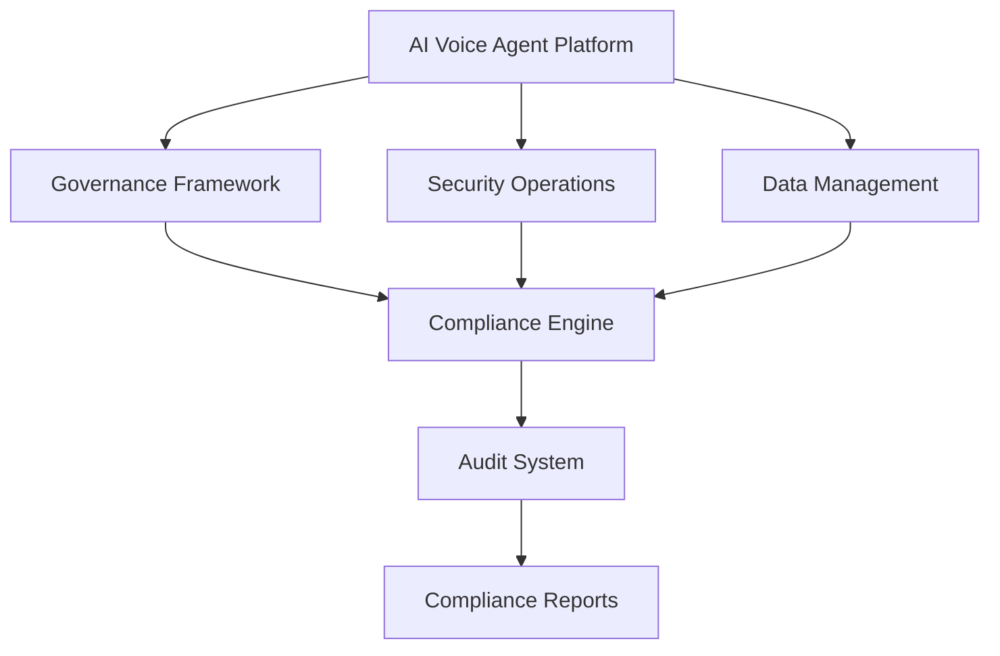
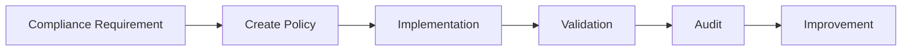

# Agent Platform Compliance Framework

**Document Version:** 1.0
**Project:** AI Voice Agent SaaS Platform
**Status:** Draft
**Last Updated:** 2026-07-23

---

# 1. Overview

This document defines the compliance framework for the AI Voice Agent SaaS Platform.

The compliance framework ensures that the platform operates according to:

* Data protection requirements
* Security standards
* Industry regulations
* Customer contractual obligations
* Responsible AI principles

Compliance is integrated across the entire platform lifecycle.

---

# 2. Compliance Objectives

The framework provides:

* Regulatory readiness
* Data governance
* Security assurance
* Audit capability
* Customer trust

---

# 3. Compliance Architecture



---

# 4. Compliance Domains

```text
Compliance Framework

├── Data Privacy

├── Security Compliance

├── AI Governance

├── Operational Compliance

├── Industry Compliance

└── Audit Management
```

---

# 5. Data Privacy Compliance

The platform protects:

* Customer information
* Conversation data
* Call recordings
* User profiles
* Knowledge documents

Controls:

* Data classification
* Consent management
* Retention policies
* Data deletion workflows

---

# 6. Data Classification

Information is categorized:

| Level        | Description               |
| ------------ | ------------------------- |
| Public       | Non-sensitive information |
| Internal     | Business information      |
| Confidential | Customer information      |
| Restricted   | Highly sensitive data     |

---

# 7. Data Lifecycle Management

```text
Data Created

↓

Stored

↓

Used

↓

Archived

↓

Deleted
```

---

# 8. Data Retention Policies

Retention depends on:

* Business requirements
* Customer contracts
* Legal requirements
* Industry standards

Examples:

```text
Conversation Data

↓

Retention Period

↓

Automatic Archive/Delete
```

---

# 9. Customer Data Rights

The platform supports:

* Data access requests
* Data export
* Data correction
* Data deletion

---

# 10. AI Governance Compliance

AI systems require:

* Model transparency
* Evaluation records
* Human oversight
* Risk assessment

---

# 11. AI Agent Compliance Controls

Every agent requires:

```text
Agent Registration

↓

Risk Classification

↓

Approval

↓

Deployment

↓

Monitoring
```

---

# 12. Model Compliance

Track:

* Model provider
* Model version
* Usage purpose
* Evaluation results
* Performance history

---

Example:

```json
{
"model":"production-model",

"version":"1.0",

"approved":true
}
```

---

# 13. Security Compliance

Security requirements:

* Authentication
* Authorization
* Encryption
* Logging
* Monitoring

---

# 14. Access Compliance

Ensure:

* Least privilege access
* Role-based permissions
* Periodic access reviews

---

# 15. Audit Compliance

The platform records:

* User actions
* Configuration changes
* Agent changes
* Data access
* Security events

---

Example:

```json
{
"event":"agent_configuration_updated",

"user":"admin",

"time":"2026-07-23"
}
```

---

# 16. Operational Compliance

Operations must maintain:

* Availability targets
* Incident procedures
* Backup processes
* Recovery testing

---

# 17. Vendor Compliance

External services require review.

Examples:

* Voice providers
* AI providers
* Cloud providers
* Integration services

Review:

* Security practices
* Data handling
* Reliability

---

# 18. Industry Compliance Readiness

The platform architecture supports industries such as:

## Healthcare

Consider:

* Patient data protection
* Access controls
* Audit requirements

---

## Finance

Consider:

* Transaction security
* Identity verification
* Data protection

---

## Customer Service

Consider:

* Recording policies
* Privacy notices
* Data handling

---

# 19. Compliance Monitoring

Monitor:

```text
Compliance Monitoring

├── Policy Violations

├── Access Events

├── Data Usage

├── Security Events

├── Agent Behavior

└── Audit Results
```

---

# 20. Compliance Dashboard

Dashboard provides:

* Compliance status
* Open issues
* Audit history
* Risk scores

---

# 21. Compliance Workflow



---

# 22. Compliance Database Entities

Recommended tables:

```text
compliance_policies

compliance_requirements

audit_records

risk_assessments

data_classifications

compliance_reviews
```

---

# 23. Compliance Testing

Testing includes:

* Security testing
* Access testing
* Data handling testing
* AI behavior testing

---

# 24. Documentation Requirements

Maintain:

* Policies
* Procedures
* Audit records
* Architecture documents
* Risk assessments

---

# 25. Compliance Incident Management

Process:

```text
Issue Detected

↓

Risk Assessment

↓

Containment

↓

Correction

↓

Documentation
```

---

# 26. Continuous Compliance

Compliance is maintained through:

* Automated checks
* Regular reviews
* Monitoring
* Governance processes

---

# 27. Future Enhancements

Potential additions:

* Automated compliance engine
* AI compliance assistant
* Policy recommendation system
* Continuous audit automation

---

# 28. Related Documents

| Document                                 | Purpose           |
| ---------------------------------------- | ----------------- |
| 24_Agent_Governance_Framework.md         | Governance        |
| 32_Agent_Platform_Security_Operations.md | Security          |
| 31_Agent_Platform_Operations_Model.md    | Operations        |
| 23_Agent_Disaster_Recovery.md            | Recovery          |
| 40_Security_Threat_Model                 | Threat management |

---

# 29. Conclusion

The Agent Platform Compliance Framework provides the foundation for operating AI agents responsibly in enterprise environments.

It ensures the platform remains:

* Secure
* Auditable
* Transparent
* Regulation-ready

---

**End of Document**
