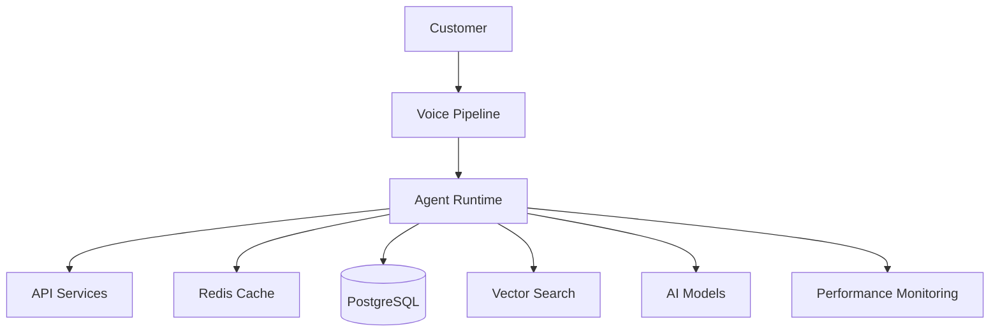

# Agent Platform Performance Optimization

**Document Version:** 1.0
**Project:** AI Voice Agent SaaS Platform
**Status:** Draft
**Last Updated:** 2026-07-23

---

# 1. Overview

This document defines the performance optimization strategy for the AI Voice Agent SaaS Platform.

The goal is to achieve:

* Low latency conversations
* High throughput
* Efficient resource usage
* Reliable scaling
* Controlled operational costs

Performance optimization applies across:

* Voice processing
* Agent runtime
* APIs
* Databases
* AI models
* Infrastructure

---

# 2. Performance Objectives

The platform should achieve:

* Real-time voice interaction
* Fast agent responses
* Predictable latency
* High availability
* Efficient AI resource usage

---

# 3. Performance Architecture



---

# 4. Performance Optimization Areas

```text
Performance Optimization

├── Voice Latency

├── Agent Reasoning

├── API Performance

├── Database Performance

├── AI Model Performance

├── Infrastructure Scaling

└── Cost Optimization
```

---

# 5. Voice Latency Optimization

Voice experience depends on:

* Audio streaming
* Speech recognition speed
* Model response time
* Text-to-speech generation

Target:

```text
Caller Speech

↓

STT

↓

LLM

↓

TTS

↓

Response

< 2 seconds
```

---

# 6. Streaming Architecture

Use streaming wherever possible:

```text
Audio Stream

↓

Partial Transcription

↓

Incremental Reasoning

↓

Streaming Response

↓

Audio Playback
```

Benefits:

* Lower perceived latency
* Better user experience
* Faster interactions

---

# 7. Agent Runtime Optimization

Optimize:

* Context loading
* Memory retrieval
* Tool execution
* Workflow processing

---

Example:

```text
Request

↓

Load Required Context

↓

Execute Reasoning

↓

Return Response
```

Avoid:

* Loading unnecessary data
* Excessive tool calls
* Large prompts

---

# 8. Prompt Optimization

Large prompts increase:

* Latency
* Token cost
* Processing time

Optimization:

* Remove unnecessary instructions
* Use structured prompts
* Retrieve only relevant context

---

# 9. Model Selection Strategy

Use different models based on task complexity.

Example:

```text
Simple Task

↓

Fast Model


Complex Task

↓

Advanced Model
```

Benefits:

* Lower cost
* Faster responses
* Better scalability

---

# 10. Context Management

Manage conversation context using:

* Summaries
* Memory retrieval
* Relevant history only

Example:

```text
Old Conversation

↓

Summary

↓

Relevant Context

↓

Agent
```

---

# 11. RAG Performance Optimization

Optimize:

* Embedding generation
* Vector indexing
* Retrieval accuracy
* Chunk strategy

---

Best practices:

* Good document chunking
* Metadata filtering
* Hybrid search
* Ranking optimization

---

# 12. Database Optimization

PostgreSQL optimization:

* Proper indexes
* Query optimization
* Connection pooling
* Partitioning

---

Example:

```text
Large Conversation Table

↓

Partition by Tenant / Date

↓

Faster Queries
```

---

# 13. Redis Optimization

Redis is used for:

* Sessions
* Cache
* Temporary state

Optimize:

* Expiration policies
* Memory usage
* Key structure

---

Example:

```text
agent_session:{session_id}

TTL: 30 minutes
```

---

# 14. API Performance

Optimize:

* Response times
* Payload size
* Database calls
* Authentication checks

---

Techniques:

* Async processing
* Caching
* Pagination
* Background jobs

---

# 15. Workflow Engine Optimization

Optimize workflows through:

* Efficient state transitions
* Parallel execution
* Retry strategies

---

Example:

```text
Workflow Step A

↓

Parallel

↓

Step B + Step C

↓

Final Result
```

---

# 16. Tool Execution Optimization

Improve:

* Tool response time
* External API calls
* Failure handling

---

Strategies:

* Timeout controls
* Caching
* Retries
* Circuit breakers

---

# 17. Infrastructure Optimization

Optimize:

* CPU usage
* Memory usage
* Network performance
* Container resources

---

Use:

* Auto scaling
* Load balancing
* Resource limits

---

# 18. Horizontal Scaling

Scale components independently:

```text
Voice Workers

+

Agent Workers

+

API Workers

+

Background Workers
```

---

# 19. Load Testing Strategy

Test:

* Concurrent calls
* API requests
* Agent sessions
* Database load

---

Example:

```text
100 Calls

↓

500 Calls

↓

5000 Calls
```

---

# 20. Performance Monitoring Metrics

Track:

| Metric      | Purpose               |
| ----------- | --------------------- |
| Latency     | Response speed        |
| Throughput  | Processing capacity   |
| Error Rate  | Reliability           |
| CPU Usage   | Infrastructure health |
| Token Usage | AI efficiency         |

---

# 21. Cost Performance Optimization

Reduce costs through:

* Model routing
* Prompt optimization
* Caching
* Efficient retrieval

---

Example:

```text
Same Question

↓

Cached Answer

↓

No New AI Call
```

---

# 22. Performance Testing Lifecycle


---

# 23. Performance Database Metrics

Recommended tables:

```text
performance_metrics

latency_records

resource_usage

model_usage_metrics

optimization_events
```

---

# 24. Performance Alerts

Alert on:

* High latency
* Increased errors
* Resource exhaustion
* Cost spikes

---

# 25. Continuous Optimization Loop

```text
Production Data

↓

Measure

↓

Analyze

↓

Improve

↓

Deploy
```

---

# 26. Future Enhancements

Potential improvements:

* AI performance optimizer
* Automatic model routing
* Predictive scaling
* Self-tuning agents

---

# 27. Related Documents

| Document                                 | Purpose      |
| ---------------------------------------- | ------------ |
| 31_Agent_Platform_Operations_Model.md    | Operations   |
| 27_Agent_Analytics_Platform.md           | Analytics    |
| 32_Agent_Platform_Security_Operations.md | Security     |
| 29_Agent_Platform_Final_Architecture.md  | Architecture |

---

# 28. Conclusion

Performance optimization is essential for delivering a production-grade AI Voice Agent Platform.

A successful optimization strategy ensures:

* Natural conversations
* Scalable infrastructure
* Better reliability
* Lower operating costs

---

**End of Document**
