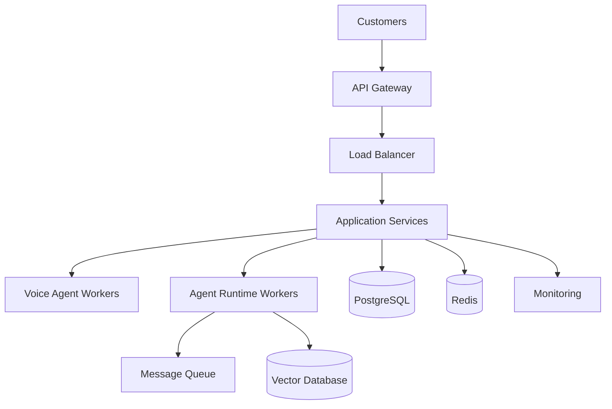

# Agent Platform Scaling Strategy

**Document Version:** 1.0
**Project:** AI Voice Agent SaaS Platform
**Status:** Draft
**Last Updated:** 2026-07-23

---

# 1. Overview

This document defines the scaling strategy for the AI Voice Agent SaaS Platform.

The objective is to ensure the platform can grow from:

* Initial customers
* Thousands of concurrent conversations
* Enterprise workloads
* Global deployments

while maintaining:

* Low latency
* Reliability
* Security
* Cost efficiency

---

# 2. Scaling Objectives

The scaling strategy focuses on:

* Horizontal scalability
* Independent service scaling
* Database scalability
* AI workload optimization
* Operational simplicity

---

# 3. Scaling Architecture



---

# 4. Scaling Principles

The platform follows:

```text
Scalable Architecture

├── Stateless Services

├── Horizontal Scaling

├── Async Processing

├── Distributed Workloads

├── Independent Components

└── Automated Operations
```

---

# 5. Growth Stages

```text
Stage 1

Startup Scale


↓

Stage 2

Growing SaaS Platform


↓

Stage 3

Enterprise Scale


↓

Stage 4

Global AI Platform
```

---

# 6. Stage 1 — Startup Scale

## Expected Usage

Example:

* Hundreds of users
* Dozens of concurrent calls
* Single region deployment

---

## Architecture

```text
Single Cloud Environment

↓

Docker Services

↓

Managed Database

↓

Basic Monitoring
```

---

# 7. Stage 2 — Growing SaaS Platform

## Expected Usage

Example:

* Thousands of users
* Hundreds of active agents
* Higher call volume

---

## Improvements

Implement:

* Multiple workers
* Load balancing
* Queue processing
* Database optimization

---

Architecture:

```text
Traffic

↓

Load Balancer

↓

Multiple Services

↓

Shared Data Layer
```

---

# 8. Stage 3 — Enterprise Scale

## Expected Usage

Example:

* Large organizations
* Thousands of concurrent conversations
* Multiple regions

---

## Improvements

Implement:

* Kubernetes deployment
* Service separation
* Advanced monitoring
* Regional scaling

---

Architecture:

```text
Region A

↓

Agent Services


Region B

↓

Agent Services


Shared Control Plane
```

---

# 9. Stage 4 — Global AI Platform

Future architecture:

```text
Global Users

↓

Global Routing Layer

↓

Regional AI Platforms

↓

Distributed Agent Runtime

↓

Global Analytics
```

---

# 10. Horizontal Scaling Strategy

Components that scale independently:

```text
API Servers

+

Voice Workers

+

Agent Workers

+

Workflow Workers

+

Background Jobs
```

---

# 11. Voice Agent Scaling

Voice workloads require:

* Real-time processing
* Session management
* Audio streaming capacity

Scale by:

* Adding voice workers
* Distributing sessions
* Monitoring resource usage

---

Example:

```text
Incoming Calls

↓

Session Router

↓

Available Agent Worker
```

---

# 12. Agent Runtime Scaling

Agent workers should support:

* Multiple sessions
* Independent execution
* Failure recovery

---

Scaling model:

```text
Agent Requests

↓

Worker Pool

↓

Execution Nodes
```

---

# 13. Background Processing Scaling

Background jobs handle:

* Document ingestion
* Embeddings
* Reports
* Analytics processing

---

Use:

* Queues
* Workers
* Retry systems

---

# 14. Database Scaling Strategy

Database growth plan:

## Phase 1

Optimize:

* Indexes
* Queries
* Connection pooling

---

## Phase 2

Add:

* Read replicas
* Partitioning

---

## Phase 3

Advanced:

* Sharding
* Regional databases

---

# 15. Multi-Tenant Scaling

Tenant-aware scaling:

```text
Tenant

↓

Organization Resources

↓

Agent Capacity

↓

Usage Limits
```

---

Implement:

* Tenant quotas
* Resource limits
* Usage tracking

---

# 16. Caching Strategy

Cache:

* Agent configuration
* Session state
* Frequently accessed data

---

Architecture:

```text
Request

↓

Redis Cache

↓

Database (if required)
```

---

# 17. Queue-Based Architecture

Queues handle:

* Long-running tasks
* Retries
* Work distribution

---

Example:

```text
Event

↓

Queue

↓

Worker

↓

Result
```

---

# 18. Auto Scaling Strategy

Scale based on:

* CPU usage
* Memory usage
* Active calls
* Queue size
* Latency

---

Example:

```text
High Traffic

↓

Increase Workers

↓

Process Load

↓

Reduce Workers
```

---

# 19. Reliability During Scaling

Requirements:

* No dropped calls
* Graceful shutdown
* Health checks
* Failover handling

---

# 20. Cost-Aware Scaling

Optimization:

* Scale down idle resources
* Use appropriate models
* Cache results
* Optimize workloads

---

# 21. Disaster Recovery Scaling

Support:

* Backup regions
* Data replication
* Recovery procedures

---

# 22. Scaling Monitoring

Track:

| Metric           | Purpose         |
| ---------------- | --------------- |
| Concurrent Calls | Voice capacity  |
| Worker Count     | Scaling status  |
| Queue Depth      | Processing load |
| Database Load    | Data capacity   |
| Latency          | User experience |

---

# 23. Capacity Planning

Forecast:

* Customer growth
* Call volume
* AI usage
* Storage requirements

---

# 24. Scaling Database Entities

Recommended tables:

```text
tenant_limits

resource_usage

scaling_events

capacity_reports

worker_metrics
```

---

# 25. Scaling Automation

Automate:

* Resource provisioning
* Worker scaling
* Monitoring
* Recovery actions

---

# 26. Future Enhancements

Potential improvements:

* AI-driven auto scaling
* Global edge deployment
* Autonomous infrastructure management
* Predictive capacity planning

---

# 27. Related Documents

| Document                                      | Purpose      |
| --------------------------------------------- | ------------ |
| 34_Agent_Platform_Performance_Optimization.md | Performance  |
| 31_Agent_Platform_Operations_Model.md         | Operations   |
| 29_Agent_Platform_Final_Architecture.md       | Architecture |
| 32_Agent_Platform_Security_Operations.md      | Security     |

---

# 28. Conclusion

The Agent Platform Scaling Strategy provides a roadmap for growing the AI Voice Agent SaaS Platform from an early product into a globally scalable AI infrastructure platform.

The strategy ensures:

* Reliable growth
* Predictable performance
* Efficient resource usage
* Enterprise readiness

---

**End of Document**
