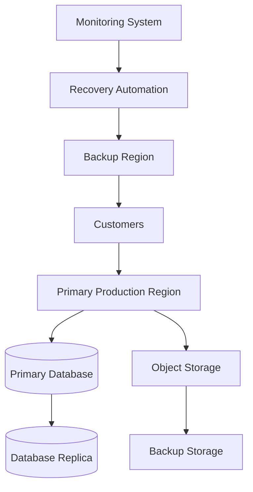
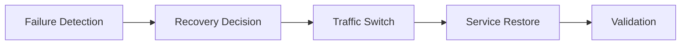

# Agent Platform Disaster Recovery Strategy

**Document Version:** 1.0
**Project:** AI Voice Agent SaaS Platform
**Status:** Draft
**Last Updated:** 2026-07-23

---

# 1. Overview

This document defines the Disaster Recovery (DR) strategy for the AI Voice Agent SaaS Platform.

The objective is to ensure the platform can recover from:

* Infrastructure failures
* Service outages
* Database failures
* Security incidents
* Regional failures
* Data corruption

The DR strategy ensures business continuity while protecting:

* Customer data
* Voice operations
* AI agent configurations
* Knowledge systems
* Platform availability

---

# 2. Disaster Recovery Objectives

The DR framework provides:

* Fast service restoration
* Minimal data loss
* Reliable recovery procedures
* Automated recovery processes
* Operational confidence

---

# 3. Disaster Recovery Architecture



---

# 4. Recovery Principles

The DR strategy follows:

```text
Disaster Recovery

├── Prevention

├── Detection

├── Response

├── Recovery

└── Improvement
```

---

# 5. Disaster Categories

Supported scenarios:

```text
Disaster Types

├── Application Failure

├── Database Failure

├── Infrastructure Failure

├── Cloud Provider Failure

├── Security Incident

├── Data Corruption

└── Regional Outage
```

---

# 6. Recovery Objectives

## Recovery Time Objective (RTO)

Maximum acceptable downtime.

Example:

```text
Critical Voice Services

RTO: Minutes
```

---

## Recovery Point Objective (RPO)

Maximum acceptable data loss.

Example:

```text
Conversation Data

RPO: Minutes
```

---

# 7. Service Criticality Classification

| Service          | Priority |
| ---------------- | -------- |
| Voice Processing | Critical |
| Agent Runtime    | Critical |
| Authentication   | Critical |
| Database         | Critical |
| Analytics        | Medium   |
| Reporting        | Low      |

---

# 8. Backup Strategy

Backup targets:

* PostgreSQL database
* Agent configurations
* Knowledge documents
* Conversation records
* System configurations

---

Backup types:

```text
Full Backup

+

Incremental Backup

+

Continuous Replication
```

---

# 9. Database Recovery Strategy

PostgreSQL protection:

Implement:

* Automated backups
* Point-in-time recovery
* Replication
* Backup validation

---

Recovery flow:

```text
Failure Detected

↓

Promote Replica

↓

Restore Missing Data

↓

Validate System

↓

Resume Service
```

---

# 10. Redis Recovery Strategy

Redis stores:

* Sessions
* Cache
* Temporary state

Recovery:

* Persistence snapshots
* Replica recovery
* Cache rebuilding

---

# 11. Vector Database Recovery

Protect:

* Embeddings
* Knowledge indexes
* Semantic memory

Recovery:

```text
Documents

↓

Rebuild Embeddings

↓

Restore Index

↓

Validate Search
```

---

# 12. Application Recovery

Application recovery includes:

* Container redeployment
* Configuration restoration
* Secret recovery
* Dependency validation

---

Deployment recovery:

```text
Infrastructure Ready

↓

Deploy Services

↓

Run Health Checks

↓

Accept Traffic
```

---

# 13. Voice Service Recovery

Voice systems require special handling.

Recover:

* SIP connections
* Voice workers
* Active routing
* Call handling

---

Strategy:

```text
Voice Failure

↓

Redirect Traffic

↓

Activate Healthy Workers

↓

Resume Calls
```

---

# 14. Multi-Region Recovery

For enterprise scale:

```text
Primary Region

↓

Replication

↓

Secondary Region

↓

Traffic Switch
```

---

# 15. Failover Strategy

Failover process:



---

# 16. Security Incident Recovery

Security events require:

* Isolation
* Investigation
* Data validation
* Credential rotation

---

Example:

```text
Security Alert

↓

Contain Threat

↓

Rotate Secrets

↓

Restore Clean Environment
```

---

# 17. Backup Validation

Backups must be tested.

Testing:

* Restore testing
* Data verification
* Application startup testing

---

# 18. Disaster Recovery Testing

Schedule:

* Monthly backup tests
* Quarterly recovery drills
* Annual full simulations

---

# 19. Monitoring and Alerting

Monitor:

```text
DR Monitoring

├── Backup Status

├── Replication Health

├── Recovery Readiness

├── System Availability

└── Data Integrity
```

---

# 20. Recovery Runbooks

Maintain procedures for:

* Database recovery
* Service recovery
* Security recovery
* Regional failover

---

# 21. Disaster Recovery Team

Roles:

```text
DR Team

├── Incident Commander

├── Infrastructure Engineer

├── Backend Engineer

├── Database Engineer

├── Security Engineer

└── Customer Communication
```

---

# 22. Recovery Communication

During incidents:

Communicate:

* Incident status
* Customer impact
* Recovery progress
* Resolution summary

---

# 23. Disaster Recovery Database Entities

Recommended tables:

```text
backup_records

recovery_events

failover_history

disaster_incidents

recovery_tests
```

---

# 24. Continuous Improvement

After recovery:

```text
Incident

↓

Analysis

↓

Root Cause

↓

Improvement Actions

↓

Updated Procedures
```

---

# 25. Future Enhancements

Potential improvements:

* Automated disaster recovery
* Self-healing infrastructure
* AI incident commander
* Global active-active deployment

---

# 26. Related Documents

| Document                                 | Purpose             |
| ---------------------------------------- | ------------------- |
| 31_Agent_Platform_Operations_Model.md    | Operations          |
| 32_Agent_Platform_Security_Operations.md | Security            |
| 35_Agent_Platform_Scaling_Strategy.md    | Scaling             |
| 37_Observability                         | Monitoring          |
| 38_Runbooks                              | Recovery procedures |

---

# 27. Conclusion

The Agent Platform Disaster Recovery Strategy ensures that the AI Voice Agent SaaS Platform remains resilient during failures.

It provides:

* Business continuity
* Data protection
* Fast recovery
* Enterprise reliability

---

**End of Document**
