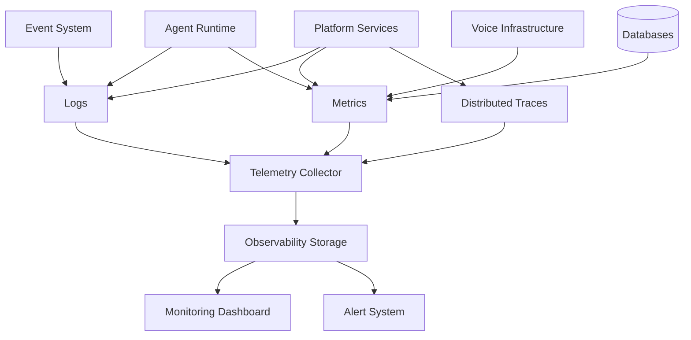

# Agent Platform Observability Strategy

**Document Version:** 1.0
**Project:** AI Voice Agent SaaS Platform
**Status:** Draft
**Last Updated:** 2026-07-23

---

# 1. Overview

This document defines the observability strategy for the AI Voice Agent SaaS Platform.

Observability provides complete visibility into:

* System health
* Voice interactions
* Agent behavior
* AI performance
* Infrastructure state
* Customer experience

The goal is to understand not only **what failed**, but **why it failed**.

---

# 2. Observability Objectives

The observability platform enables:

* Faster troubleshooting
* Proactive issue detection
* Performance optimization
* AI quality measurement
* Operational intelligence

---

# 3. Observability Architecture



---

# 4. Observability Pillars

The platform follows the three major pillars:

```text
Observability

├── Logs

├── Metrics

└── Distributed Traces
```

Additional AI-specific signals:

```text
AI Observability

├── Agent Behavior

├── Prompt Performance

├── Model Quality

├── Tool Execution

└── Conversation Outcomes
```

---

# 5. Logging Strategy

Logs provide detailed event information.

Sources:

```text
Logs

├── API Services

├── Agent Runtime

├── Voice Workers

├── Workflow Engine

├── Database

├── Security System

└── Background Workers
```

---

# 6. Structured Logging

All services should use structured logs.

Example:

```json
{
  "timestamp":"2026-07-23T12:00:00Z",
  "service":"agent-runtime",
  "event":"tool_execution",
  "agent_id":"agent_123",
  "duration_ms":450
}
```

---

# 7. Log Categories

## Application Logs

Track:

* Requests
* Errors
* Business events

---

## Agent Logs

Track:

* Agent decisions
* Tool calls
* Workflow transitions

---

## Voice Logs

Track:

* Calls
* SIP events
* Audio processing

---

## Security Logs

Track:

* Login attempts
* Permission changes
* Suspicious activity

---

# 8. Metrics Strategy

Metrics provide numerical system measurements.

---

Important metrics:

```text
Platform Metrics

├── Request Rate

├── Latency

├── Error Rate

├── Availability

├── Resource Usage

└── Cost
```

---

# 9. Voice Platform Metrics

Monitor:

* Active calls
* Call duration
* Connection success
* Audio quality
* Transfer rate

---

Example:

```text
Incoming Calls

↓

Connected Calls

↓

Completed Calls

↓

Failed Calls
```

---

# 10. Agent Runtime Metrics

Measure:

* Agent executions
* Response time
* Tool usage
* Workflow completion
* Failures

---

Example:

```json
{
"agent":"booking_agent",
"success_rate":"98%",
"average_latency":"1.6s"
}
```

---

# 11. AI Quality Observability

AI-specific monitoring:

Track:

* Response accuracy
* Hallucination rate
* Task completion
* User satisfaction

---

Flow:

```text
Conversation

↓

Evaluation

↓

Quality Score

↓

Improvement
```

---

# 12. Distributed Tracing

Tracing follows requests across services.

Example:

```text
Caller

↓

LiveKit

↓

Agent Runtime

↓

LLM

↓

Tool

↓

Database
```

---

Trace information:

* Service timing
* Dependencies
* Failures
* Bottlenecks

---

# 13. Conversation Observability

Monitor:

* Conversation lifecycle
* Intent detection
* Agent decisions
* Final outcome

---

Example:

```text
Call Started

↓

Intent Detected

↓

Workflow Executed

↓

Task Completed
```

---

# 14. Workflow Observability

Track:

* Workflow states
* Execution time
* Failed steps
* Retries

---

Example:

```text
Booking Workflow

Step 1 ✓

Step 2 ✓

Step 3 Failed

Retry Started
```

---

# 15. Tool Execution Monitoring

Monitor:

* Tool calls
* Response time
* Failures
* Permission checks

---

Example:

```text
Agent

↓

CRM Tool

↓

API Response

↓

Agent Decision
```

---

# 16. Database Observability

Monitor:

PostgreSQL:

* Query performance
* Connections
* Locks
* Storage

Redis:

* Memory usage
* Cache hits
* Expiration

Vector DB:

* Search latency
* Index health

---

# 17. Infrastructure Monitoring

Monitor:

* CPU
* Memory
* Disk
* Network
* Containers
* Kubernetes

---

# 18. Alerting Strategy

Alerts should detect:

* Service failures
* High latency
* Resource exhaustion
* Security events
* AI quality degradation

---

Example:

```text
Latency > Threshold

↓

Alert Triggered

↓

Operations Team Notified
```

---

# 19. Alert Severity

| Level    | Description         |
| -------- | ------------------- |
| Critical | Service unavailable |
| High     | Major degradation   |
| Medium   | Performance issue   |
| Low      | Informational       |

---

# 20. Dashboards

Required dashboards:

```text
Operations Dashboard

├── Platform Health

├── Voice Performance

├── Agent Quality

├── Infrastructure

├── Security

└── Cost
```

---

# 21. AI Agent Debugging

Developers need visibility into:

* Prompt
* Context
* Memory retrieval
* Tool calls
* Final response

---

Debug flow:

```text
User Request

↓

Context

↓

Reasoning

↓

Action

↓

Response
```

---

# 22. Observability Data Storage

Recommended:

```text
Telemetry

↓

Time-Series Storage

↓

Log Storage

↓

Trace Storage

↓

Analytics Layer
```

---

# 23. Observability Database Entities

Recommended tables:

```text
system_metrics

application_logs

trace_records

alert_events

agent_quality_metrics

performance_events
```

---

# 24. Operational Integration

Observability integrates with:

* Incident Management
* Security Operations
* Analytics Platform
* CI/CD Pipeline
* Agent Evaluation System

---

# 25. Observability Best Practices

Follow:

* Centralized logging
* Consistent metrics
* Trace correlation IDs
* Automated alerts
* Retention policies

---

# 26. Future Enhancements

Potential improvements:

* AI operations assistant
* Automated root cause analysis
* Predictive monitoring
* Self-healing systems

---

# 27. Related Documents

| Document                                      | Purpose     |
| --------------------------------------------- | ----------- |
| 31_Agent_Platform_Operations_Model.md         | Operations  |
| 34_Agent_Platform_Performance_Optimization.md | Performance |
| 32_Agent_Platform_Security_Operations.md      | Security    |
| 27_Agent_Analytics_Platform.md                | Analytics   |

---

# 28. Conclusion

The Agent Platform Observability Strategy provides the visibility required to operate a reliable AI Voice Agent SaaS Platform.

It enables:

* Faster debugging
* Better reliability
* Higher AI quality
* Continuous improvement

---

**End of Document**
