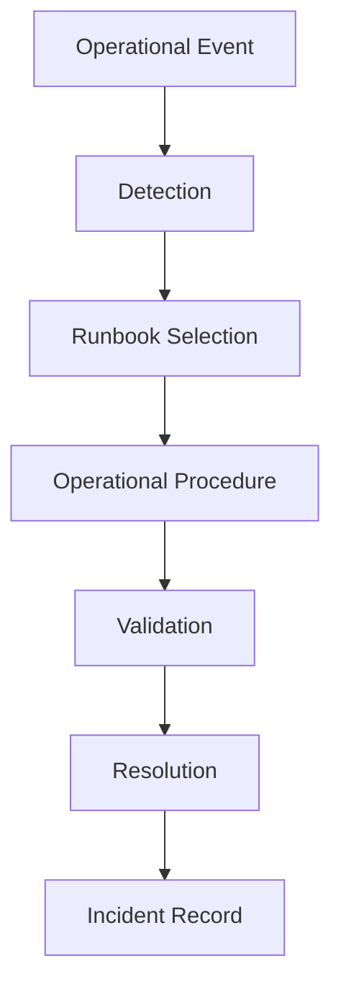

# Agent Platform Runbook Strategy

**Document Version:** 1.0
**Project:** AI Voice Agent SaaS Platform
**Status:** Draft
**Last Updated:** 2026-07-23

---

# 1. Overview

This document defines the runbook strategy for operating and maintaining the AI Voice Agent SaaS Platform.

Runbooks provide standardized operational procedures for:

* Monitoring
* Troubleshooting
* Incident response
* Recovery
* Maintenance
* Deployment

The objective is to reduce operational risk and enable consistent platform management.

---

# 2. Runbook Objectives

Runbooks ensure:

* Faster incident resolution
* Consistent operational actions
* Reduced human error
* Knowledge sharing
* Easier onboarding of operations teams

---

# 3. Runbook Architecture



---

# 4. Runbook Categories

```text
Runbooks

├── Infrastructure Runbooks

├── Application Runbooks

├── Voice Platform Runbooks

├── Agent Runtime Runbooks

├── Database Runbooks

├── Security Runbooks

└── Disaster Recovery Runbooks
```

---

# 5. Runbook Structure Standard

Every runbook should contain:

```text
Runbook

├── Purpose

├── Scope

├── Preconditions

├── Detection

├── Investigation

├── Resolution Steps

├── Validation

├── Rollback

└── Post Incident Actions
```

---

# 6. Infrastructure Runbooks

Cover:

* Server issues
* Container failures
* Kubernetes problems
* Network failures

Examples:

```text
Infrastructure Issues

├── Node Failure

├── Container Crash

├── Resource Exhaustion

└── Network Failure
```

---

# 7. Application Runbooks

Cover:

* API failures
* Backend errors
* Frontend issues
* Service degradation

---

Example:

```text
API Failure

↓

Check Logs

↓

Check Dependencies

↓

Restart Service

↓

Validate Health
```

---

# 8. Voice Platform Runbooks

Voice operations require dedicated procedures.

Cover:

* SIP failures
* Call routing issues
* Audio problems
* LiveKit failures

---

Example:

```text
Call Failure

↓

Check SIP Connection

↓

Check LiveKit Status

↓

Check Agent Worker

↓

Restore Service
```

---

# 9. Agent Runtime Runbooks

Cover:

* Agent failures
* Workflow errors
* Tool failures
* Memory issues

---

Example:

```text
Agent Error

↓

Check Agent Logs

↓

Inspect Workflow State

↓

Review Tool Calls

↓

Deploy Fix
```

---

# 10. Database Runbooks

Cover:

* Connection problems
* Slow queries
* Backup recovery
* Migration failures

---

Example:

```text
Database Issue

↓

Check Health

↓

Review Metrics

↓

Apply Fix

↓

Verify Data
```

---

# 11. Redis Runbooks

Common scenarios:

* Memory exhaustion
* Cache failures
* Session loss

Procedure:

```text
Redis Issue

↓

Check Memory

↓

Review Keys

↓

Clear Cache if Required

↓

Restart/Recover
```

---

# 12. Vector Database Runbooks

Handle:

* Index problems
* Search failures
* Embedding issues

---

Procedure:

```text
Search Failure

↓

Check Index

↓

Validate Embeddings

↓

Rebuild Index

↓

Test Retrieval
```

---

# 13. Security Runbooks

Security procedures include:

* Unauthorized access
* Credential leaks
* Suspicious activity

---

Example:

```text
Security Alert

↓

Investigate

↓

Contain

↓

Rotate Credentials

↓

Document
```

---

# 14. Deployment Runbooks

Deployment process:

```text
Prepare Release

↓

Run Tests

↓

Deploy

↓

Monitor

↓

Rollback if Needed
```

---

# 15. Rollback Procedures

Every deployment requires rollback instructions.

Example:

```text
Failed Deployment

↓

Stop Release

↓

Restore Previous Version

↓

Validate System

↓

Resume Traffic
```

---

# 16. Monitoring Runbooks

For alerts:

```text
Alert Triggered

↓

Identify Service

↓

Check Metrics

↓

Investigate Cause

↓

Resolve
```

---

# 17. Customer Impact Runbooks

Handle:

* Customer complaints
* Service degradation
* Data issues

---

Required actions:

* Identify impact
* Communicate status
* Resolve issue
* Document outcome

---

# 18. Common Incident Runbooks

Required initial set:

```text
Critical Runbooks

├── Service Outage

├── Database Failure

├── Voice Call Failure

├── Agent Failure

├── Security Incident

├── Deployment Failure

└── Data Recovery
```

---

# 19. Runbook Automation

Automate:

* Health checks
* Diagnostics
* Recovery actions
* Notifications

---

Example:

```text
Alert

↓

Automation Script

↓

Diagnostic Report

↓

Engineer Action
```

---

# 20. Runbook Repository Structure

Recommended:

```text
runbooks/

├── infrastructure/

├── application/

├── voice/

├── agent/

├── database/

├── security/

└── recovery/
```

---

# 21. Runbook Ownership

Each runbook requires:

| Field        | Description      |
| ------------ | ---------------- |
| Owner        | Responsible team |
| Reviewer     | Quality check    |
| Last Updated | Maintenance date |
| Version      | Change tracking  |

---

# 22. Runbook Testing

Runbooks should be tested through:

* Simulated incidents
* Disaster drills
* Recovery exercises

---

# 23. Runbook Metrics

Measure:

* Resolution time
* Successful recoveries
* Runbook usage
* Incident frequency

---

# 24. Continuous Improvement

After incidents:

```text
Incident

↓

Review

↓

Improve Runbook

↓

Update Procedures
```

---

# 25. Future Enhancements

Potential improvements:

* AI-powered runbook assistant
* Automated troubleshooting
* Self-healing workflows
* Predictive incident response

---

# 26. Related Documents

| Document                                        | Purpose    |
| ----------------------------------------------- | ---------- |
| 31_Agent_Platform_Operations_Model.md           | Operations |
| 36_Agent_Platform_Disaster_Recovery_Strategy.md | Recovery   |
| 37_Agent_Platform_Observability_Strategy.md     | Monitoring |
| 32_Agent_Platform_Security_Operations.md        | Security   |

---

# 27. Conclusion

The Agent Platform Runbook Strategy provides the operational foundation needed to manage the AI Voice Agent SaaS Platform reliably.

Well-defined runbooks enable:

* Faster recovery
* Consistent operations
* Reduced downtime
* Better platform reliability

---

**End of Document**
