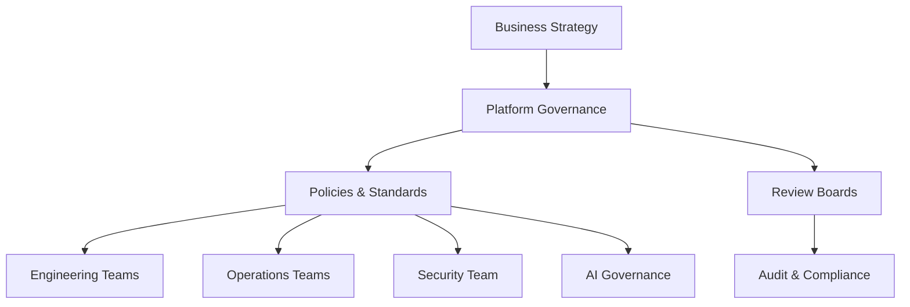
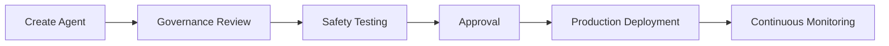

# Agent Platform Governance Operations

**Document Version:** 1.0
**Project:** AI Voice Agent SaaS Platform
**Status:** Draft
**Last Updated:** 2026-07-23

---

# 1. Overview

This document defines the governance operating model for the AI Voice Agent SaaS Platform.

Governance ensures that AI agents, platform services, data, integrations, and operational processes are managed in a controlled and responsible manner.

The governance model provides:

* Ownership
* Accountability
* Approval processes
* Risk management
* Change control
* Continuous improvement

---

# 2. Governance Objectives

The governance framework ensures:

* Safe AI deployment
* Controlled platform evolution
* Regulatory readiness
* Operational consistency
* Business alignment

---

# 3. Governance Architecture



---

# 4. Governance Domains

```text
Governance

├── AI Governance

├── Platform Governance

├── Data Governance

├── Security Governance

├── Change Governance

├── Vendor Governance

└── Compliance Governance
```

---

# 5. AI Agent Governance

AI agents require controlled lifecycle management.

Lifecycle:

```text
Design

↓

Development

↓

Testing

↓

Approval

↓

Deployment

↓

Monitoring

↓

Improvement

↓

Retirement
```

---

# 6. Agent Registration Process

Every agent must have:

```text
Agent Identity

+

Owner

+

Purpose

+

Capabilities

+

Permissions

+

Risk Level

+

Version History
```

---

# 7. Agent Risk Classification

Agents are classified by impact.

| Level    | Description             |
| -------- | ----------------------- |
| Low      | Informational assistant |
| Medium   | Customer interaction    |
| High     | Business decisions      |
| Critical | Sensitive operations    |

---

# 8. Agent Approval Workflow



---

# 9. Change Governance

All significant changes require:

* Impact analysis
* Testing
* Approval
* Documentation

Examples:

* New models
* New tools
* Database changes
* Security changes

---

# 10. Change Management Process

```text
Request Change

↓

Analyze Impact

↓

Review

↓

Approve

↓

Implement

↓

Validate

↓

Document
```

---

# 11. Model Governance

Track:

* Model provider
* Model version
* Usage purpose
* Performance
* Security review
* Cost impact

---

Example:

```json
{
 "model":"production_llm",
 "version":"v1",
 "approved":true,
 "owner":"AI Team"
}
```

---

# 12. Prompt Governance

Prompts are treated as controlled assets.

Manage:

* Version history
* Owners
* Testing results
* Performance metrics

---

# 13. Tool Governance

Agent tools require:

* Registration
* Permission scope
* Security review
* Usage monitoring

Example:

```text
Agent

↓

Tool Request

↓

Permission Check

↓

Execution

↓

Audit Record
```

---

# 14. Data Governance

Manage:

* Data ownership
* Data quality
* Data access
* Data retention

---

# 15. Knowledge Base Governance

RAG knowledge sources require:

* Document ownership
* Approval workflow
* Version tracking
* Expiration policies

---

# 16. Security Governance

Security governance ensures:

* Secure architecture
* Access control
* Threat management
* Risk reduction

---

# 17. Vendor Governance

External providers:

* AI providers
* Voice providers
* Cloud providers
* Integration services

must be reviewed for:

* Security
* Reliability
* Cost
* Data handling

---

# 18. Governance Committees

Recommended structure:

```text
AI Governance Board

├── Product Representative

├── Engineering Lead

├── AI Lead

├── Security Lead

├── Operations Lead

└── Compliance Representative
```

---

# 19. Governance Reviews

Review frequency:

| Review              | Frequency |
| ------------------- | --------- |
| Agent Review        | Monthly   |
| Security Review     | Quarterly |
| Architecture Review | Quarterly |
| Compliance Review   | Quarterly |

---

# 20. Governance Metrics

Measure:

* Number of approved agents
* Policy violations
* Security findings
* Agent quality scores
* Change success rate

---

# 21. Governance Dashboard

```text
Governance Dashboard

├── Agent Inventory

├── Risk Levels

├── Approvals

├── Policy Compliance

├── Security Findings

└── Audit History
```

---

# 22. Governance Database Entities

Recommended tables:

```text
agent_registry

agent_versions

approval_records

governance_policies

risk_assessments

change_requests

review_records
```

---

# 23. Governance Automation

Automate:

* Approval workflows
* Policy checks
* Compliance checks
* Documentation generation

---

# 24. Continuous Governance Improvement

```text
Measure

↓

Review

↓

Identify Issues

↓

Improve Policies

↓

Update Platform
```

---

# 25. Future Enhancements

Potential improvements:

* AI governance assistant
* Automated risk scoring
* Policy enforcement engine
* Autonomous compliance monitoring

---

# 26. Related Documents

| Document                                           | Purpose                |
| -------------------------------------------------- | ---------------------- |
| 24_Agent_Governance_Framework.md                   | Governance principles  |
| 32_Agent_Platform_Security_Operations.md           | Security               |
| 33_Agent_Platform_Compliance_Framework.md          | Compliance             |
| 39_Agent_Platform_Architecture_Decision_Records.md | Architecture decisions |

---

# 27. Conclusion

The Agent Platform Governance Operations model provides the control framework required to operate AI agents safely and responsibly.

It enables:

* Controlled AI growth
* Enterprise trust
* Operational accountability
* Sustainable platform evolution

---

**End of Document**
