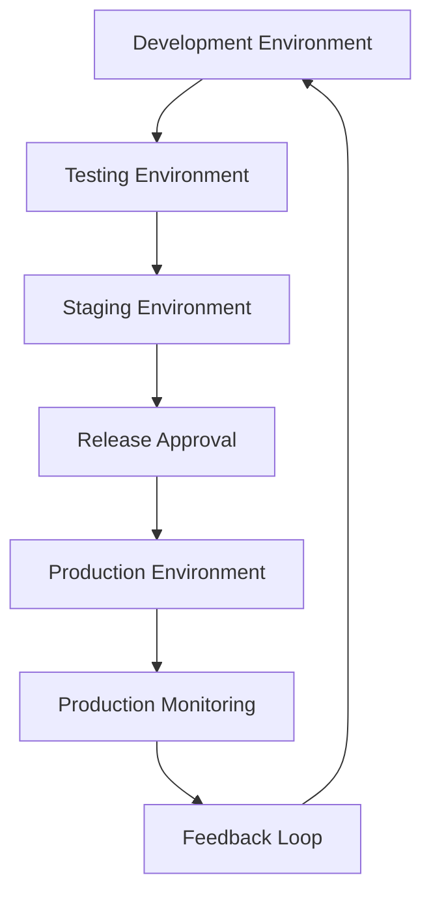
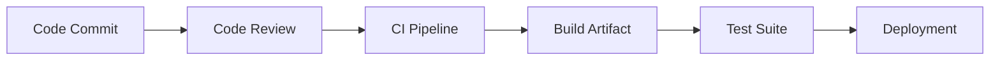

# Agent Platform Release Management

**Document Version:** 1.0
**Project:** AI Voice Agent SaaS Platform
**Status:** Draft
**Last Updated:** 2026-07-23

---

# 1. Overview

This document defines the release management strategy for the AI Voice Agent SaaS Platform.

Release management ensures that software, AI models, agent configurations, infrastructure changes, and platform updates are delivered safely and consistently.

The objective is to provide:

* Predictable releases
* Controlled deployments
* Reduced operational risk
* Faster innovation cycles

---

# 2. Release Management Objectives

The release process ensures:

* Quality validation
* Deployment consistency
* Change visibility
* Rollback capability
* Production stability

---

# 3. Release Architecture



---

# 4. Release Lifecycle

```text
Release Planning

↓

Development

↓

Code Review

↓

Testing

↓

Security Validation

↓

Staging Deployment

↓

Approval

↓

Production Release

↓

Monitoring

↓

Review
```

---

# 5. Release Types

The platform supports:

```text
Releases

├── Major Release

├── Minor Release

├── Patch Release

├── Emergency Release

└── Configuration Release
```

---

# 6. Major Releases

Major releases include:

* New platform capabilities
* Architecture changes
* Major AI upgrades
* Breaking changes

Example:

```text
Version 1.x → 2.x
```

---

# 7. Minor Releases

Minor releases include:

* New features
* Agent improvements
* UI enhancements
* API additions

Example:

```text
Version 1.2 → 1.3
```

---

# 8. Patch Releases

Patch releases fix:

* Bugs
* Security issues
* Performance problems

Example:

```text
Version 1.3.1
```

---

# 9. Emergency Releases

Emergency releases address:

* Critical vulnerabilities
* Production outages
* Severe failures

Process:

```text
Issue

↓

Rapid Fix

↓

Validation

↓

Emergency Deployment

↓

Post Review
```

---

# 10. Release Planning

Each release requires:

* Scope definition
* Feature list
* Risk assessment
* Testing plan
* Rollback plan

---

# 11. Release Package

A release package contains:

```text
Release Package

├── Application Code

├── Database Changes

├── Configuration Changes

├── Infrastructure Changes

├── AI Model Changes

├── Agent Updates

└── Documentation
```

---

# 12. Code Release Process



---

# 13. Database Release Management

Database changes require:

* Migration scripts
* Backward compatibility checks
* Backup validation
* Rollback strategy

---

Example:

```text
Migration Created

↓

Test Migration

↓

Backup Database

↓

Apply Migration

↓

Validate
```

---

# 14. AI Model Release Management

AI changes include:

* Model upgrades
* Prompt changes
* Tool changes
* Agent behavior changes

---

Required validation:

* Accuracy testing
* Safety testing
* Cost analysis
* Performance testing

---

# 15. Agent Configuration Releases

Agent changes include:

* System prompts
* Tools
* Workflows
* Knowledge sources

---

Process:

```text
Agent Change

↓

Evaluation

↓

Approval

↓

Deployment

↓

Monitoring
```

---

# 16. Feature Flag Strategy

Use feature flags for:

* New capabilities
* Experimental features
* Gradual rollout

---

Example:

```text
Feature Disabled

↓

Internal Testing

↓

Limited Customers

↓

Full Release
```

---

# 17. Deployment Strategies

Supported strategies:

```text
Deployment

├── Rolling Deployment

├── Blue/Green Deployment

├── Canary Release

└── Emergency Rollback
```

---

# 18. Canary Release

Process:

```text
New Version

↓

Small User Group

↓

Monitor Metrics

↓

Expand Release

↓

Complete Rollout
```

---

# 19. Rollback Strategy

Every release must support rollback.

Rollback triggers:

* High error rate
* Performance degradation
* Security issue
* Customer impact

---

Rollback process:

```text
Detect Problem

↓

Stop Release

↓

Restore Previous Version

↓

Validate System

↓

Document Incident
```

---

# 20. Release Testing Requirements

Testing includes:

## Functional Testing

* Features
* APIs
* Workflows

## Performance Testing

* Latency
* Throughput
* Resource usage

## AI Testing

* Agent behavior
* Prompt quality
* Tool execution

## Security Testing

* Vulnerabilities
* Permissions
* Data protection

---

# 21. Release Approval Process

Required approvals:

| Area        | Owner          |
| ----------- | -------------- |
| Engineering | Technical Lead |
| Security    | Security Team  |
| Operations  | Platform Team  |
| Product     | Product Owner  |

---

# 22. Release Monitoring

After deployment monitor:

```text
Production Metrics

├── Error Rate

├── Latency

├── Voice Quality

├── Agent Success Rate

├── Resource Usage

└── Customer Feedback
```

---

# 23. Release Documentation

Every release requires:

* Release notes
* Change summary
* Known issues
* Migration notes
* Support notes

---

# 24. Release Database Entities

Recommended tables:

```text
release_versions

deployment_records

change_requests

release_approvals

rollback_events

feature_flags
```

---

# 25. Release Automation

Automate:

* Build creation
* Testing
* Deployment
* Validation
* Notifications

---

# 26. Release Metrics

Measure:

* Deployment frequency
* Deployment success rate
* Rollback frequency
* Lead time
* Recovery time

---

# 27. Continuous Improvement

Release improvement cycle:

```text
Release

↓

Measure

↓

Analyze

↓

Improve Process

↓

Better Release
```

---

# 28. Related Documents

| Document                                    | Purpose    |
| ------------------------------------------- | ---------- |
| 35_Agent_Platform_Scaling_Strategy.md       | Scaling    |
| 37_Agent_Platform_Observability_Strategy.md | Monitoring |
| 38_Agent_Platform_Runbook_Strategy.md       | Operations |
| 43_Agent_Platform_Governance_Operations.md  | Governance |

---

# 29. Conclusion

The Agent Platform Release Management strategy provides a controlled method for delivering improvements to the AI Voice Agent SaaS Platform.

It enables:

* Safe deployments
* Faster innovation
* Reliable operations
* Continuous delivery

---

**End of Document**
