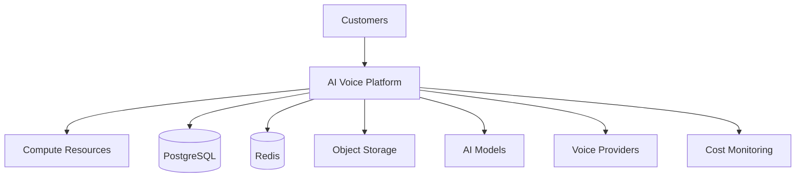

# Agent Platform Cost Optimization Strategy

**Document Version:** 1.0
**Project:** AI Voice Agent SaaS Platform
**Status:** Draft
**Last Updated:** 2026-07-23

---

# 1. Overview

This document defines the cost optimization strategy for the AI Voice Agent SaaS Platform.

The objective is to maintain a balance between:

* Platform performance
* AI quality
* Reliability
* Scalability
* Infrastructure cost

The strategy focuses on controlling costs across:

* Cloud infrastructure
* AI model usage
* Voice communication
* Storage
* Databases
* Operations

---

# 2. Cost Optimization Objectives

The platform should achieve:

* Predictable operating costs
* Efficient resource utilization
* Lower cost per conversation
* Better customer margins
* Sustainable scaling

---

# 3. Cost Architecture Overview



---

# 4. Cost Categories

```text
Cost Areas

├── Infrastructure Costs

├── AI Model Costs

├── Voice Communication Costs

├── Storage Costs

├── Database Costs

├── Monitoring Costs

└── Operational Costs
```

---

# 5. Infrastructure Cost Optimization

Infrastructure includes:

* Servers
* Containers
* Kubernetes resources
* Networking
* Storage

Optimization methods:

* Right-size resources
* Remove unused services
* Auto-scale workloads
* Use reserved capacity

---

# 6. Compute Optimization

Optimize:

* CPU usage
* Memory allocation
* Worker count
* Container resources

Example:

```text
Low Traffic

↓

Reduce Workers

↓

Lower Cost


High Traffic

↓

Increase Workers

↓

Maintain Performance
```

---

# 7. Auto Scaling Strategy

Scale resources based on:

* Active calls
* Agent sessions
* Queue depth
* CPU utilization
* Memory usage

---

Example:

```text
Demand Increase

↓

Scale Agent Workers

↓

Process Requests

↓

Scale Down
```

---

# 8. AI Model Cost Optimization

AI costs are driven by:

* Token usage
* Model selection
* Conversation length
* Embedding generation

---

Optimization methods:

* Use smaller models where possible
* Cache responses
* Reduce unnecessary context
* Optimize prompts

---

# 9. Model Routing Strategy

Use different models based on task complexity.

```text
Simple Task

↓

Small Model


Complex Task

↓

Advanced Model
```

---

# 10. Prompt Optimization

Reduce AI cost through:

* Shorter prompts
* Better instructions
* Removing duplicate context
* Efficient memory retrieval

---

# 11. RAG Cost Optimization

Optimize:

* Chunk size
* Embedding frequency
* Retrieval count
* Vector search efficiency

---

Example:

```text
User Query

↓

Retrieve Top Relevant Documents

↓

Send Only Required Context

↓

Generate Response
```

---

# 12. Voice Cost Optimization

Voice costs include:

* SIP usage
* Phone numbers
* Call minutes
* Transcription
* Text-to-speech

---

Optimization:

* Reduce unnecessary transfers
* Optimize call flows
* End inactive sessions
* Monitor usage

---

# 13. Conversation Cost Tracking

Track:

* Call duration
* Token usage
* Model usage
* Provider cost

---

Recommended entity:

```text
conversation_costs

├── conversation_id

├── duration

├── tokens_used

├── model_cost

└── total_cost
```

---

# 14. Database Cost Optimization

Optimize PostgreSQL:

* Proper indexing
* Query optimization
* Connection pooling
* Data retention policies

---

# 15. Storage Optimization

Manage:

* Call recordings
* Documents
* Logs
* Backups

Strategies:

* Compression
* Lifecycle policies
* Archive old data

---

# 16. Redis Cost Optimization

Optimize:

* Memory usage
* Expiration policies
* Cache size
* Key cleanup

---

# 17. Multi-Tenant Cost Allocation

Track costs per customer:

```text
Tenant

↓

Usage

↓

Cost Calculation

↓

Billing
```

---

# 18. Usage Metering

Measure:

```text
Usage Metrics

├── Calls

├── Minutes

├── Tokens

├── Storage

├── API Requests

└── Agent Executions
```

---

# 19. Cost Monitoring Dashboard

Required views:

```text
Cost Dashboard

├── Total Platform Cost

├── Cost Per Customer

├── AI Cost

├── Voice Cost

├── Infrastructure Cost

└── Trend Analysis
```

---

# 20. Budget Controls

Implement:

* Spending limits
* Alerts
* Usage thresholds
* Customer quotas

---

Example:

```text
Usage Limit Reached

↓

Warning

↓

Restriction

↓

Upgrade Plan
```

---

# 21. Cost Governance

Every major change should evaluate:

* Infrastructure impact
* AI cost impact
* Customer pricing impact

---

# 22. Cost Database Entities

Recommended tables:

```text
cost_records

usage_metrics

billing_events

resource_consumption

tenant_usage

cost_alerts
```

---

# 23. FinOps Practices

Follow:

* Cost ownership
* Budget tracking
* Forecasting
* Optimization reviews

---

# 24. Cost Optimization Reviews

Review:

Monthly:

* Infrastructure usage
* AI spending
* Voice costs

Quarterly:

* Architecture efficiency
* Provider contracts
* Scaling strategy

---

# 25. Cost Optimization Automation

Automate:

* Resource cleanup
* Usage alerts
* Cost reports
* Idle detection

---

# 26. Future Enhancements

Potential improvements:

* AI cost optimizer
* Predictive spending analysis
* Automatic model selection
* Dynamic resource allocation

---

# 27. Related Documents

| Document                                      | Purpose     |
| --------------------------------------------- | ----------- |
| 35_Agent_Platform_Scaling_Strategy.md         | Scaling     |
| 34_Agent_Platform_Performance_Optimization.md | Performance |
| 44_Agent_Platform_Release_Management.md       | Releases    |
| 43_Agent_Platform_Governance_Operations.md    | Governance  |

---

# 28. Conclusion

The Agent Platform Cost Optimization Strategy ensures the AI Voice Agent SaaS Platform remains financially sustainable while maintaining enterprise-level performance.

It enables:

* Lower operational costs
* Better resource efficiency
* Predictable margins
* Sustainable growth

---

**End of Document**
