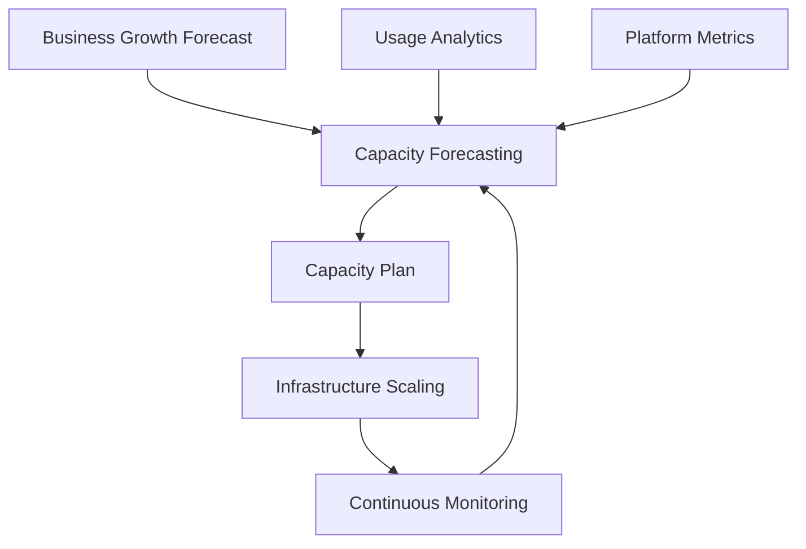

# Agent Platform Capacity Planning Strategy

**Document Version:** 1.0
**Project:** AI Voice Agent SaaS Platform
**Status:** Draft
**Last Updated:** 2026-07-23

---

# 1. Overview

This document defines the capacity planning strategy for the AI Voice Agent SaaS Platform.

Capacity planning ensures that the platform can support expected growth while maintaining:

* Performance
* Reliability
* Availability
* Cost efficiency
* Customer experience

The strategy covers:

* Infrastructure capacity
* Voice capacity
* AI workload capacity
* Database capacity
* Storage capacity
* Operational capacity

---

# 2. Capacity Planning Objectives

The platform should:

* Predict future resource requirements
* Prevent performance degradation
* Maintain service availability
* Optimize infrastructure spending
* Support business growth

---

# 3. Capacity Planning Architecture



---

# 4. Capacity Planning Areas

```text id="k0w6u8"
Capacity Areas

├── User Capacity

├── Voice Capacity

├── Agent Capacity

├── AI Model Capacity

├── Database Capacity

├── Storage Capacity

├── Network Capacity

└── Operations Capacity
```

---

# 5. Growth Assumptions

Capacity planning should consider:

* Customer growth
* Active tenants
* Number of agents
* Concurrent calls
* Conversation volume
* Data growth

---

Example:

```text id="0o1v6h"
Year 1

↓

Growing SaaS Users


Year 2

↓

Enterprise Customers


Year 3

↓

Global Platform Scale
```

---

# 6. User Capacity Planning

Track:

* Registered users
* Active users
* Organizations
* Administrators

---

Metrics:

```text id="3n5h3r"
User Capacity

├── Total Users

├── Active Users

├── Requests/User

└── Peak Usage Time
```

---

# 7. Voice Capacity Planning

Voice workload is based on:

* Concurrent calls
* Call duration
* Audio processing
* Transcription load

---

Capacity model:

```text id="mqc7pl"
Incoming Calls

↓

Voice Sessions

↓

Agent Workers

↓

Completed Conversations
```

---

# 8. Concurrent Call Capacity

Important metrics:

| Metric        | Purpose             |
| ------------- | ------------------- |
| Active Calls  | Current load        |
| Peak Calls    | Maximum requirement |
| Call Duration | Resource usage      |
| Failure Rate  | Capacity health     |

---

# 9. Agent Worker Capacity

Agent workers handle:

* Conversation processing
* Tool execution
* Workflow execution

---

Scaling formula:

```text id="xw9h2f"
Required Workers

=

Active Conversations

×

Average Processing Load
```

---

# 10. AI Model Capacity Planning

AI workload depends on:

* Requests per minute
* Tokens per request
* Model latency
* Context size

---

Track:

```text id="e3f2da"
AI Capacity

├── Requests

├── Tokens

├── Latency

├── Model Availability

└── Cost
```

---

# 11. RAG Capacity Planning

Consider:

* Number of documents
* Embedding volume
* Search requests
* Vector index size

---

Growth model:

```text id="6x1d8m"
Documents

↓

Embeddings

↓

Vector Index

↓

Search Load
```

---

# 12. Database Capacity Planning

Monitor:

PostgreSQL:

* Storage growth
* Connections
* Query load
* Transactions

---

Capacity actions:

* Add indexes
* Optimize queries
* Increase resources
* Add replicas

---

# 13. Redis Capacity Planning

Monitor:

* Memory usage
* Active sessions
* Cache size
* Expiration rate

---

Optimization:

```text id="cx6p8y"
Monitor

↓

Remove Unused Data

↓

Adjust Memory

↓

Scale
```

---

# 14. Storage Capacity Planning

Storage includes:

* Call recordings
* Documents
* Logs
* Backups

---

Planning:

```text id="g7vx2s"
Data Growth

↓

Storage Forecast

↓

Retention Policy

↓

Archive Strategy
```

---

# 15. Network Capacity Planning

Monitor:

* API traffic
* Audio streams
* Data transfers
* External integrations

---

Voice requires special attention because of:

* Real-time audio streams
* Low latency requirements

---

# 16. Infrastructure Forecasting

Forecast:

* CPU
* Memory
* Containers
* Database resources
* Network bandwidth

---

Example:

```text id="f0nx34"
Current Usage

↓

Growth Prediction

↓

Future Resources

↓

Scaling Plan
```

---

# 17. Capacity Thresholds

Define warning levels:

| Level | Action            |
| ----- | ----------------- |
| 70%   | Monitor           |
| 80%   | Prepare scaling   |
| 90%   | Scale immediately |
| 95%+  | Critical response |

---

# 18. Capacity Alerts

Alert on:

* CPU saturation
* Memory pressure
* Database limits
* Call capacity
* Queue backlog

---

# 19. Load Testing Strategy

Regular testing:

```text id="x9k4p0"
Load Test

↓

Stress Test

↓

Measure

↓

Improve

↓

Repeat
```

---

# 20. Capacity Reports

Generate:

Monthly:

* Resource usage
* Growth trends
* Cost analysis

Quarterly:

* Architecture review
* Scaling requirements

---

# 21. Capacity Database Entities

Recommended tables:

```text id="4o7w6m"
capacity_metrics

resource_forecasts

scaling_events

usage_forecasts

capacity_reports
```

---

# 22. Capacity Planning Ownership

| Area           | Owner        |
| -------------- | ------------ |
| Infrastructure | DevOps       |
| Database       | Backend Team |
| AI Systems     | AI Team      |
| Voice Platform | Voice Team   |
| Cost           | FinOps       |

---

# 23. Capacity Review Process

```text id="v9j1ak"
Measure

↓

Analyze

↓

Forecast

↓

Plan

↓

Scale

↓

Review
```

---

# 24. Future Enhancements

Potential improvements:

* AI-based capacity prediction
* Automatic resource provisioning
* Predictive scaling
* Global capacity optimization

---

# 25. Related Documents

| Document                                        | Purpose    |
| ----------------------------------------------- | ---------- |
| 35_Agent_Platform_Scaling_Strategy.md           | Scaling    |
| 45_Agent_Platform_Cost_Optimization_Strategy.md | Cost       |
| 37_Agent_Platform_Observability_Strategy.md     | Monitoring |
| 36_Agent_Platform_Disaster_Recovery_Strategy.md | Recovery   |

---

# 26. Conclusion

The Agent Platform Capacity Planning Strategy ensures the AI Voice Agent SaaS Platform can grow reliably from early deployments to enterprise-scale operations.

It provides:

* Predictable growth planning
* Better resource utilization
* Improved reliability
* Sustainable scaling

---

**End of Document**
