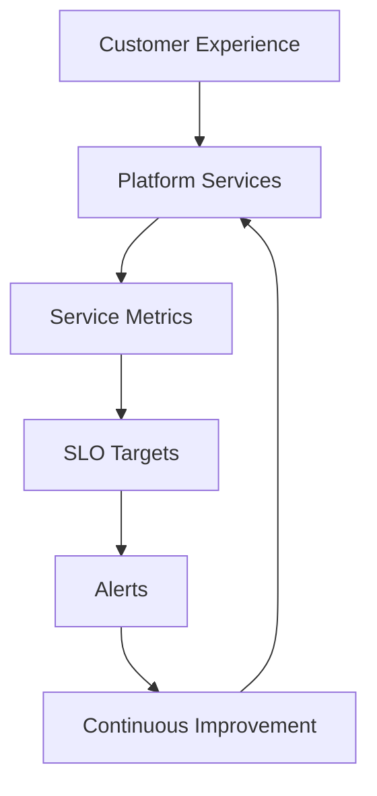

# Agent Platform Service Level Objectives (SLO)

**Document Version:** 1.0
**Project:** AI Voice Agent SaaS Platform
**Status:** Draft
**Last Updated:** 2026-07-23

---

# 1. Overview

This document defines the Service Level Objectives (SLOs) for the AI Voice Agent SaaS Platform.

SLOs establish measurable reliability targets for platform services and ensure alignment between:

* Customer expectations
* Engineering goals
* Operational practices
* Business requirements

The SLO framework covers:

* Availability
* Latency
* Reliability
* Voice quality
* AI performance
* Recovery objectives

---

# 2. SLO Principles

The platform follows:

```text
SLO Principles

├── Measure What Matters

├── Define Customer Impact

├── Monitor Continuously

├── Improve Reliability

└── Balance Speed and Stability
```

---

# 3. Reliability Model



---

# 4. Service Categories

The platform defines SLOs for:

```text
Services

├── API Platform

├── Voice Platform

├── Agent Runtime

├── Knowledge System

├── Database Layer

├── Authentication

├── Integrations

└── Monitoring Platform
```

---

# 5. Availability Objectives

## Core Platform Availability

Target:

```text
99.9% Monthly Availability
```

Applies to:

* Dashboard
* APIs
* Agent management
* Customer services

---

# 6. Voice Service Availability

Voice systems require higher reliability.

Target:

```text
99.95% Voice Service Availability
```

Measures:

* SIP connectivity
* Call routing
* Agent connection

---

# 7. API Service Objectives

Metrics:

| Metric        | Target |
| ------------- | ------ |
| Availability  | 99.9%  |
| Error Rate    | <1%    |
| Response Time | <500ms |

---

# 8. Voice Latency Objectives

Voice experience depends on latency.

Targets:

```text
Audio Processing

↓

Low Delay

↓

Natural Conversation
```

Metrics:

| Component          | Target        |
| ------------------ | ------------- |
| Speech Recognition | Low latency   |
| Agent Response     | Fast response |
| Text-to-Speech     | Real-time     |

---

# 9. Agent Runtime Objectives

Measure:

* Agent execution success
* Workflow completion
* Tool execution reliability

Targets:

```text
Agent Execution Success

> 98%
```

---

# 10. AI Quality Objectives

AI quality metrics:

* Task completion
* Correct responses
* Tool accuracy
* User satisfaction

---

Example:

```text
Conversation

↓

Evaluation

↓

Quality Score

↓

Improvement
```

---

# 11. Database Objectives

PostgreSQL targets:

| Metric         | Objective |
| -------------- | --------- |
| Availability   | 99.95%    |
| Query Errors   | Minimal   |
| Backup Success | 100%      |

---

# 12. Cache Objectives

Redis targets:

Monitor:

* Availability
* Hit ratio
* Memory usage

---

# 13. Knowledge System Objectives

RAG system measures:

* Retrieval success
* Search latency
* Index availability

---

Targets:

```text
Search Availability

> 99.9%
```

---

# 14. Error Budget Model

SLOs use error budgets.

Formula:

```text
Error Budget

=

Allowed Failure Time

-

Actual Failure Time
```

---

Example:

```text
99.9% Availability

=

43 minutes downtime/month allowed
```

---

# 15. Error Budget Policy

When budget is healthy:

Allow:

* Feature releases
* Improvements
* Experiments

When budget is exhausted:

Prioritize:

* Reliability
* Bug fixes
* Infrastructure work

---

# 16. Monitoring Requirements

Track:

```text
SLO Metrics

├── Availability

├── Latency

├── Errors

├── Throughput

├── AI Quality

└── Customer Impact
```

---

# 17. Alerting Rules

Alert when:

* SLO approaching violation
* Error budget exhausted
* Performance degraded

---

Example:

```text
Latency Increase

↓

SLO Warning

↓

Engineering Review

↓

Action Plan
```

---

# 18. Incident Relationship

SLOs connect with incident management.

Flow:

```text
Issue

↓

Metric Impact

↓

SLO Violation

↓

Incident

↓

Resolution

↓

Review
```

---

# 19. Customer SLA Relationship

SLOs support customer SLAs.

Relationship:

```text
SLA

↓

Customer Commitment


SLO

↓

Engineering Target
```

---

# 20. SLO Dashboard

Required views:

```text
SLO Dashboard

├── Availability

├── Latency

├── Error Budget

├── Voice Quality

├── Agent Quality

└── Trends
```

---

# 21. SLO Database Entities

Recommended tables:

```text
service_objectives

service_metrics

error_budgets

slo_events

availability_reports
```

---

# 22. SLO Review Process

Review:

Monthly:

* Performance
* Reliability trends

Quarterly:

* Target adjustments
* Architecture improvements

---

# 23. Ownership Model

| Area           | Owner         |
| -------------- | ------------- |
| APIs           | Backend Team  |
| Voice          | Voice Team    |
| AI Runtime     | AI Team       |
| Infrastructure | DevOps        |
| Security       | Security Team |

---

# 24. Future Enhancements

Potential improvements:

* Automated SLO management
* AI reliability analysis
* Predictive incident detection
* Customer-specific SLOs

---

# 25. Related Documents

| Document                                        | Purpose    |
| ----------------------------------------------- | ---------- |
| 37_Agent_Platform_Observability_Strategy.md     | Monitoring |
| 38_Agent_Platform_Runbook_Strategy.md           | Operations |
| 36_Agent_Platform_Disaster_Recovery_Strategy.md | Recovery   |
| 46_Agent_Platform_Capacity_Planning_Strategy.md | Capacity   |

---

# 26. Conclusion

The Agent Platform Service Level Objectives framework defines measurable reliability expectations for the AI Voice Agent SaaS Platform.

It enables:

* Better customer experience
* Proactive reliability management
* Operational discipline
* Continuous improvement

---

**End of Document**
