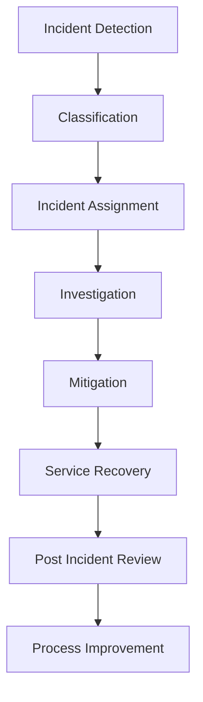

# Agent Platform Incident Management Process

**Document Version:** 1.0
**Project:** AI Voice Agent SaaS Platform
**Status:** Draft
**Last Updated:** 2026-07-23

---

# 1. Overview

This document defines the incident management process for the AI Voice Agent SaaS Platform.

Incident management ensures that service disruptions, security events, AI failures, and operational issues are handled in a structured and efficient manner.

The objectives are:

* Restore services quickly
* Reduce customer impact
* Communicate effectively
* Identify root causes
* Prevent recurrence

---

# 2. Incident Management Objectives

The process provides:

* Fast detection
* Clear ownership
* Effective response
* Reliable recovery
* Continuous improvement

---

# 3. Incident Management Lifecycle



---

# 4. Incident Categories

```text
Incident Types

├── Application Incident

├── Voice Platform Incident

├── Agent Runtime Incident

├── Database Incident

├── Security Incident

├── Infrastructure Incident

├── Integration Incident

└── Data Incident
```

---

# 5. Incident Severity Levels

| Severity | Description                               |
| -------- | ----------------------------------------- |
| SEV-1    | Critical outage affecting major customers |
| SEV-2    | Significant degradation                   |
| SEV-3    | Limited impact                            |
| SEV-4    | Minor issue or request                    |

---

# 6. SEV-1 Critical Incident

Examples:

* Complete platform outage
* Voice calling unavailable
* Customer data exposure
* Major security breach

Response:

```text
Detect

↓

Declare Incident

↓

Assign Incident Commander

↓

Mitigate

↓

Recover

↓

Review
```

---

# 7. Incident Detection Sources

Incidents can originate from:

```text
Detection Sources

├── Monitoring Alerts

├── Customer Reports

├── Security Systems

├── Automated Checks

├── Support Team

└── Engineering Teams
```

---

# 8. Incident Response Team

Roles:

```text
Incident Team

├── Incident Commander

├── Technical Lead

├── Backend Engineer

├── Voice Engineer

├── AI Engineer

├── Database Engineer

├── Security Engineer

└── Customer Communication Owner
```

---

# 9. Incident Commander Responsibilities

The Incident Commander:

* Coordinates response
* Assigns tasks
* Controls communication
* Makes escalation decisions
* Ensures resolution

---

# 10. Incident Workflow

```text
Incident Created

↓

Severity Assigned

↓

Team Notified

↓

Investigation Started

↓

Temporary Fix Applied

↓

Permanent Fix Implemented

↓

Incident Closed
```

---

# 11. Investigation Process

Investigate:

* Logs
* Metrics
* Traces
* Recent changes
* Infrastructure state
* Customer impact

---

Example:

```text
Failure

↓

Collect Evidence

↓

Identify Root Cause

↓

Apply Solution
```

---

# 12. Voice Incident Handling

Voice incidents include:

* SIP failures
* Call routing failures
* Audio issues
* Agent connection problems

Process:

```text
Voice Failure

↓

Check Provider

↓

Check LiveKit

↓

Check Agent Workers

↓

Restore Calls
```

---

# 13. AI Agent Incident Handling

AI incidents include:

* Incorrect responses
* Tool failures
* Memory failures
* Workflow errors

Process:

```text
Agent Problem

↓

Review Conversation

↓

Analyze Workflow

↓

Check Tools

↓

Deploy Correction
```

---

# 14. Database Incident Handling

Database issues:

* Connection failures
* Slow queries
* Data corruption
* Migration failures

Recovery:

```text
Detect

↓

Protect Data

↓

Restore Service

↓

Validate
```

---

# 15. Security Incident Response

Security incidents require:

* Containment
* Investigation
* Evidence preservation
* Recovery

Process:

```text
Alert

↓

Contain

↓

Analyze

↓

Remediate

↓

Report
```

---

# 16. Communication Process

Communication includes:

Internal:

* Engineering teams
* Operations
* Leadership

External:

* Customers
* Partners

---

# 17. Incident Timeline

Maintain:

```text
Timeline

├── Detection Time

├── Response Time

├── Mitigation Time

├── Recovery Time

└── Closure Time
```

---

# 18. Incident Documentation

Every incident requires:

* Summary
* Impact
* Timeline
* Root cause
* Resolution
* Prevention actions

---

# 19. Root Cause Analysis

Use:

* Five Whys
* Fault Tree Analysis
* Timeline Analysis

Example:

```text
Problem

↓

Why?

↓

Why?

↓

Root Cause

↓

Fix
```

---

# 20. Post Incident Review

Review:

* What happened
* What worked
* What failed
* What should improve

---

# 21. Incident Metrics

Track:

| Metric           | Purpose         |
| ---------------- | --------------- |
| MTTR             | Recovery speed  |
| MTTD             | Detection speed |
| Incident Count   | Reliability     |
| Repeat Incidents | Improvement     |

---

# 22. Incident Database Entities

Recommended tables:

```text
incidents

incident_events

incident_assignments

incident_comments

root_cause_records

corrective_actions
```

---

# 23. Automation Opportunities

Automate:

* Incident creation
* Alert correlation
* Diagnostics
* Notifications
* Status updates

---

# 24. Incident Escalation

Escalation triggers:

* Extended outage
* Security impact
* Customer impact
* SLA risk

---

# 25. Continuous Improvement

Process:

```text
Incident

↓

Analysis

↓

Improvement Actions

↓

Implementation

↓

Better Reliability
```

---

# 26. Related Documents

| Document                                        | Purpose     |
| ----------------------------------------------- | ----------- |
| 37_Agent_Platform_Observability_Strategy.md     | Monitoring  |
| 38_Agent_Platform_Runbook_Strategy.md           | Operations  |
| 36_Agent_Platform_Disaster_Recovery_Strategy.md | Recovery    |
| 47_Agent_Platform_Service_Level_Objectives.md   | Reliability |

---

# 27. Conclusion

The Agent Platform Incident Management Process provides a structured approach for handling operational failures.

It ensures:

* Faster recovery
* Better communication
* Reduced downtime
* Continuous reliability improvement

---

**End of Document**
